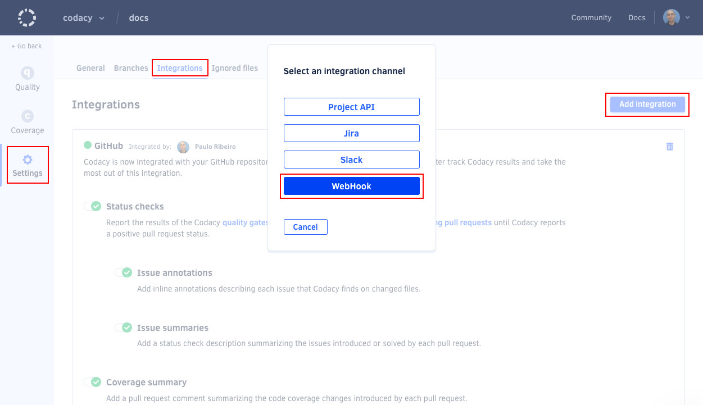
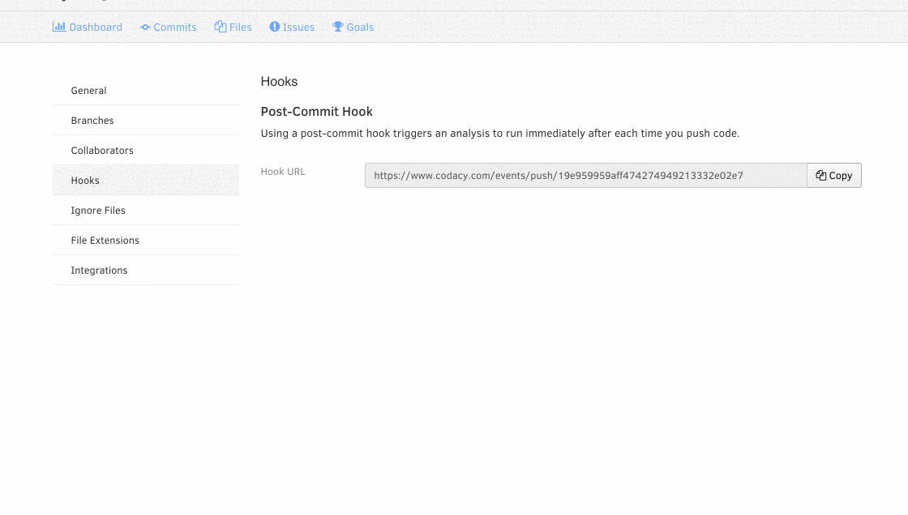

# Post-commit hooks

For Codacy to check updates in your repository (new commits and pull requests) you must have post-commit hooks enabled.

There are two ways to do this: **automatically** or **manually**

## Automatic setup of post-commit hook

If you're using GitHub or Bitbucket you can let Codacy configure the hook for you. Go to your **repository settings** and click on the **Integrations** tab. There should be a switch button for the automatic setup of post-commit hooks.

### Missing hook automatic setup switch button

If the switch isn't visible, go to the **Integrations** tab and add the GitHub or Bitbucket integration.

!!! important
    Make sure that you enable the integration after adding it.

## Manual setup of post-commit hooks on GitHub

To turn on post-commit hooks for GitHub:

1.  Copy the hook URL to your clipboard.
1.  Go to **Webhooks & Services** under your repository settings.
1.  Paste the hook URL into the field **Payload URL**.
1.  Select `application/json` in the field **Content Type**.
1.  Click **Add Webhook**.

Here's an example of how to configure your hooks on GitHub:

## Permissions to create post-commit hooks

If you get an error when turning on the post-commit hook, please make sure that you have Admin rights on the GitHub repository.
