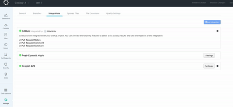
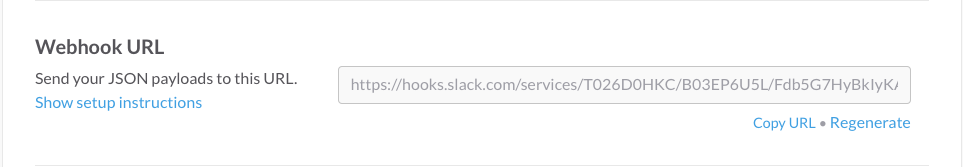
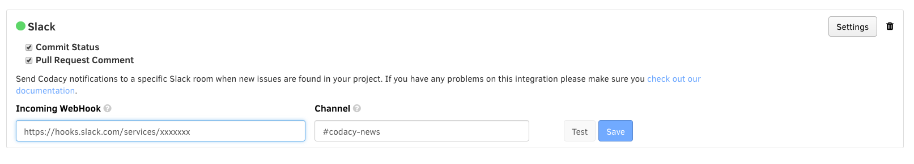
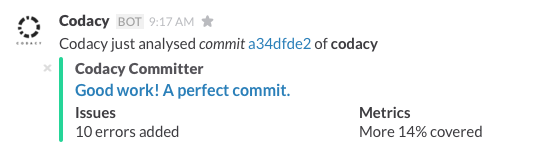

# Slack integration

After adding a repository, you may want to enable Slack integration. Codacy integrates with Slack by sending messages to a channel when it finds new issues.

To enable the Slack integration access the **Integrations** tab of your repository **Settings**, click **Add integration** and select **Slack** from the list.

## Configuration

Configure the Slack integration as follows:

**Incoming webhook:**

1.  Access the **Incoming Webhooks** page on the App Directory of your Slack account
2.  Select the channel where you want to receive notifications and click **Add Incoming Webhooks Integration**
3.  Copy the generated URL and use it on Codacy

    

4.  Save settings on Slack

**Channel:** The name of the channel where Codacy will send the notifications. This value is optional and it will override the default channel of the webhook.

After filling both fields, click the **Save** button. You can also use the **Test** button to send a test notification to your Slack channel and confirm that the integration is working.

After configuring your Slack integration with your server settings, Codacy will send a message on Slack whenever it finds new issues.

