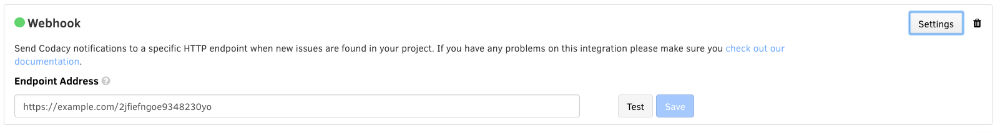

# WebHook notifications

Codacy integrates with any service by sending a POST message to a defined address.

To add a WebHook, access the **Integrations** tab of your repository **Settings**, click on **Add channel** and select **WebHook** from the list.



## Configuration

**Endpoint Address**

The URL where to POST the message.

After filling the field you have to click the Save button and everything should be setup correctly. You can use the Test button to send a test notification to the address.

When Codacy sends the POST to the address the message is in JSON format. Below, you can see an example message:

```json
{
  "commit":{
    "data":{
      "uuid":"4cbf02df84dbcaa44b75a64ed832f7dbff2231dd",
        "urls":{
          "delta":"https://www.codacy.com/public/jquery/jquery.git/commit?bid=21776&cid=6037089"
        }
    },
      "results":{
        "fixed_count":1,
        "new_count":0
      }
  }
}
```
