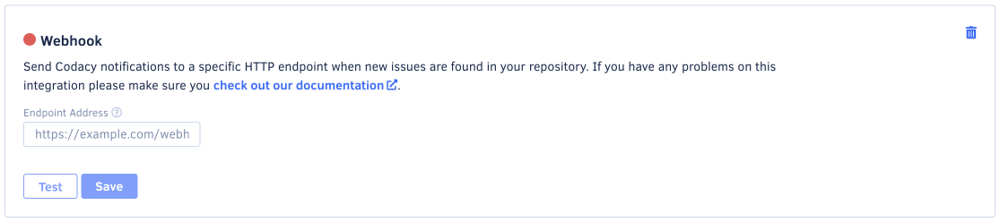

# Webhook notifications

Webhook notifications enable Codacy to integrate with a service by sending a POST message to a custom address after analyzing each commit belonging to an active branch. You can set up multiple webhook notifications per repository.

## Adding a webhook notification

To add a webhook notification:

1.  Open your repository **Settings**, tab **Integrations**, and click the button **Add integration** to open a modal window listing integration options.

1.  Click **Webhook** and scroll to the bottom of the page to access the newly created Webhook settings panel.

     

1.  Fill in the field with the address of your endpoint and click **Save**.

    To send a sample payload to the specified endpoint, click the **Test** button.

    

## Payload format

Each webhook notification includes a JSON payload with the following fields:

```json
{
  "commit": {
    "data": {
      "uuid": "4cbf02df84dbcaa44b75a64ed832f7dbff2231dd",
      "urls": {
        "delta": "https://www.codacy.com/public/jquery/jquery.git/commit?bid=21776&cid=6037089"
      }
    },
    "results": {
      "fixed_count": 1,
      "new_count": 0
    }
  }
}
```
