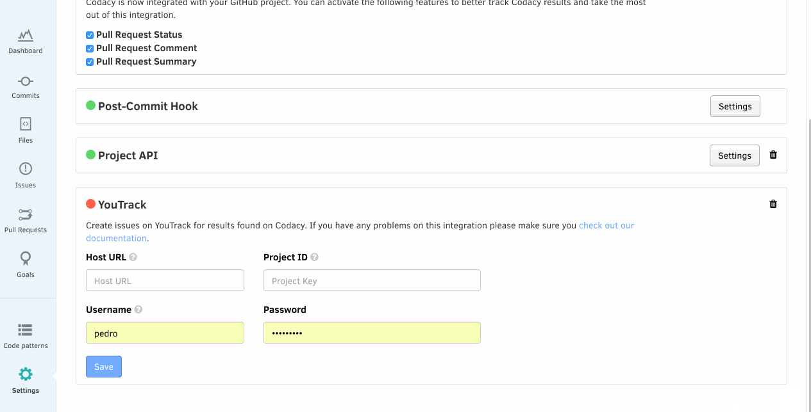
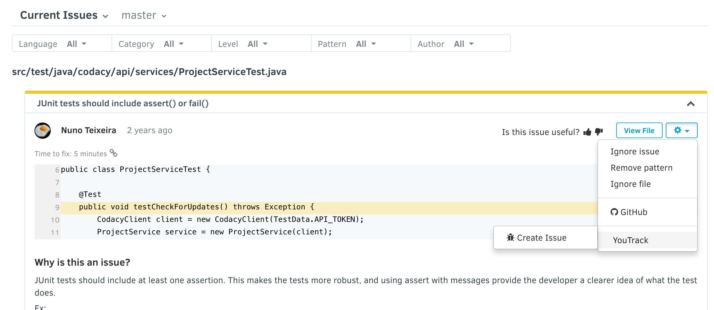

# YouTrack integration

After adding a repository, you may want to enable YouTrack integration, in order to be able to comment or to create issues.

To do so, navigate to your **Repository Settings**, and select the tab **Integrations**. The YouTrack integration can be installed with one click. After installing it in a repository, it will have to be configured be able to access your YouTrack installation:

After configuring your YouTrack integration with your server settings, you will have additional options when browsing the existing issues on the repository:

 
