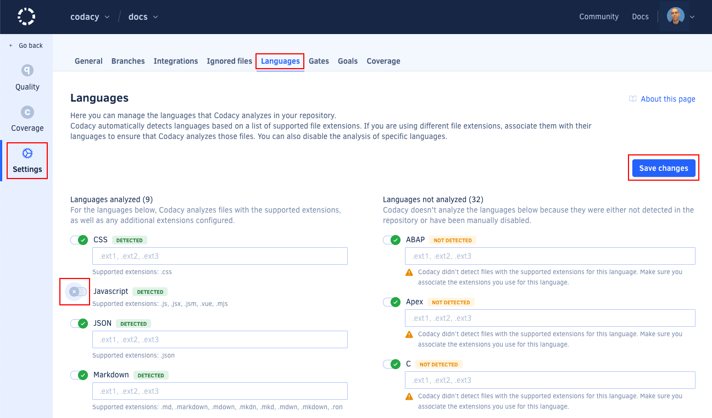

# Configuring languages



Codacy automatically detects and analyzes languages in your repository based on a list of supported file extensions. On the repository **Settings**, tab **Languages**, you can see the list of languages that Codacy detected and will include in the next analysis.

By default, the analysis is enabled for all languages that Codacy detects in you repository. You can adapt this configuration to your needs as follows:

-   [Configure Codacy to include unrecognized extensions](#configuring-file-extensions)
-   [Disable the analysis of specific languages](#disable-language)

## Configuring file extensions

If your repository has source files with extensions different from those Codacy supports, associate them with their languages to ensure that Codacy also analyzes those files in the next analysis:

1.  Go to your repository's **Settings**, **Languages**.

1.  Add the extensions you want to be recognized for each language.

1.  Click **Save changes** to update your file extension settings.

    

    The updated settings will be used on the next analysis, but you can click **reanalyze the latest commit of your branches now** on the notification that appears at the bottom of the page to trigger an analysis immediately.

    

!!! note
    Currently, the [Semgrep](https://github.com/codacy/codacy-semgrep) static analysis tool doesn't support custom file extensions.

## Disabling analysis of a language {: id="disable-language"}

By default, Codacy analyzes all languages detected in your repository. To disable the analysis of a specific language, do the following:

1.  Go to your repository's **Settings**, **Languages**.

1.  Use the toggle next to the language to disable its analysis.

1.  Click **Save changes** to update your settings.

    

    The updated settings will be used on the next analysis, but you can click **reanalyze the latest commit of your branches now** on the notification that appears at the bottom of the page to trigger an analysis immediately.

    
