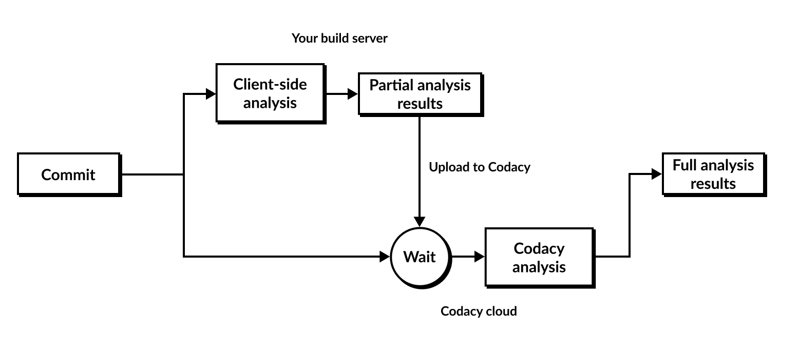

# Client-side tools

Client-side tools enable you to run an analysis locally or as part of your build process and upload the results to Codacy. This way, Codacy presents the analysis information reported by your local tools on the Codacy dashboards, in addition to the default code quality information.

The following diagram presents a high-level overview of the local analysis flow.

Codacy supports client-side tools in two ways:

-   **Containerized tools:** Codacy provides Docker images to run analysis tools locally. To fetch code pattern configurations from Codacy, run the images, print out analysis results, and upload them to Codacy, use the [Codacy Analysis CLI](https://github.com/codacy/codacy-analysis-cli).

    The Codacy Analysis CLI automatically fetches the code pattern settings that you define on the Codacy UI and applies them when running the tools.

-   **Standalone tools:** Codacy provides auxiliary converters that parse the output of third-party tools and convert to a format that you then upload to Codacy. You must download, configure, and run the third-party tools yourself.<!-- NOTE: If updating this line or the one below, search for and update the matching UI copy on the Code patterns page in codacy-spa. -->

    You can't configure these tools on the Codacy UI, since you manage their configuration locally.

The table below describes the supported client-side tools and includes links to specific instructions on how to run each tool.

!!! tip
    **If you're using GitHub** we recommend that you use the [Codacy Analysis CLI GitHub Action](https://github.com/codacy/codacy-analysis-cli-action#integration-with-codacy-for-client-side-tools) to run the **containerized** client-side tools and upload the results to Codacy.

<!--NOTE
    When adding a new supported tool, make sure that you update the following pages:

    docs/getting-started/supported-languages-and-tools.md
    docs/repositories-configure/local-analysis/client-side-tools.md (if the tool runs client-side)
    docs/organizations/managing-security-and-risk.md  (if the tool reports security issues)
    docs/repositories-configure/configuring-code-patterns.md (supported configuration files table, or list of tools that don't support configuration files)
    docs/repositories-configure/codacy-configuration-file.md (list of tool short names to use on the Codacy configuration file)
-->

<table>
<colgroup>
<col/>
<col/>
<col style="width: 45%" />
<col/>
</colgroup>
<thead>
    <tr>
        <th>Language</th>
        <th>Client-side tool</th>
        <th>Description</th>
        <th>Usage instructions</th>
    </tr>
</thead>
<tbody>
    <tr>
        <td>C, C++</td>
        <td><a href="https://clang.llvm.org/extra/clang-tidy/">Clang-Tidy</a></td>
        <td>Clang-tidy is a clang-based C++ “linter” tool. Its purpose is to provide an extensible framework for diagnosing and fixing typical programming errors, like style violations, interface misuse, or bugs that can be deduced via static analysis. Clang-tidy is modular and provides a convenient interface for writing new checks.</td>
        <td><a href="https://github.com/codacy/codacy-clang-tidy#usage">Running Clang-Tidy</a> (standalone)</td>
    </tr>
    <tr>
        <td rowspan="4">Go</td>
        <td><a href="https://gitlab.com/opennota/check">aligncheck</a></td>
        <td>aligncheck is a utility for finding unused struct fields in Go source files.</td>
        <td><a href="../running-aligncheck/">Running aligncheck</a> (containerized)</td>
    </tr>
    <tr>
        <td><a href="https://github.com/tsenart/deadcode">deadcode</a></td>
        <td>deadcode is a very simple utility which detects unused declarations in Go packages.</td>
        <td><a href="../running-deadcode/">Running deadcode</a> (containerized)</td>
    </tr>
    <tr>
        <td><a href="https://github.com/securego/gosec">Gosec</a></td>
        <td>Gosec inspects source code for security problems by scanning the Go AST.</td>
        <td><a href="https://github.com/codacy/codacy-gosec#usage">Running Gosec</a> (standalone)</td>
    </tr>
    <tr>
        <td><a href="https://staticcheck.io/">Staticcheck</a></td>
        <td>Staticcheck is a state of the art linter for the Go programming language. Using static analysis, it finds bugs and performance issues, offers simplifications, and enforces style rules.</td>
        <td><a href="https://github.com/codacy/codacy-staticcheck#usage">Running Staticcheck</a> (standalone)</td>
    </tr>
    <tr>
        <td>Java, Scala</td>
        <td><a href="https://spotbugs.github.io/">SpotBugs</a></td>
        <td>SpotBugs is a program which uses static analysis to look for bugs in Java code. Together with the <a href="http://find-sec-bugs.github.io/">Find Security Bugs plugin</a> it provides security audits. It has support for Maven, sbt, and Gradle in Java projects.</td>
        <td><a href="../running-spotbugs/">Running SpotBugs</a> (containerized)</td>
    </tr>
    <tr>
        <td>Objective-C</td>
        <td><a href="https://clang.llvm.org/extra/clang-tidy/">Clang-Tidy</a></td>
        <td>Clang-tidy is a clang-based C++ "linter" tool. Its purpose is to provide an extensible framework for diagnosing and fixing typical programming errors, like style violations, interface misuse, or bugs that can be deduced via static analysis. Clang-tidy is modular and provides a convenient interface for writing new checks.</td>
        <td><a href="https://github.com/codacy/codacy-clang-tidy#usage">Running Clang-Tidy</a> (standalone)</td>
    </tr>
    <tr>
        <td>Unity</td>
        <td><a href="https://github.com/microsoft/Microsoft.Unity.Analyzers">Unity Roslyn Analyzers</a></td>
        <td>Unity-specific diagnostics for CSharp Unity projects.</td>
        <td><a href="https://github.com/codacy/codacy-roslyn#usage">Running Unity Roslyn Analyzers</a> (standalone)</td>
    </tr>
</table>

## See also

-   [Supported languages and tools](../../getting-started/supported-languages-and-tools.md)
