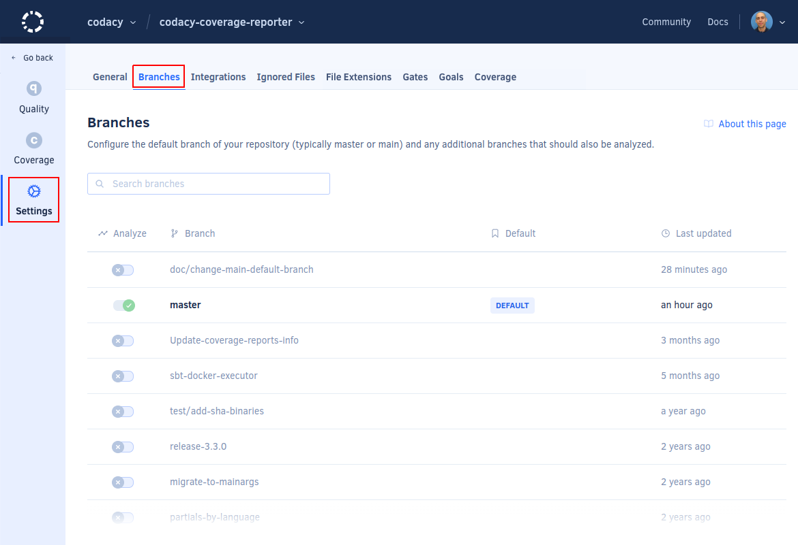

# Managing branches

Codacy automatically triggers analysis on the main branch of your repository (typically `master` or `main`), and also supports analyzing multiple branches.

To change the main branch of your repository or enable analysis on other branches, open your repository **Settings**, tab **Branches**:

## Analyzing pull request branches

When you create new pull requests Codacy automatically triggers analysis on the corresponding branches to analyze the pull requests **as long as the target branch of the pull request is enabled**.
