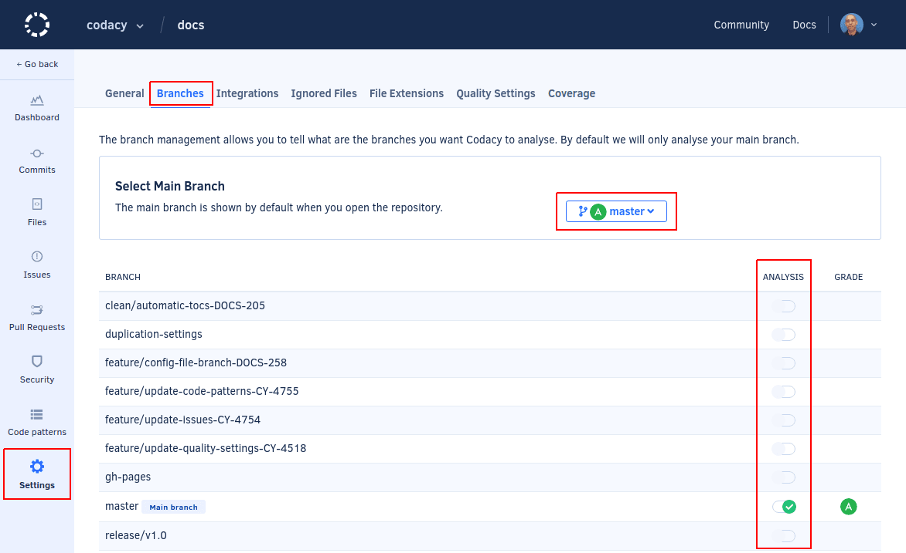
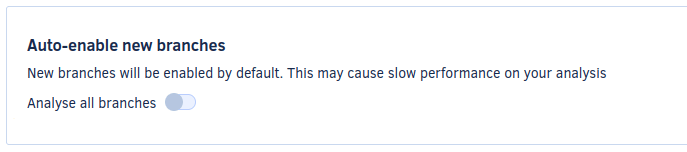

# Managing branches


Codacy automatically analyzes the default branch of your repository (typically `master` or `main` as configured on your Git provider) and loads its data first on dashboards. Codacy also supports analyzing multiple branches.

To change the default branch of your repository or start analyzing other branches:

1.  Open your repository **Settings**, tab **Branches**.

    <!--TODO PLUTO-532 Update screenshot-->

1.  To enable analysis for a new branch, toggle the corresponding switch in the column **Analyze**.

    Enabling a new branch triggers an initial analysis of that branch and the analysis results and information for that branch will become available after the analysis is complete.

1.  To change the default branch on Codacy, click the corresponding **Make default** link that appears when you hover the column **Default**. Changing the default branch on Codacy doesn't change the default branch on your Git provider.

    !!! note
        You can only set as default branch an already enabled branch.

Codacy automatically triggers analysis on the main branch of your repository (typically `master` or `main` as configured on your Git provider), and also supports analyzing multiple branches.

To change the main branch of your repository or enable analysis on other branches, open your repository **Settings**, tab **Branches**. Enabling a new branch triggers an initial analysis of that branch and the analysis results and information for that branch will become available after the analysis is complete.

This page also displays the [code quality grade](../faq/code-analysis/which-metrics-does-codacy-calculate.md) for each enabled branch.

<!--TODO PLUTO-532 Update screenshot-->

!!! note
    **If you're using Codacy Self-hosted** you can also configure Codacy to automatically enable all new branches that are pushed to the repository.

    


Codacy manages pull request branches and inactive branches as follows:

-   **Pull request branches**

    Codacy automatically analyzes branches corresponding to new pull requests and also enables the target branches if they're disabled.

-   **Inactive branches**

    Codacy automatically disables analysis for branches that don't have any commits for more than 2 weeks, except for the main branch and pull request branches that are analyzed automatically.
