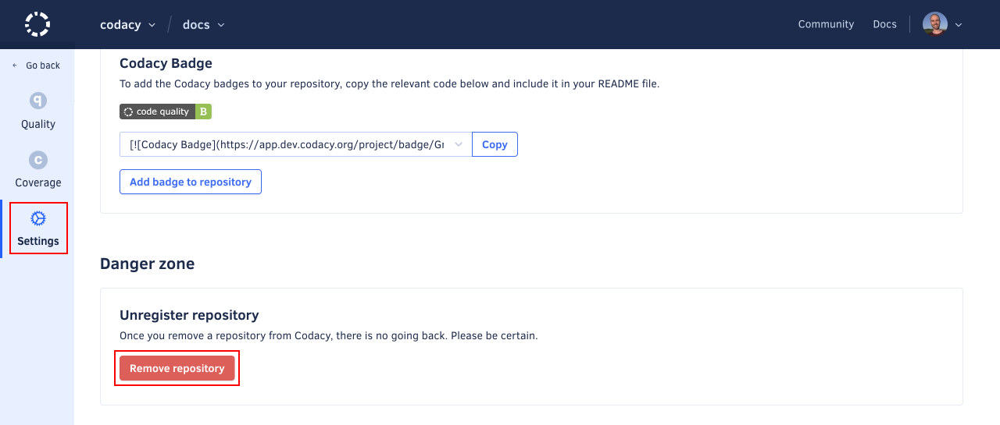

# Removing your repository

To stop Codacy from analyzing your repository, you must remove the repository from Codacy.

Removing a repository from Codacy completely removes the configurations and all data related to your repository from Codacy. This operation doesn't make any changes on your Git provider.

!!! important
    To remove a repository from Codacy you must have [administrator permissions](../organizations/roles-and-permissions-for-synced-organizations.md) for that repository on your Git provider.

To delete your repository from Codacy:

1.  Open your repository **Settings**, tab **General**.

1.  Click the button **Remove repository** and confirm that you want to remove the repository.

    
