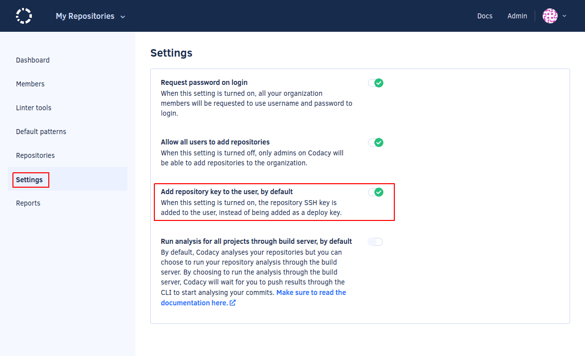

# Using submodules

<!--TODO PLUTO-630 Update content-->

[Git submodules](https://git-scm.com/book/en/v2/Git-Tools-Submodules) allow you to keep a Git repository as a subdirectory within another Git repository. Git submodules are helpful in maintaining a shared configuration file for your team, and then applying it to multiple Git repositories.

## Enabling submodules

By default, Codacy does normal Git clones that don't include submodules to ensure that we only clone necessary repositories. However, if your organization needs to use submodules, please contact us at <mailto:support@codacy.com> asking to enable submodules on Codacy.

After we enabled submodules for your organization, do the following:

1.  **If you're using Codacy Self-hosted**, you must [update the license](../chart/maintenance/license.md).

1.  If your submodules are:

    -   **Public repositories**, make sure that your Git URL uses the HTTPS protocol
    -   **Private repositories**, make sure that your Git URL uses the SSH protocol.

1.  If you already have repositories on Codacy where you want to use submodules, add a new SSH key to your git provider account for each of these repositories. On the repository **Settings** page, you can click the link **Add new user key** to go to your Git provider page where you manage your user account SSH keys.

    !!! note
        **If you're using GitLab Cloud**, navigate to the page **Settings** and click the button **Generate New User Key** for each repository. Codacy generates new keys on your user account.

    When you add a repository to Codacy, Codacy adds a new SSH key to your repository using an integration with your Git provider. Codacy uses this SSH key every time it needs to clone that repository. When you're using submodules, Codacy needs to clone additional repositories it has no access to. Since there is no way of identifying the submodules of a repository before cloning the repository, Codacy adds the SSH keys to the user account so that it has access to the same repositories as the user.

    

1.  If you're using submodules to share an analysis tool configuration file across your repositories, check if your tool recursively searches the subdirectories of your repositories for configuration files.

    If your tool doesn't detect the configuration files in the submodule directories, you must include a configuration file directly in the root of your repositories referencing the configuration files in the submodule directories.

## Using submodules on new repositories

You must repeat steps 2 to 4 above every time you add new repositories with submodules to Codacy.

**If you're using Codacy Self-hosted**, you can make this the default behavior for all new repositories by enabling **Add project key to the user, by default** in **Administration**, page **Settings**.

!!! important
    **If you're using Bitbucket Cloud** this setting must be turned off since automatically adding the user keys isn't supported.

## See also

-   [Add an SSH key to your GitHub account](https://docs.github.com/en/authentication/connecting-to-github-with-ssh/generating-a-new-ssh-key-and-adding-it-to-the-ssh-agent)
-   [Add an SSH key to your Bitbucket account](https://support.atlassian.com/bitbucket-cloud/docs/configure-ssh-and-two-step-verification/)
