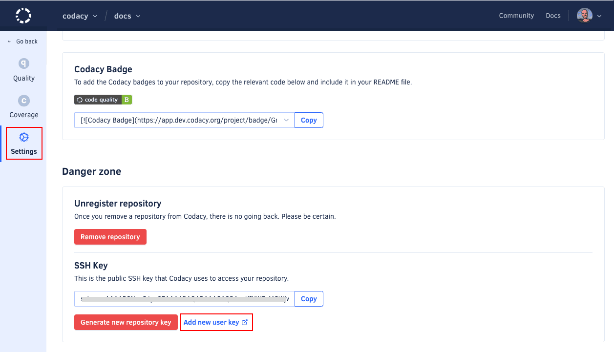

# Using submodules

[Git submodules](https://git-scm.com/book/en/v2/Git-Tools-Submodules) allow you to keep a Git repository as a subdirectory within another Git repository. Git submodules are helpful in maintaining a shared configuration file for your team, and then applying it to multiple Git repositories.

By default, Codacy does normal Git clones that **don't include submodules** to ensure that we only clone necessary repositories. If your organization needs to use submodules, you can request Codacy to enable this feature for you.

!!! note
    GitHub only: Your repository and the repositories that you add as submodules must belong to the same GitHub organization.

## Prerequisites for using submodules

1.  Contact us at <mailto:support@codacy.com> asking to enable submodules on Codacy.

1.  **If you're using Codacy Self-hosted**, [update your license](../chart/maintenance/license.md).

1.  If your submodules are:<!--TODO PLUTO-772 Validate prerequisites-->
    -   **Public repositories**, make sure that your Git URL uses the HTTPS protocol.
    -   **Private repositories**, make sure that your Git URL uses the SSH protocol.

## Enabling submodules on a repository

When using submodules, you must do the following for all your existing and new repositories:

1.  **For GitLab and Bitbucket**, [update the public SSH key](#update-key) that Codacy uses to access your repository.

1.  If you're using submodules to share an analysis tool configuration file across your repositories, check if your tool recursively searches the subdirectories of your repositories for configuration files.

    If your tool doesn't detect the configuration files in the submodule directories, you must include a configuration file directly in the root of your repositories referencing the configuration files in the submodule directories.

## Updating the public SSH key to access the repository {: id="update-key"}

!!! info "This section applies only to GitLab and Bitbucket"

On GitLab and Bitbucket organizations, Codacy generates a repository key when you add a repository to Codacy and uses it to clone that repository. When you're using submodules, Codacy needs to clone additional repositories it may not have access to. To overcome this, Codacy must use an SSH key of your user account to have access to the same repositories as your user.

To update your GitLab or Bitbucket public SSH key that Codacy uses to access your repository, do the following:

1.  Open the repository **Settings**, tab **General**. In the **Danger zone** area, you have the **SSH Key** generated by Codacy to access your repository.

1.  Depending on your Git provider, do the following to update the key:

    -   For GitLab, click the button **Generate New User Key**. Codacy removes the existing repository key and creates the new SSH key on your user account automatically.

    -   For Bitbucket:
        1.  Take note of the existing key.
        1.  Remove this Codacy key from the repository settings on your Git provider.
        1.  Click the link **Add new user key**. This takes you to the Git provider page where you can manage your user account SSH keys.
        1.  Add a new SSH key to your Git provider account.

    

## Automating user keys for new repositories

!!! info "This section applies only to Codacy Self-hosted"

You can set Codacy to automatically add the new SSH key to your Git provider account for all new repositories by enabling **Add project key to the user, by default** on the **Administration** console, page **Settings**.

!!! important
    **If you're using Bitbucket Cloud** this setting must be turned off since automatically adding the user keys isn't supported.

## See also

-   [Configure repository settings in Bitbucket](https://support.atlassian.com/bitbucket-cloud/docs/configure-repository-settings/)
-   [Add an SSH key to your Bitbucket account](https://support.atlassian.com/bitbucket-cloud/docs/configure-ssh-and-two-step-verification/)
