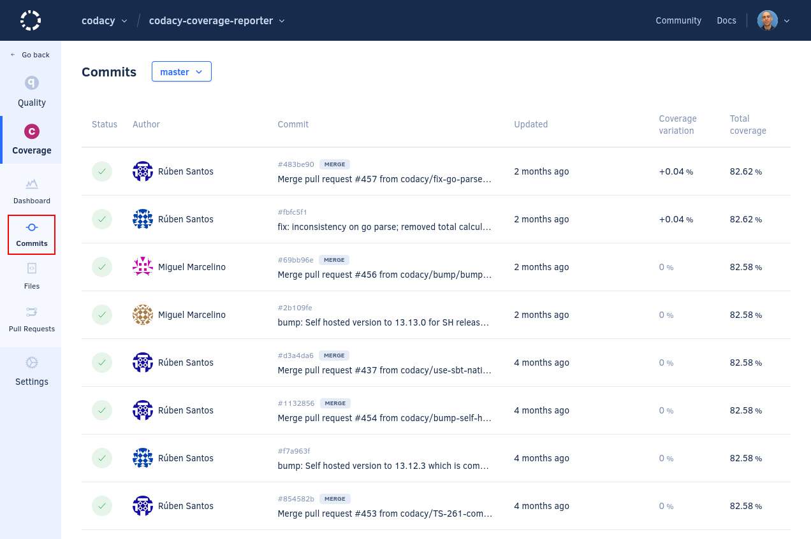
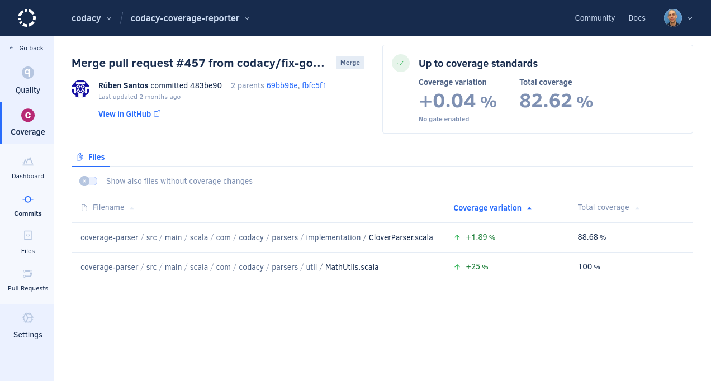

# Coverage Commits page

The **Coverage Commits page** displays an overview of the commits in your repository, such as the analysis status and coverage for each commit. This allows you to monitor the evolution of coverage in your repository per commit.

By default, the page lists the commits on the main branch of your repository but if you have [more than one branch enabled](../repositories-configure/managing-branches.md) you can use the drop-down list at the top of the page to display commits on other branches.

Click a specific commit to see detailed information about the code coverage changes introduced by that commit.

The next sections describe each area of the commit detail page.

## Commit information {: id="info"}

This area displays detailed information about the commit:

-   Commit message
-   Committer, SHA hash, and parent commits
-   Date
-   Link to the commit on your Git provider

<!--coverage-overview-start-->
## {{ page.meta.page_name.capitalize() }} coverage overview {: id="coverage-overview"}

This area displays the coverage gate status and an overview of the coverage metrics for the {{ page.meta.page_name }}:

-   The quality gate status is either **Up to coverage standards** or **Not up to coverage standards** depending on the [coverage gate rules](../repositories-configure/adjusting-quality-gates.md) for your repository.

    If you don't have any rules enabled for {{ page.meta.page_name }}s, the status is always **Up to coverage standards**.

-   The following coverage metrics for the {{ page.meta.page_name }}, displayed either as a **positive or negative variation**, or **no variation** (represented by `=`)**no variation** (represented by `=`), or **not applicable** (represented by `∅`):


    -   **Coverage variation:** Variation of code coverage percentage relative to the parent commit
    -   **Total coverage:** Coverage value of the repository at this commit

    -   **Diff coverage:** Code coverage of the coverable lines added or changed by the pull request, or `∅` (not applicable) if there aren't any coverable lines added or changed
    -   **Coverage variation:** Variation of code coverage percentage relative to the target branch of the pull request


    !!! note
        Learn how Codacy calculates the code quality metrics in more detail:

        -   [Which coverage metrics does Codacy calculate?](../faq/code-analysis/which-metrics-does-codacy-calculate.md#code-coverage)
        -   [Why does Codacy show unexpected coverage changes?](../faq/code-analysis/why-does-codacy-show-unexpected-coverage-changes.md)

-   The **colors** depend on the [coverage gate rules](../repositories-configure/adjusting-quality-gates.md) for your repository:

    -   **Green:** The metric passes the coverage gate
    -   **Red:** The metric fails the coverage gate
    -   **Gray:** There aren't coverage gate rules configured for the metric or the value doesn't impact the coverage gate

<!-- vale off -->

<!-- vale on -->
<!--coverage-overview-end-->

<!--tab-files-start-->
## Files tab

The **Files** tab displays the coverage variation that the {{ page.meta.page_name }} introduces to the files in your repository relative to the parent committarget branch, displayed either as a **positive or negative variation**, or **no variation** (represented by `=`):

The option **Show also files without coverage changes** allows you to list all files that the {{ page.meta.page_name }} updates, even if their coverage doesn't change.

<!-- vale off -->

<!-- vale on -->
<!--tab-files-end-->
