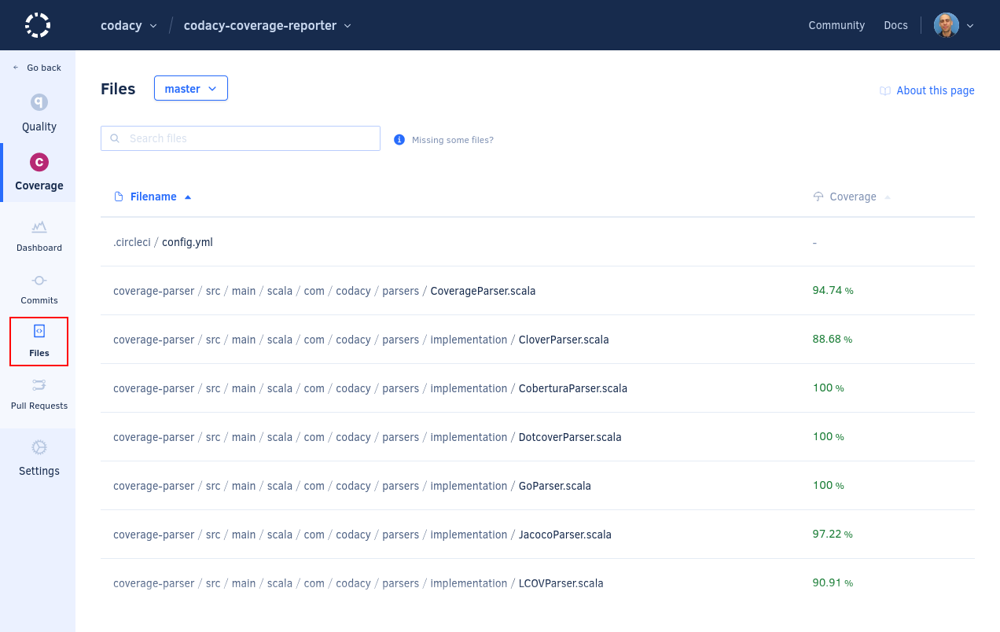
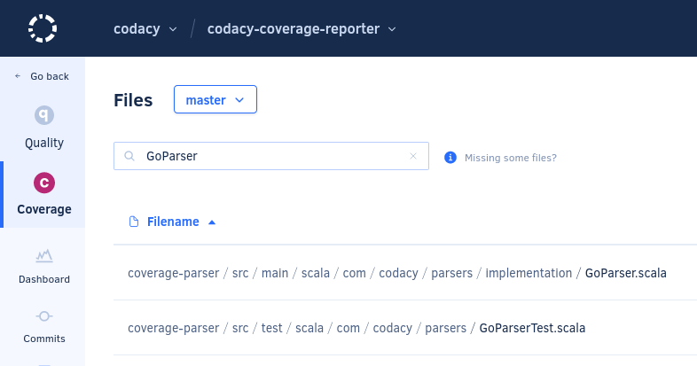
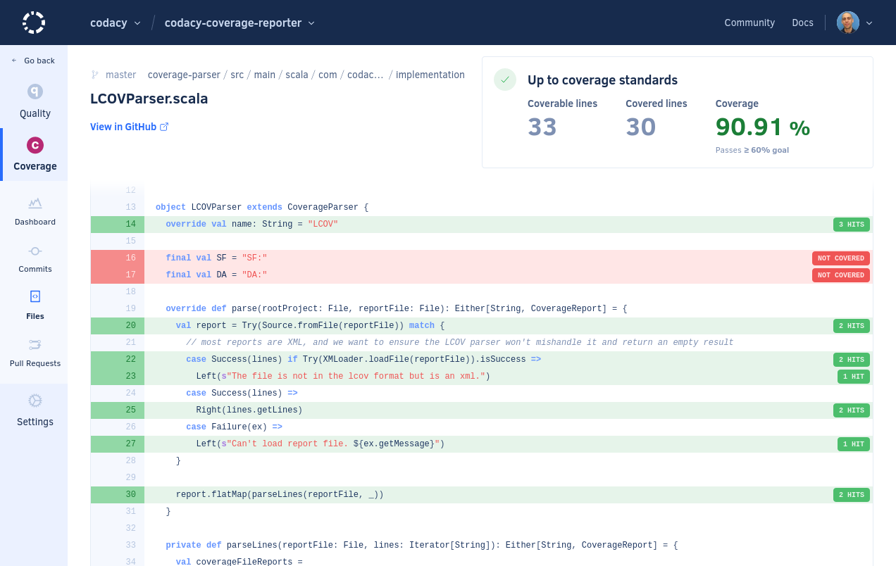

# Coverage Files page

The **Coverage Files page** displays the current code coverage information for each analyzed file in your [enabled repository branches](../repositories-configure/managing-branches.md).

By default, the page lists the files on the main branch of your repository but if you have [more than one branch enabled](../repositories-configure/managing-branches.md) you can use the drop-down list at the top of the page to display files on other branches.

Codacy displays the files in alphabetical order by default, but you can sort the list by each column to help you identify which files need more test coverage.

!!! note
    [You can use the Codacy API](../codacy-api/examples/obtaining-code-quality-metrics-for-files.md) to generate reports or obtain coverage metrics for the files in your repositories in a more flexible way.

Use the search box to filter the list and find specific files:

## File details

Click a specific file to see more detailed coverage information for that file, including:

-   **Coverable lines:** Source lines of code that can be covered by tests
-   **Covered lines:** Source lines of code that are covered by tests
-   **Coverage:** Percentage of coverable source lines of code that are covered by tests

The page also shows the source code of the file and identifies which lines of code are covered by tests (green background) or not (red background).

## Why are some files missing? {: id="missing-files"}

The Files page only displays files in your repository that were analyzed by Codacy. This means that some of your files may be missing from the list, for example:

-   **You're viewing the incorrect branch**

    Not all files may exist in all branches of your repositories. Make sure that you're displaying files for the correct branch.

-   **The file might be ignored**

    The Files page doesn't display [ignored files](../repositories-configure/ignoring-files.md) that aren't meant to be analyzed, including the [files that Codacy ignores by default](../repositories-configure/ignoring-files.md#default-ignored-files).

-   **The file has an extension that is not on the list of supported extensions**

    Codacy has a [list of file extensions](../repositories-configure/file-extensions.md) associated with each language. Codacy doesn't analyze or display files with extensions that aren't associated with a language.

-   **The file might be too big**

    Codacy doesn't analyze or display files that are over a certain size. [Read more details](../faq/troubleshooting/why-is-my-file-over-150-kb-missing.md) for information on how to overcome this limit.

## See also

-   [Which metrics does Codacy calculate?](../faq/code-analysis/which-metrics-does-codacy-calculate.md)
-   [Using the Codacy API to obtain code quality metrics for files](../codacy-api/examples/obtaining-code-quality-metrics-for-files.md)
