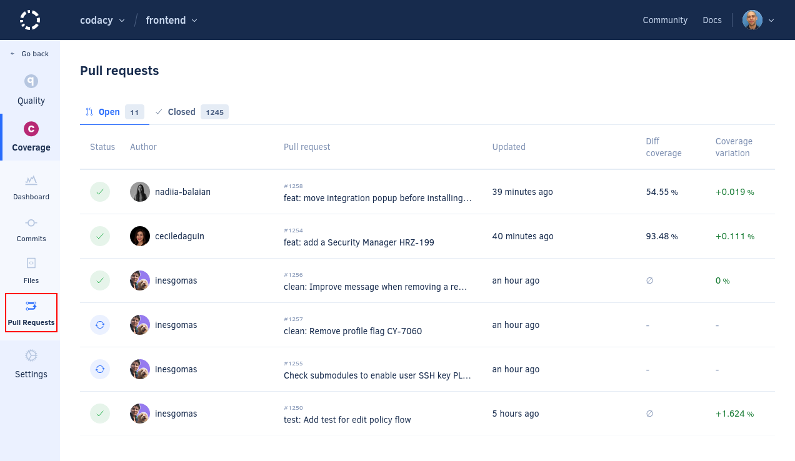
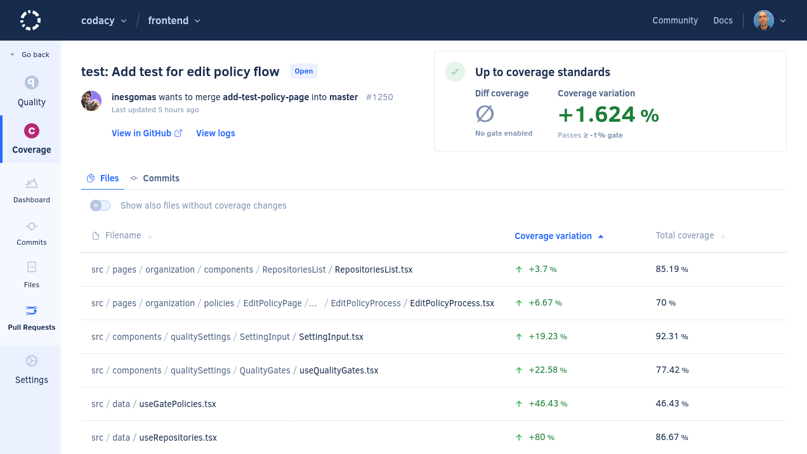
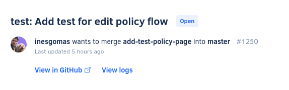
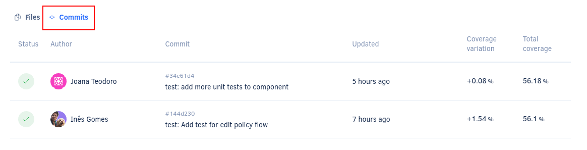

# Coverage Pull Requests page

The **Coverage Pull Requests page** displays an overview of the pull requests in your repository, such as the status and coverage metrics for each pull request. This allows you to monitor the coverage of the work in progress in your repository.

By default, the page lists open pull requests but you can click the **Closed** tab at the top of the list to display the closed pull requests.

Click a specific pull request to see detailed coverage information for that pull request.

The next sections describe each area of the pull request detail page.

## Pull request information {: id="info"}

This area displays detailed information about the pull request:

-   Pull request title and pull request status
-   Pull request author, pull request branch, target branch, and pull request identifier on the Git provider
-   Last updated date of the pull request
-   Link to the pull request on your Git provider
-   Codacy logs<!--NOTE As an improvement, explain how to read the logs in more detail-->





## Commits tab

The **Commits** tab displays an overview of each commit included in the pull request, such as the status and coverage metrics for each commit.

Click a specific commit to see [detailed information about that commit](commits.md#info).

## See also

-   [Which metrics does Codacy calculate?](../faq/code-analysis/which-metrics-does-codacy-calculate.md)
