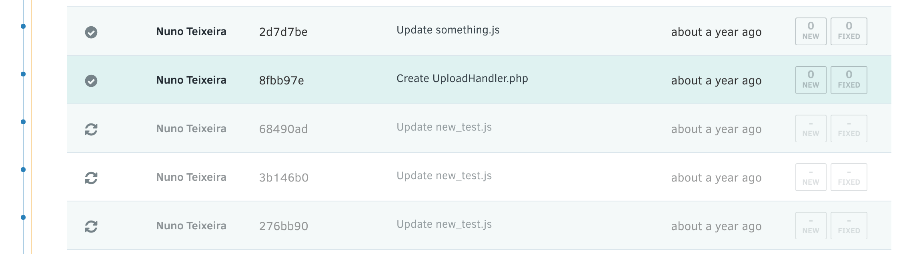
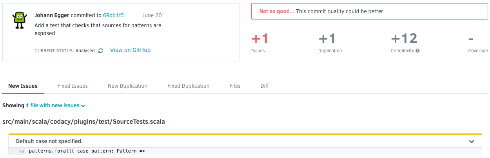
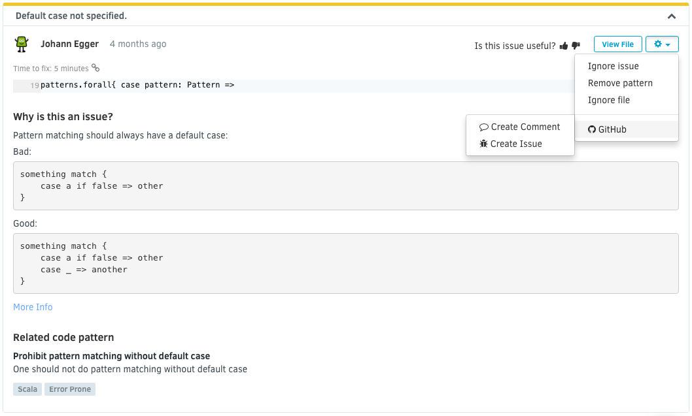
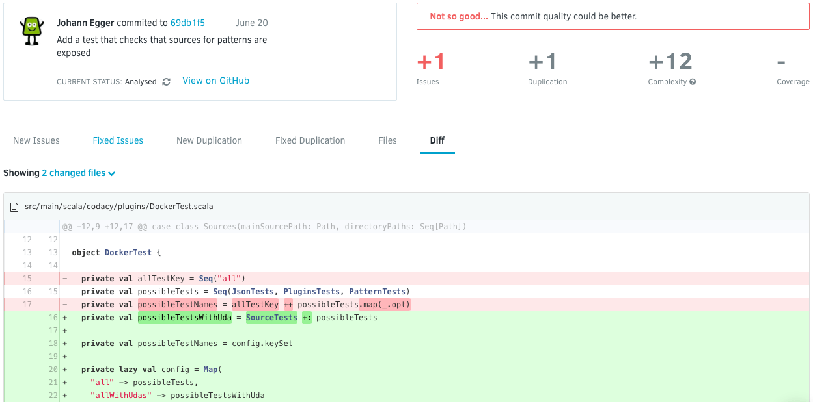

# Commits View

## 1. Commit list

This list is meant to give you an overview of the repository's commits, providing valuable information about changes and quality improvements. Click on the row to see more details.

Visualization of the commits defaults to the main branch of the repository. This can be changed by selecting another branch on the combo box.

When viewing the commits list, some commits may still not have been analysed, either because the analysis is still running or belongs to a branch that has not been selected for analysis. These can be easily identified by the status column. Just hover the icon to get some extra info.

If any commit created or fixed any issue on the repository, that information will be displayed on the right-hand side of the list, allowing for a quick overview of the repository quality evolution.

## 2. Commit detail

The commit detail will show you an overview of what changed in that particular commit, showing all the differences that were introduced.

A detailed issue delta information is always available, showing exactly which issues were fixed or created in each commit.

By expanding an issue, you can find information on why it's an issue, how to solve it, and links to community sources on the problem found.
You will also find a few additional options, including "Ignore issue", "Remove pattern", "Ignore file", and also integrations you may have enabled.

The changed files can also be reviewed using a git diff visualizer, helping achieve a quick and easy code review.

