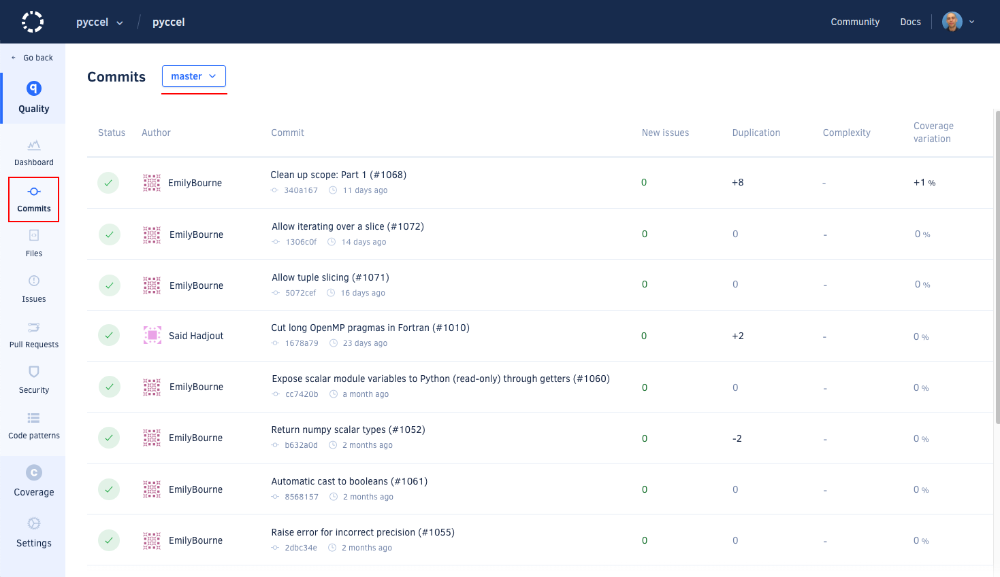
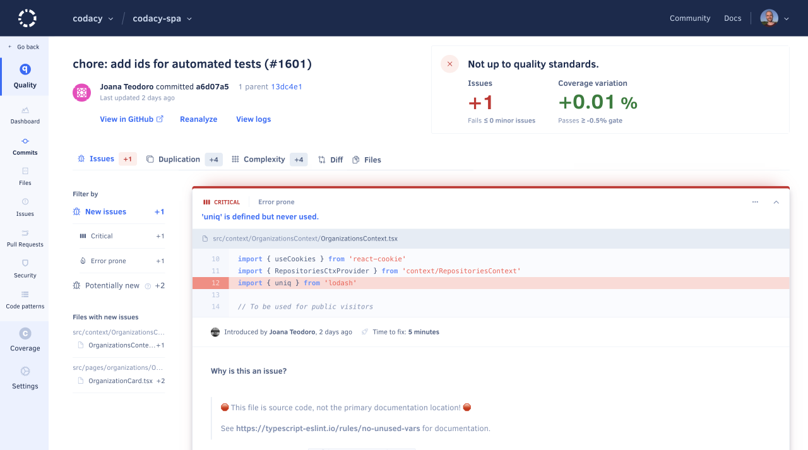
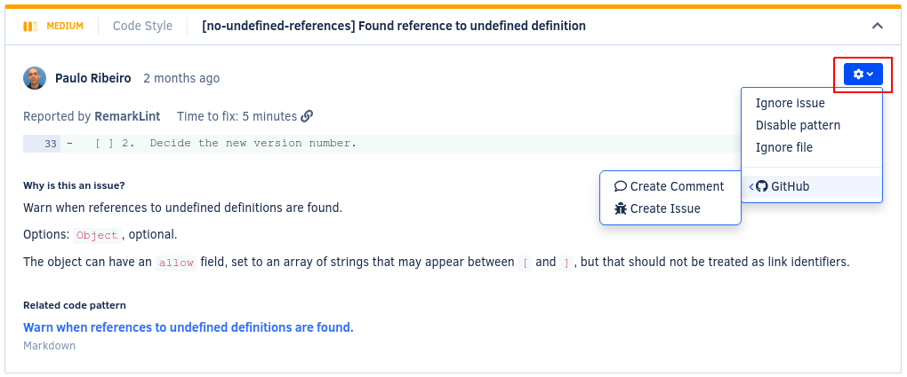
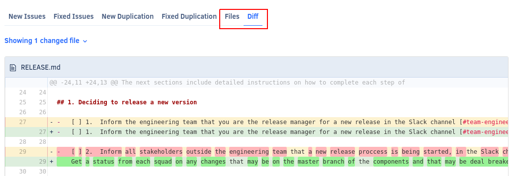
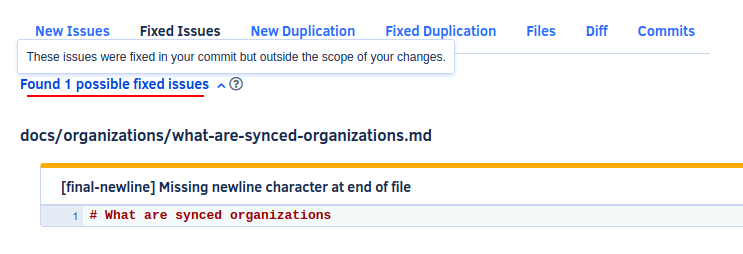

# Commits page

The **Commits page** displays an overview of the commits in your repository, such as the analysis status and the number of new and fixed issues for each commit. This allows you to monitor the evolution of the code quality in your repository per commit.

By default, the page lists the commits on the main branch of your repository but if you have [more than one branch enabled](../repositories-configure/managing-branches.md) you can use the drop-down list at the top of the page to display issues on other branches.

## Commit detail

Click a specific commit to see detailed information about the quality changes in that commit.

The commit detail displays:

-   The status and logs of the analysis of the commit
-   An overview of the code quality changes introduced by the commit
-   The list of issues and duplication blocks that the commit created or fixed
-   The list of files and the lines of code changed in the commit



Use the options in the cogwheel menu of each issue to [ignore and manage issues](issues.md#ignoring-and-managing-issues).

The commit differences view allows you to review the lines of code changed in the commit.

## Possible issues

In some situations, Codacy may report either new or fixed **possible** issues on a commit or pull request. This means that the code analysis detected new or fixed issues in lines of code that weren't changed by that commit or pull request.

