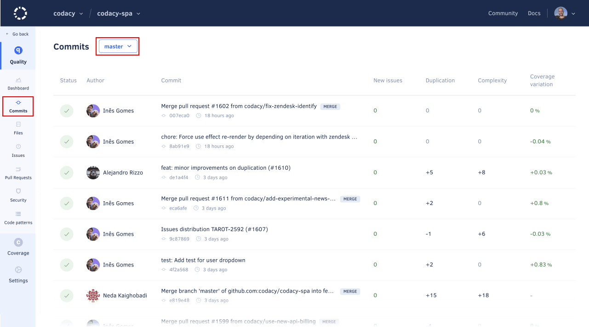

# Commits page

The **Commits page** displays an overview of the commits in your repository, such as the analysis status and the number of new and fixed issues for each commit. This allows you to monitor the evolution of the code quality in your repository per commit.

By default, the page lists the commits on the main branch of your repository but if you have [more than one branch enabled](../repositories-configure/managing-branches.md) you can use the drop-down list at the top of the page to display issues on other branches.

## Commit detail

Click a specific commit to see detailed information about the quality changes in that commit.

The commit detail displays:

-   The status and logs of the analysis of the commit
-   An overview of the code quality changes introduced by the commit
-   The list of issues and duplication blocks that the commit created or fixed
-   The list of files and the lines of code changed in the commit

    !!! note
        The changes in the number of issues and code quality metrics introduced by the commit are displayed either as a **positive or negative variation**, or **no variation** (represented by `=`).

        Depending on the languages being analyzed or if you haven't [set up coverage for your repository](../coverage-reporter/index.md), **some metrics may be missing** (represented by `-`).



Use the options in the cogwheel menu of each issue to [ignore and manage issues](issues.md#ignoring-and-managing-issues).

The commit differences view allows you to review the lines of code changed in the commit.

## Possible issues

In some situations, Codacy may report either new or fixed **possible** issues on a commit or pull request, which means that the code analysis detected these issues in lines of code that weren't changed by that commit or pull request. This gives you awareness to how your changes may be affecting other parts of your code.

The following are example situations that can lead to possible issues:

-   The issue was either created or fixed in the current commit, but the static code analysis tools reported the issue on a line that didn't change in the commit. For example, if you remove the line containing the declaration of a variable you may get an "undeclared variable" issue in other lines that use that variable.

-   If a file had [more than 50 issues reported by the same tool](../faq/code-analysis/does-codacy-place-limits-on-the-code-analysis.md) and you push a new commit that fixes some of these issues, Codacy will report more issues until the limit of 50 issues. These issues will be possible issues if they're outside the lines of code changed in the current commit.
