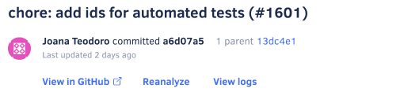
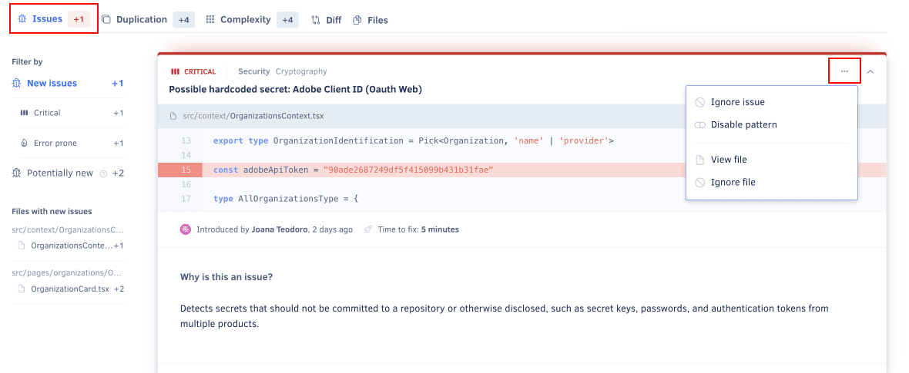
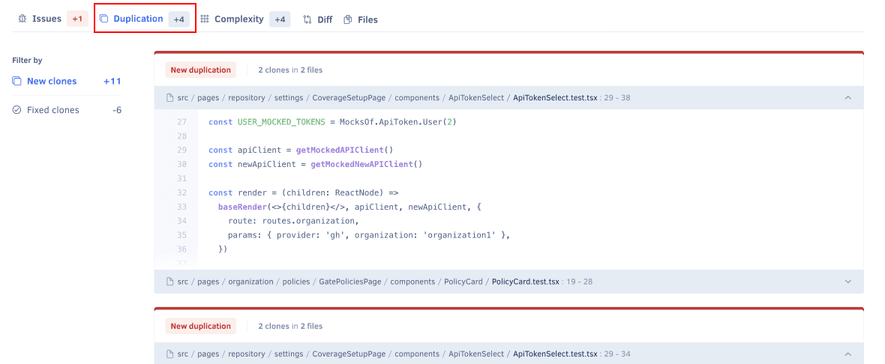
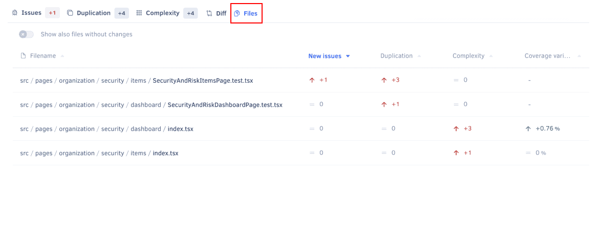

# Commits page

The **Commits page** displays an overview of the commits in your repository, such as the analysis status and the number of new and fixed issues for each commit. This allows you to monitor the evolution of the code quality in your repository per commit.

By default, the page lists the commits on the main branch of your repository but if you have [more than one branch enabled](../repositories-configure/managing-branches.md) you can use the drop-down list at the top of the page to display issues on other branches.

Click a specific commit to see detailed information about the code quality changes introduced by that commit.

The next sections describe each area of the commit detail page.

## Commit status

This area displays:

-   The information that identifies the commit, such as the SHA hash, the commit message, and the date
-   The analysis status and a link to the analysis logs
-   A link to the commit on your Git provider

## Commit quality overview

This area displays the overview of the code quality metrics for the commit:

-   The changes in the number of issues and code quality metrics introduced by the commit are displayed either as a **positive or negative variation**, or **no variation** (represented by `=`).
-   The **colors** depend on the [quality gate rules](../repositories-configure/adjusting-quality-settings.md) that are configured on your repository quality settings:
    -   **Green:** The metric passes the quality gate
    -   **Red:** The metric fails the quality gate
    -   **Gray:** There aren't quality gate rules configured for the metric
-   Depending on the languages being analyzed or if you haven't [set up coverage for your repository](../coverage-reporter/index.md), **some metrics may not be calculated** (represented by `-`).

## Issues tabs

The **New Issues** and **Fixed Issues** tabs display the list of issues that the commit created or fixed.



Use the options in the cogwheel menu of each issue to [ignore and manage issues](issues.md#ignoring-and-managing-issues).

## Duplication tabs

The **New Duplication** and **Fixed Duplication** tabs display the list of duplicated blocks that the commit created or fixed.

## Files tab

The **Files** tab displays an overview of the code quality changes introduced by each file that was changed in the commit.

## Diff tab

The **Diff** tab displays the line differences in each file that was changed in the commit.

## Possible issues

<!--NOTE
    Consider moving this section to a dedicated page under the FAQs-->

In some situations, Codacy may report either new or fixed **possible** issues on a commit or pull request, which means that the code analysis detected these issues in lines of code that weren't changed by that commit or pull request. This gives you awareness to how your changes may be affecting other parts of your code.

The following are example situations that can lead to possible issues:

-   The issue was either created or fixed in the current commit, but the static code analysis tools reported the issue on a line that didn't change in the commit. For example, if you remove the line containing the declaration of a variable you may get an "undeclared variable" issue in other lines that use that variable.

-   If a file had [more than 50 issues reported by the same tool](../faq/code-analysis/does-codacy-place-limits-on-the-code-analysis.md) and you push a new commit that fixes some of these issues, Codacy will report more issues until the limit of 50 issues. These issues will be possible issues if they're outside the lines of code changed in the current commit.

!!! note
    **If you're using GitHub** you may see [annotations](../repositories-configure/integrations/github-integration.md#annotations)  for possible issues reported under **Unchanged files with check annotations** on the **Files changed** tab of your pull requests.

    This happens when Codacy reports possible issues in files that weren't changed in your pull request. [Read more about this GitHub feature](https://developer.github.com/changes/2019-09-06-more-check-annotations-shown-in-files-changed-tab/){: target="_blank"}.
