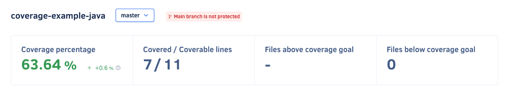

# Quality Coverage page

The **Quality Coverage page** displays the current code coverage information in your [enabled repository branches](../repositories-configure/managing-branches.md).

If your repository doesn't have coverage set up, you can learn more on how to [add coverage to your repository](../coverage-reporter/index.md).

By default, the page displays the coverage information on the main branch of your repository. However, if you have [more than one branch enabled](../repositories-configure/managing-branches.md), you can select other branches using the drop-down list at the top of the page.

## Code coverage metrics

Codacy displays the following [code coverage metrics](../faq/code-analysis/which-metrics-does-codacy-calculate.md#code-coverage), if available:

-   **Coverage percentage:** Percentage of code covered
-   **Covered / Coverable lines:** Number of covered and coverable lines
-   **Files above coverage goal:** Number of files that contain a coverage percentage above the repository's goal
-   **Files below coverage goal:** Number of files that contain a coverage percentage below the repository's goal

If the repository does not have a coverage goal set, the code coverage metrics will not show values for Files above and below coverage goals.

!!! note
    You can set a Coverage goal for the repository [inside repository settings, on the Goals tab](../repositories-configure/adjusting-quality-goals.md).

## Open pull requests

The **Open pull requests** area displays the last updated pull requests and the split between the status of all open pull requests in your repository:

-   **Up to standards:** Pull requests that meet the minimum quality levels
-   **Not up to standards:** Pull requests that failed to meet at least one of the [quality gate rules defined for the repository](../repositories-configure/adjusting-quality-gates.md)
-   **Analyzing:** Pull requests currently being analyzed by Codacy

Click a bar segment to display only pull requests with the corresponding status.

To see the details of pull requests, click a pull request from the list or click **See all pull requests** to open the [list of pull requests](pull-requests.md) in the repository.

## Low covered files with issues 

For a better files comprehension in terms of issues and coverage simultaneously, Codacy displays a files table where it is possible to check which files contain a low coverage percentage and a high number of issues.

## Low covered files with high complexity

For a better files comprehension in terms of complexity and coverage simultaneously, Codacy displays a files table where it is possible to check which files contain a low coverage percentage and a high complexity rate.

## See also

-   [Which metrics does Codacy calculate?](../faq/code-analysis/which-metrics-does-codacy-calculate.md)
-   [Using the Codacy API to obtain code quality metrics for files](../codacy-api/examples/obtaining-code-quality-metrics-for-files.md)
