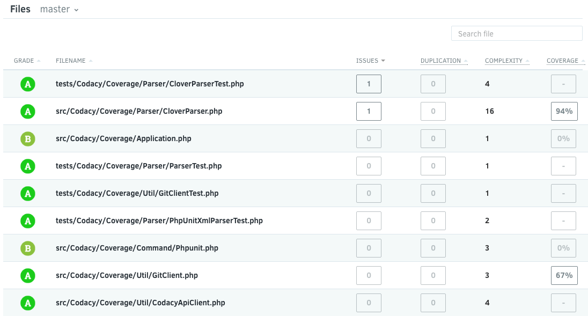
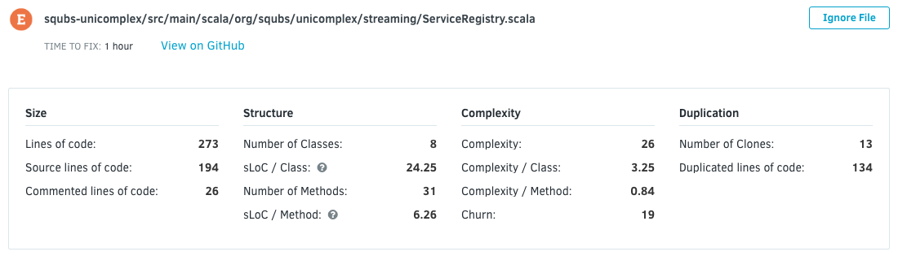
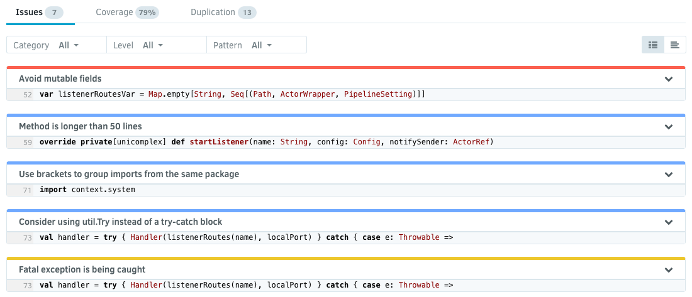
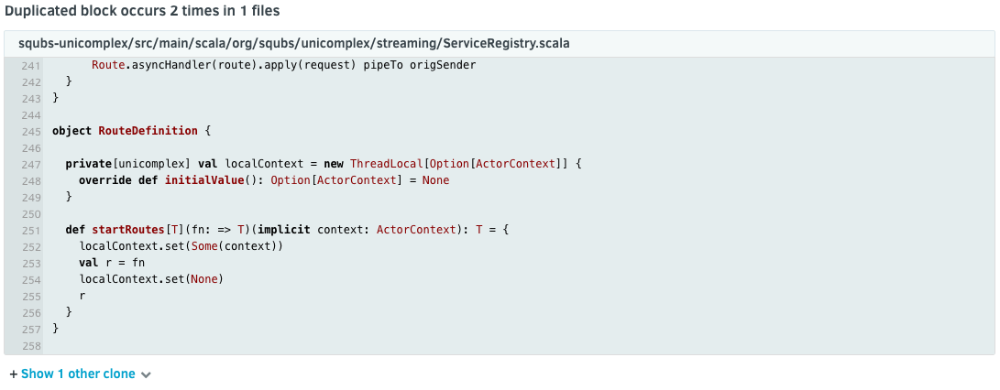

# Files View

The file list shows all the files in your repository, sortable by six different columns: [grade](/hc/en-us/articles/207994765-What-are-the-different-Grades-and-how-are-they-calculated-"), filename, number of issues, code duplication, [complexity](https://en.wikipedia.org/wiki/Cyclomatic_complexity), and code coverage. There is also a search filter available.

This allows you to keep track or focus some of your time on files with low coverage, high complexity, too many issues, or simply a lot of duplication that could be refactored.

When you click in a filename, it opens the File detail.

The file detail starts with a header where you can see a lot of statistical information on the file:

Below that header you will find a tab selector for further information on issues, coverage, and duplication. By default you will see the list of issues in the file. On the right-hand side you can toggle between a list view and the annotated source code.

You can open each issue to get more information on it. For more information about Issues, please check our [Issues view](/hc/en-us/articles/360009180134-Issues-View) page.

The coverage tab shows you which lines are covered by tests and which aren't.

As for the duplication tab, here you can find duplicated code and links to its clones.

