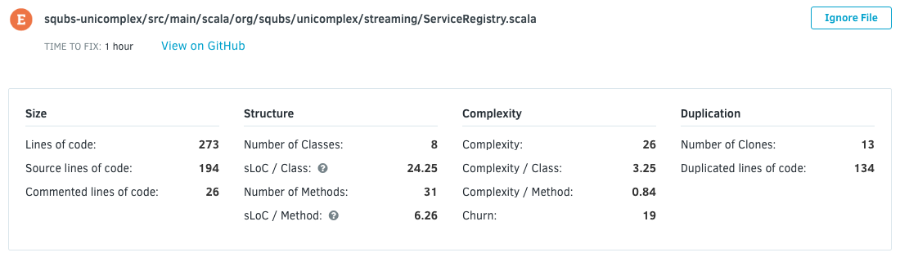
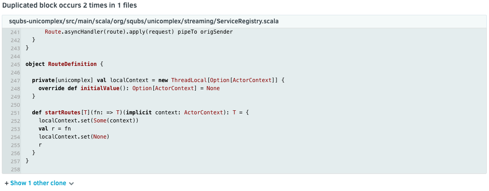

# Files page

The file list shows all the files in your repository, sortable by six different columns:

-   [Grade](../faq/repositories/what-are-the-different-grades-and-how-are-they-calculated.md)
-   Filename
-   Number of issues
-   Code duplication
-   [Complexity](https://en.wikipedia.org/wiki/Cyclomatic_complexity)
-   Code coverage

There is also a search filter available.

This allows you to keep track or focus some of your time on files with low coverage, high complexity, too many issues, or a lot of duplication that could be refactored.

Clicking on a filename opens the File detail.

The file detail starts with a header where you can see a lot of statistical information on the file:

Below that header you will find a tab selector for further information on issues, coverage, and duplication. By default you will see the list of issues in the file. On the right-hand side you can toggle between a list view and the annotated source code.

You can open each issue to get more information on it. For more information about Issues, please check the [Issues page](issues.md).

The coverage tab shows you which lines are covered by tests and which aren't.

As for the duplication tab, here you can find duplicated code and links to its clones.

