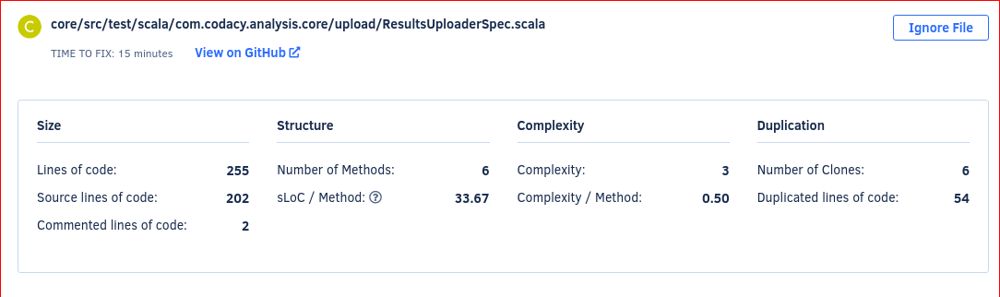
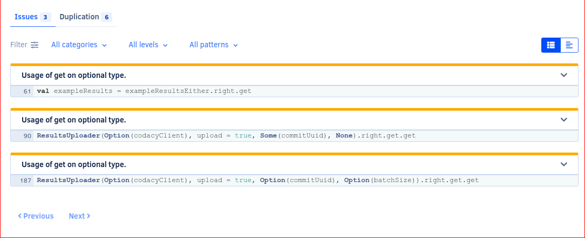
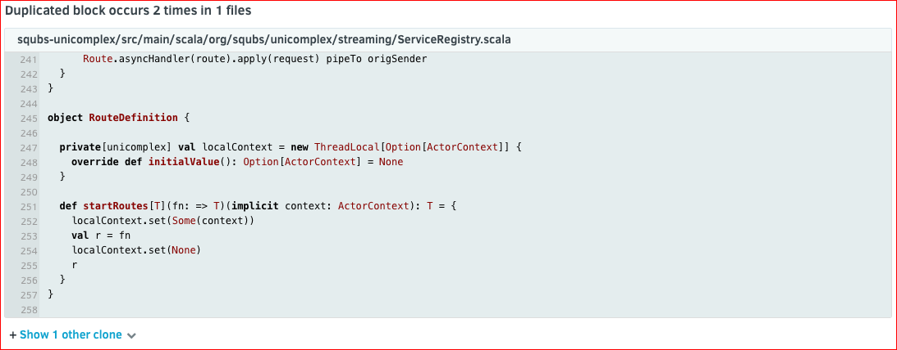

# Files page

The **Files page** displays the current code quality information for the individual files in your [active repository branches](../repositories-configure/managing-branches.md).

Codacy displays the following information for each file, if available:

-   Grade
-   Number of issues
-   Duplication
-   Complexity
-   Code coverage

You can sort the list by each column to help you identify which files you should improve or refactor next.

If you have more than one branch enabled on Codacy, use the drop-down list next to the page title to select the branch that contains the files to display on the list. Use the search box to filter the list and find specific files.

<!--TODO
    Move information about the files that aren't displayed on the list here. -->

## File details

Select a file to open the details for that file.

The file detail starts with a header where you can see a lot of statistical information on the file.

Below that header you will find a tab selector for further information on issues, coverage, and duplication. By default you will see the list of issues in the file. On the right-hand side you can toggle between a list view and the annotated source code. <!-- TODO Also mention the filters -->

-   You can open each issue to get more information on it. For more information about Issues, please check the [Issues page](issues.md).

-   The coverage tab shows you which lines are covered by tests and which aren't.

-   As for the duplication tab, here you can find duplicated code and links to its clones. <!--TODO Important mentioning the links to clones -->

    
