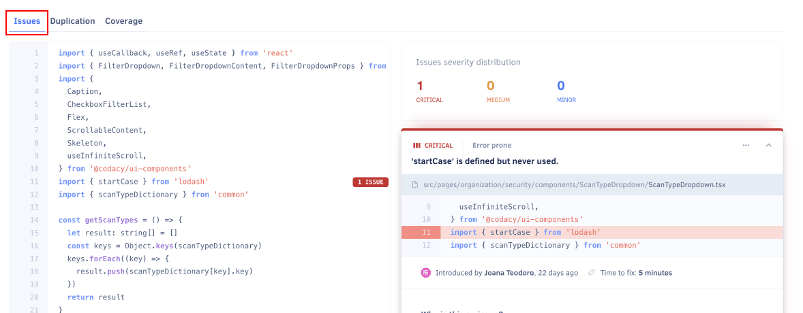

# Files page

The **Files page** displays the current code quality information for each analyzed file in your [enabled repository branches](../repositories-configure/managing-branches.md).

By default, the page lists the files on the main branch of your repository but if you have [more than one branch enabled](../repositories-configure/managing-branches.md) you can use the drop-down list at the top of the page to display files on other branches.

Codacy displays the following [code quality metrics](../faq/code-analysis/which-metrics-does-codacy-calculate.md) for each file, if available:

-   Grade
-   Number of issues
-   Complexity
-   Duplication
-   Code coverage

Codacy displays the files in alphabetical order by default, but you can sort the list by each column to help you identify which files you should improve or refactor next.

!!! note
    [You can use the Codacy API](../codacy-api/examples/obtaining-code-quality-metrics-for-files.md) to generate reports or obtain code quality metrics for the files in your repositories in a more flexible way.

Use the search box to filter the list and find specific files:

## File details

Click a specific file to see more detailed analysis information for that file, including statistics on:

-   **Size:** Lines of code, source lines of code, and commented lines of code
-   **Structure:** Number of methods and ratio of source lines of code per number of methods
-   **Complexity:** Complexity and complexity per method
-   **Duplication:** Number of clones and duplicated lines of code

The button **Ignore File** allows you to ignore the selected file on future Codacy analysis.

Depending on the available analysis information for the file, Codacy displays one or more of the following tabs:

-   **Issues:** Shows all issues in the file. The tab displays the number of issues in the file.

    Toggle between the list and annotated source code views using the icon on the right-hand side. When using the list view, you can use filters to help you find specific issues in the file. Select an issue to see more information about the issue.

    For more information about the available information and filters and for each issue see the [Issues page](issues.md).

    

-   **Duplication:** Shows all duplicated blocks in the file with links to the clones of each block. The tab displays the number of duplicated blocks in the file.

    Toggle between the list and annotated source code views using the icon on the right-hand side.

    

-   **Coverage:** Shows which lines of code are covered by tests or not. The tab displays the percentage of coverable lines that are covered by tests in the file.

    

## Why are some files missing? {: id="missing-files"}

The Files page only displays files in your repository that were analyzed by Codacy. This means that some of your files may be missing from the list, for example:

-   **You're viewing the incorrect branch**

    Not all files may exist in all branches of your repositories. Make sure that you're displaying files for the correct branch.

-   **The file might be ignored**

    The Files page doesn't display [ignored files](../repositories-configure/ignoring-files.md) that aren't meant to be analyzed, including the [files that Codacy ignores by default](../repositories-configure/ignoring-files.md#default-ignored-files).

-   **The file has an extension that is not on the list of supported extensions**

    Codacy has a [list of file extensions](../repositories-configure/file-extensions.md) associated with each language. Codacy doesn't analyze or display files with extensions that aren't associated with a language.

-   **The file might be too big**

    Codacy doesn't analyze or display files that are over a certain size. [Read more details](../faq/troubleshooting/why-is-my-file-over-150-kb-missing.md) for information on how to overcome this limit.

## See also

-   [Which metrics does Codacy calculate?](../faq/code-analysis/which-metrics-does-codacy-calculate.md)
-   [Using the Codacy API to obtain code quality metrics for files](../codacy-api/examples/obtaining-code-quality-metrics-for-files.md)
