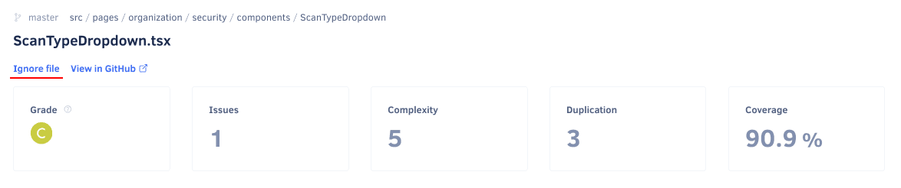

# Quality Files page

The **Quality Files page** displays the current code quality information for each analyzed file in your [enabled repository branches](../repositories-configure/managing-branches.md).

By default, the page lists the files on the main branch of your repository. However, if you have [more than one branch enabled](../repositories-configure/managing-branches.md), you can select other branches using the drop-down list at the top of the page.

Codacy displays the following [code quality metrics](../faq/code-analysis/which-metrics-does-codacy-calculate.md) for each file, if available:

-   **Grade:** The overall grade of the file
-   **Issues:** Number of issues and issue types
-   **Complexity:** Complexity and complexity per method
-   **Duplication:** Number of clones and duplicated lines of code
-   **Coverage:** Percentage of coverable source lines of code that are covered by tests

Codacy displays the files in alphabetical order by default, but you can sort the list by each column to help you identify which files you should improve or refactor next.

!!! note
    [You can use the Codacy API](../codacy-api/examples/obtaining-code-quality-metrics-for-files.md) to generate reports or obtain code quality metrics for the files in your repositories in a more flexible way.

Use the search box to filter the list and find specific files:

## File details

Click a specific file to see more detailed analysis information for that file.

The header of the file detail page displays the same code quality metrics as the Files page, along with an **Ignore file** link to ignore the file, and a link to view the file on your Git provider.

Depending on the available analysis information for the file, Codacy displays one or more of the following tabs:

-   **Issues:** Shows the annotated source code on the left-hand side and the matching list of issues and issue distribution by severity on the right-hand side. Each listed issue includes the same information and options available on the [Quality Issues page](issues.md).

    

-   **Duplication:** Shows the annotated source code on the left-hand side and the matching list of duplicated code blocks and counts on the right-hand side. Each listed duplicate includes the number of clones and their locations.

    

-   **Coverage:** Shows which lines of code are covered by tests (green background labeled with test hit count) or not covered (red background), along with the counts of coverable and covered lines and the file status with respect to the [coverage goal](../repositories-configure/adjusting-quality-goals.md).

    

## Why are some files missing? {: id="missing-files"}

The Files page only displays files in your repository that were analyzed by Codacy. This means that some of your files may be missing from the list, for example:

-   **You're viewing the incorrect branch**

    Not all files may exist in all branches of your repositories. Make sure that you're displaying files for the correct branch.

-   **The file might be ignored**

    The Files page doesn't display [ignored files](../repositories-configure/ignoring-files.md) that aren't meant to be analyzed, including the [files that Codacy ignores by default](../repositories-configure/ignoring-files.md#default-ignored-files).

-   **The file has an extension that is not on the list of supported extensions**

    Codacy supports a [list of file extensions](../repositories-configure/languages.md#configuring-file-extensions) associated with each language. Codacy doesn't analyze or display files with extensions that aren't associated with a language.

-   **The file might be too big**

    Codacy doesn't analyze or display files that are over a certain size. [Read more details](../faq/troubleshooting/why-is-my-file-over-150-kb-missing.md) for information on how to overcome this limit.

## See also

-   [Which metrics does Codacy calculate?](../faq/code-analysis/which-metrics-does-codacy-calculate.md)
-   [Using the Codacy API to obtain code quality metrics for files](../codacy-api/examples/obtaining-code-quality-metrics-for-files.md)
