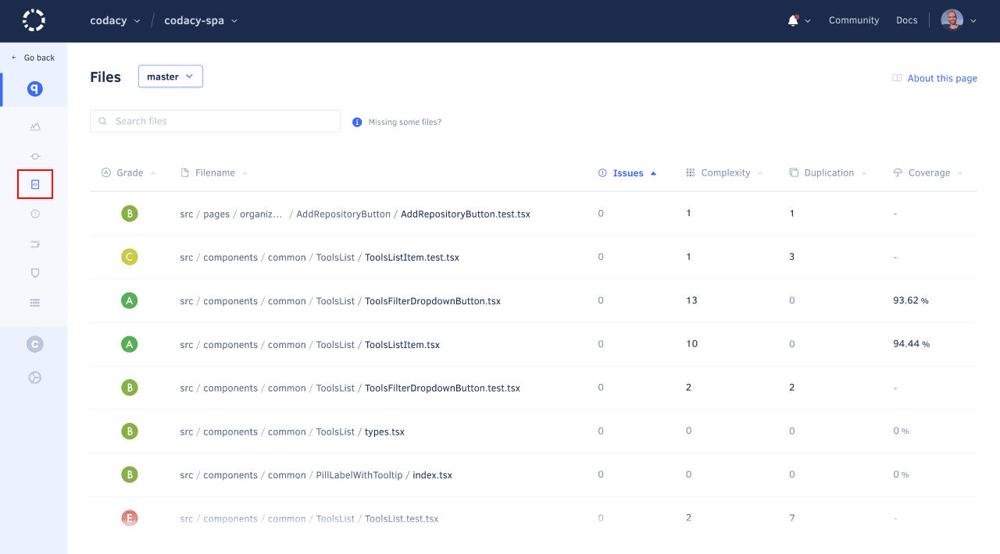
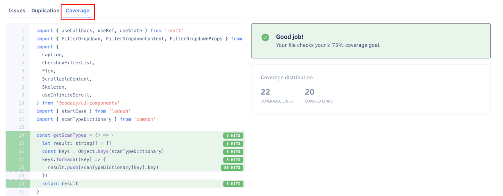

# Files page

The **Files page** displays the current code quality information for the individual files in your [active repository branches](../repositories-configure/managing-branches.md).

Codacy displays the following information for each file, if available:

-   Grade
-   Number of issues
-   Duplication
-   Complexity
-   Code coverage

You can sort the list by each column to help you identify which files you should improve or refactor next.

If you have more than one branch enabled on Codacy, use the drop-down list next to the page title to select the branch that contains the files to display on the list. Use the search box to filter the list and find specific files.

<!--TODO
    Move information about the files that aren't displayed on the list here. -->

## File details

Select a file to see more detailed analysis information for that file, including statistics on:

-   **Size:** Lines of code, source lines of code, and commented lines of code
-   **Structure:** Number of methods and ratio of source lines of code per number of methods
-   **Complexity:** Complexity and complexity per method
-   **Duplication:** Number of clones and duplicated lines of code

The button **Ignore File** allows you to ignore the selected file on future Codacy analysis.

Depending on the available analysis information for the file, Codacy displays one or more of the following tabs:

-   **Issues:** Shows all issues in the file.

    Toggle between the list and annotated source code views using the icon on the right-hand side. When using the list view, you can use filters to help you find specific issues in the file. Select an issue to see more information about the issue.

    For more information about the available filters and information for each issue see the [Issues page](issues.md).

    

-   **Duplication:** Shows all duplicated blocks in the file with links to the clones of each block.

    Toggle between the list and annotated source code views using the icon on the right-hand side. 

    

-   **Coverage:** Shows which lines of code are covered by tests or not.

    
