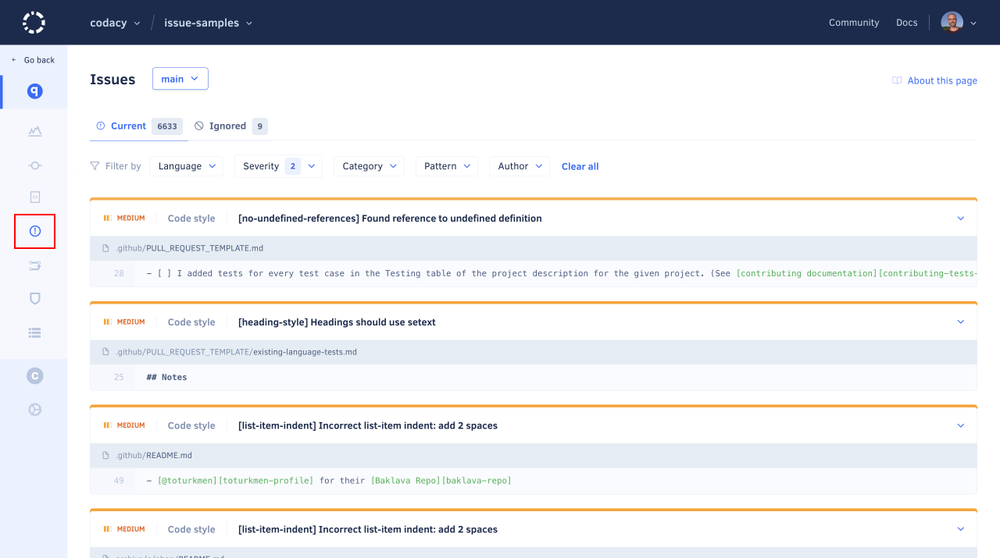
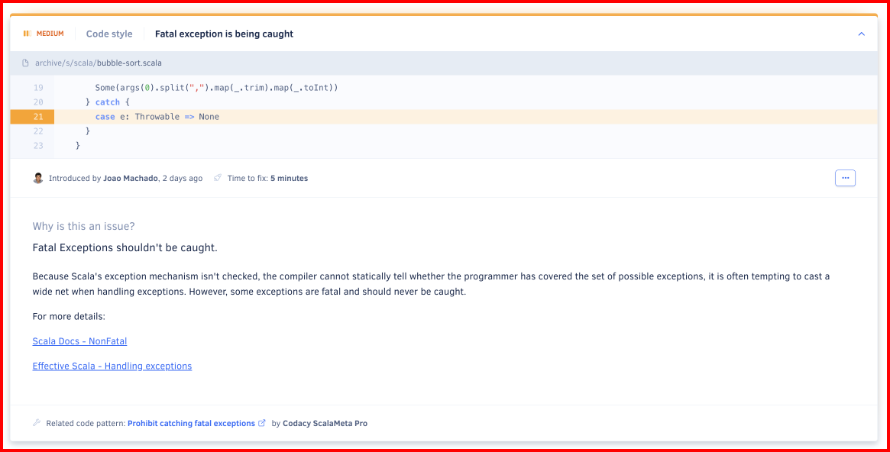
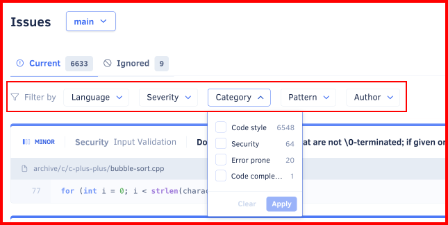
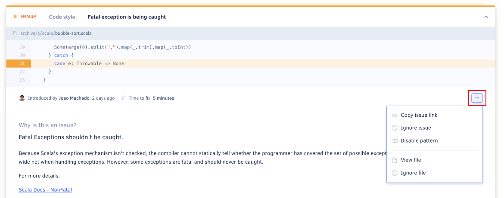
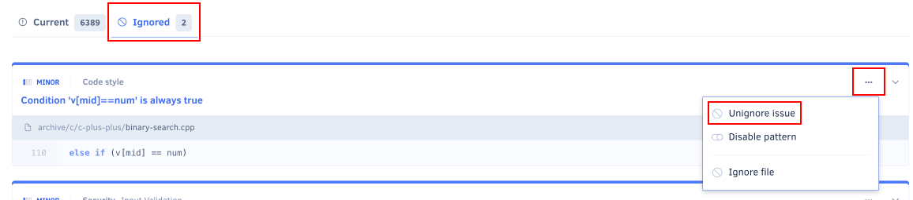

# Issues page

The **Issues page** lists all the issues that Codacy detected in your repository, including the severity level and category of each issue.

By default, the page lists the issues on the main branch of your repository but if you have [more than one branch enabled](../repositories-configure/managing-branches.md) you can use the drop-down list at the top of the page to display issues on other branches.

Click the title of an issue to see the following information:

-   The contributor and date of the commit that introduced the issue
-   The [tool that reported the issue](../getting-started/supported-languages-and-tools.md) and the estimated time to fix it
-   What's the issue and how to solve it
-   The programming language and category of the issue

## Filtering issues

Filter the list of issues to find specific issues, such as the issues with the highest severity or security issues:

You can define one or more of the following filters:

-   **Language:** Programming language of the file where the issues were detected

-   **Issue category:** One of the following types of issue:

    

-   **Severity level:** Potential impact of the issues:

    -   **Critical (red):** The most dangerous issues that you should prioritize fixing since they identify code that's susceptible to serious problems regarding security and compatibility
    -   **Medium (yellow):** You should check out these issues, as they're based on code standards and conventions
    -   **Minor (blue):** The least critical issues, such as code style issues

-   **Pattern:** [Code pattern](../repositories-configure/code-patterns.md) that detected the issue

-   **Author:** Commit author that introduced the issue on the code

!!! note
    Each code pattern has a pre-defined severity level and at the moment Codacy doesn't support customizing that information.

## Ignoring and managing issues

Use the options in the cogwheel menu of each issue to:

-   **Ignore the issue** and hide it from the list.

    Codacy will no longer report the issue after the next analysis of your repository. For example, you can ignore issues that you disagree with because:

    -   Your team won't tackle the issues in the immediate future
    -   The issue isn't relevant in the specific context of your code
    -   The issue is a false positive

    See [how to restore ignored issues](#restoring-ignored-issues).

    !!! tip
        Organization owners can [configure who is allowed to ignore issues](../organizations/roles-and-permissions-for-synced-organizations.md#change-analysis-configuration).

-   **Disable the code pattern** that detected the issue.

    Codacy will stop using that pattern after the next analysis of your repository, so be sure that you're no longer interested in identifying similar issues. To re-enable patterns use the [Code patterns page](../repositories-configure/code-patterns.md).

    !!! note
        If you're using a [custom configuration file](../repositories-configure/code-patterns.md#using-your-own-tool-configuration-files), you must manage patterns manually on your configuration file.

-   **Ignore the file** where the issue was detected.

    Codacy will no longer analyze that file on your repository, so be sure that you're no longer interested in identifying any type of issues on that file. To remove an ignored file use the [Ignored Files tab](../repositories-configure/ignoring-files.md) in your repository settings.

The menu can include more options depending on the features that you enable on your GitHub or Bitbucket integration:

-   [GitHub integration](../repositories-configure/integrations/github-integration.md)
-   [Bitbucket integration](../repositories-configure/integrations/bitbucket-integration.md)

## Restoring ignored issues

To see the list of ignored issues, click **Current Issues** and select **Ignored Issues**.

To restore an ignored issue, click the button **Unignore** next to the issue title:

