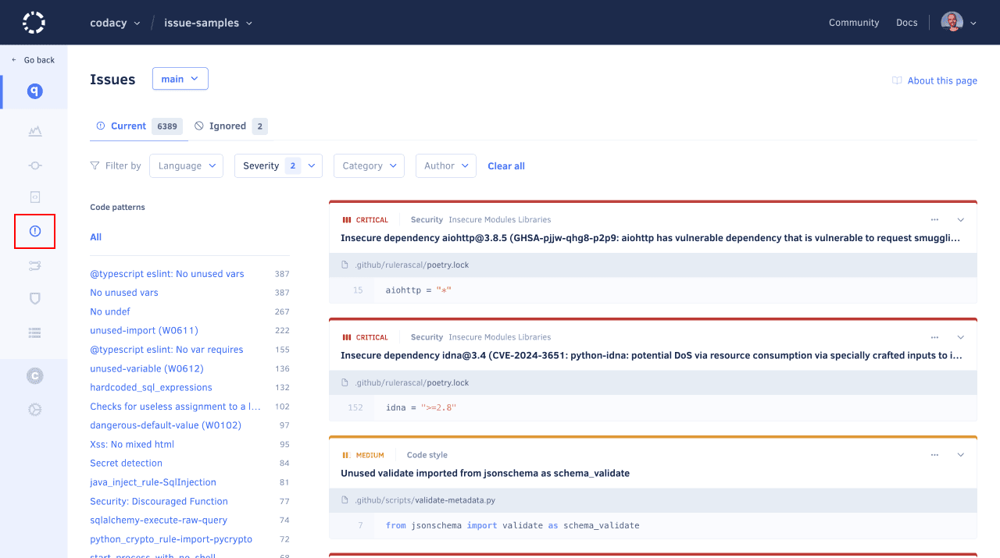
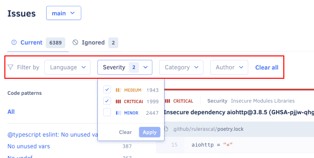
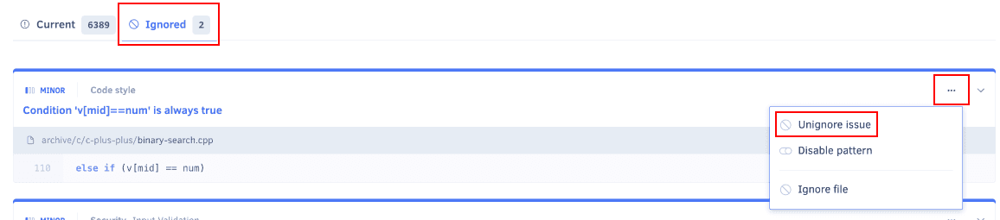
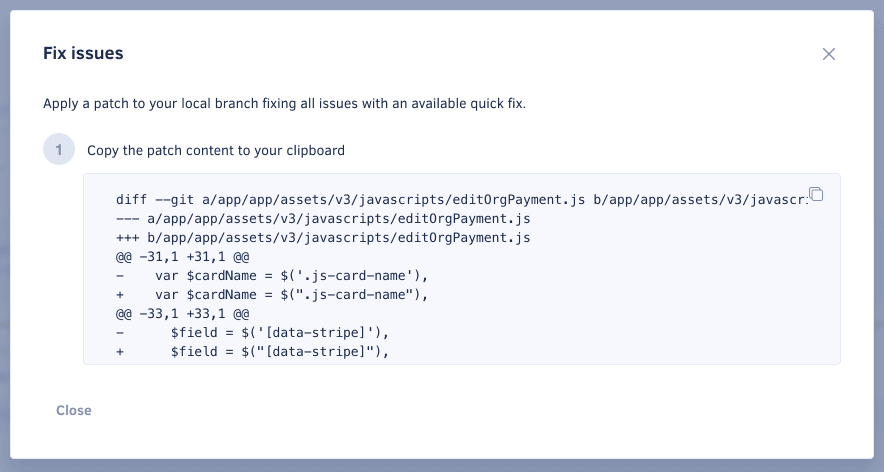

# Quality Issues page

The **Quality Issues page** lists all the issues that Codacy detected in your repository, including the severity level and category of each issue.

By default, the page lists the issues on the main branch of your repository but if you have [more than one branch enabled](../repositories-configure/managing-branches.md) you can use the drop-down list at the top of the page to display issues on other branches.

!!! note
    [You can use the Codacy API](../codacy-api/examples/obtaining-current-issues-in-repositories.md) to generate reports or obtain information about the current issues in your repositories in a more flexible way.

<!--issue-details-start-->
Click the title of an issue card to expand it and see the following information:

-   The committer and date of the commit that introduced the issue, if available
-   The estimated time to fix the issue
-   What the issue is and how to solve it
-   The [tool that reported the issue](../getting-started/supported-languages-and-tools.md) and the related code pattern
-   Where is this pattern enabled: coding standard, repository rules, or configuration file
<!--issue-details-end-->

## Filtering issues

Filter the list of issues to find specific issues, such as the issues with the highest severity or security issues.

The list of code patterns with issues is always visible on the left side of the page. Click a [code pattern](../repositories-configure/configuring-code-patterns.md) to filter the list of issues by that pattern.

You can moreover define one or more of the following filters:

-   **Language:** Programming language of the file where the issues were detected

-   **Severity level:** Potential impact of the issues:

    -   **Critical (red):** The most dangerous issues that you should prioritize fixing since they identify code that's susceptible to serious problems regarding security and compatibility
    -   **Medium (yellow):** You should check out these issues, as they're based on coding standards and conventions
    -   **Minor (blue):** The least critical issues, such as most code style issues

-   **Issue category:** One of the following types of issue:

    

-   **Author:** Commit author that introduced the issue on the code

!!! note
    Each code pattern has a pre-defined severity level and at the moment Codacy doesn't support customizing that information.

## Ignoring and managing issues



Use the options in the menu of each issue to:

-   **Ignore the issue** and hide it from the list.

    Codacy will no longer report the issue after the next analysis of your repository. For example, you can ignore issues that you disagree with because:

    -   Your team won't tackle the issues in the immediate future
    -   The issue isn't relevant in the specific context of your code
    -   The issue is a false positive

    See [how to restore ignored issues](#restoring-ignored-issues).

    !!! tip
        Organization admins can [configure who is allowed to ignore issues](../organizations/roles-and-permissions-for-organizations.md#change-analysis-configuration).

-   **Disable the code pattern** that detected the issue.

    Codacy will stop using that pattern after the next analysis of your repository, so be sure that you're no longer interested in identifying similar issues. To re-enable patterns use the [Code patterns page](../repositories-configure/configuring-code-patterns.md).

    !!! note
        -   If you're using a [custom configuration file](../repositories-configure/configuring-code-patterns.md#using-your-own-tool-configuration-files), you must manage patterns manually on your configuration file.
        -   If your repository is following an [organization coding standard](../organizations/using-coding-standards.md), disabling the code pattern causes the repository to stop following the coding standard. In this case, Codacy asks for your confirmation before accepting the changes and then copies the coding standard configurations to your repository, so you can customize them.

-   **View the file** where the issue was detected.

-   **Ignore the file** where the issue was detected.

    Codacy will no longer analyze that file on your repository, so be sure that you're no longer interested in identifying any type of issues on that file. To remove an ignored file use the [Ignored Files tab](../repositories-configure/ignoring-files.md) in your repository settings.

## Restoring ignored issues

To see the list of ignored issues, click the **Ignored** tab.

To restore an ignored issue, select **Unignore issue** from the options menu:

## Fixing issues automatically

!!! info "This section applies to GitHub repositories only"

If Codacy detects code patterns with suggested fixes, a **Fix issues** button appears above the issue list.

In this case, Codacy generates a patch that enables you to solve all resolvable issues. To apply this patch to the default branch, do the following:

1.  Click the button **Fix issues** to open a modal with a patch that addresses all resolvable issues.

    

1.  Copy the patch content to the clipboard.
1.  Create a new branch from the default branch.
1.  Apply the patch from the repository's root directory, for example with the `pbpaste | patch` command.  

    !!! note
        These changes are automatically generated. Review them to make sure they're correct.

1.  Push the new branch to the repository.
1.  On GitHub, create a pull request from the new branch to the default branch.

## See also

-   [Which metrics does Codacy calculate?](../faq/code-analysis/which-metrics-does-codacy-calculate.md)
-   [Using the Codacy API to obtain current issues in repositories](../codacy-api/examples/obtaining-current-issues-in-repositories.md)
