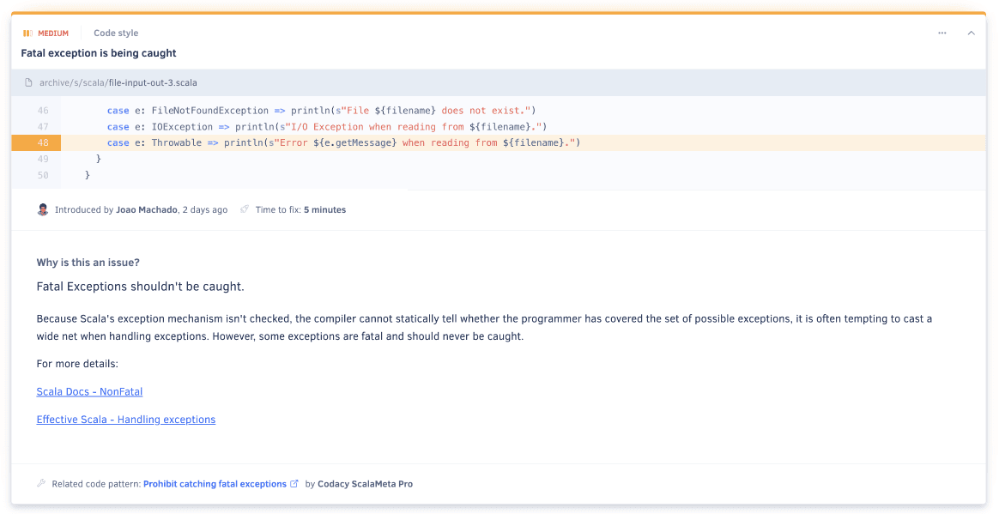
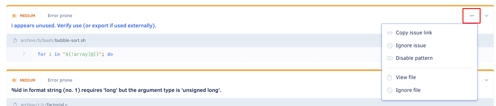

# Issues page

The **Issues page** lists all the issues that Codacy detected in your repository.

By default, the page lists the issues on the main branch of your repository but if you have [more than one branch enabled](../repositories-configure/managing-branches.md) you can use the drop-down list at the top of the page to display issues on other branches.

Click the title of an issue to see the following information:

-   What's the issue and how to solve it
-   Details about the code pattern that detected the issue

## Filtering issues

Filter the list of issues to find particular issues, such as the issues with the highest severity or security issues:

You can define one or more of the following filters:

-   **Language**: Programming language of the file where the issues were detected

-   **Issue category**: One of the following types of issue:

    

-   **Severity level**: Potential impact of the issues:

    -   **Error (red):** The most dangerous issues that you should prioritize fixing since they identify code that's susceptible to serious problems regarding security and compatibility
    -   **Warning (yellow):** You should check out these issues, as they're based on code standards and conventions
    -   **Info (blue):** The least critical issues, such as code style issues

-   **Pattern**: [Code pattern](../repositories-configure/code-patterns.md) that detected the issue

-   **Author**: Commit author that introduced the issue on the code

!!! note
    Each code pattern has a pre-defined severity level and at the moment Codacy doesn't support customizing that information.

## Issue actions

Use the actions in the cogwheel menu of each issue to:

-   [Ignore the issue](#ignoring-issues)
-   [Disable the code pattern](#disabling-patterns) that detected the issue
-   [Ignore the file](#ignoring-files) where the issue was detected 

The menu can include more actions depending on the features that you enable on your GitHub and Bitbucket integration:

-   [GitHub integration](../repositories-configure/integrations/github-integration.md)
-   [Bitbucket integration](../repositories-configure/integrations/bitbucket-integration.md)

### Ignoring issues

Ignoring an issue hides the issue from the list of issues and helps you focus on the issues that your team should tackle.

For example, you can ignore issues that you disagree with because:

-   Your team won't tackle the issues in the immediate feature
-   The issue isn't relevant in the specific context of your code
-   The issue is a false positive

To ignore an issue, click the issue title and select **Ignore issue** on the cogwheel menu. To see the list of ignored issues or restore ignored issues, click **Current Issues** and select **Ignored Issues**:

!!! tip
    Organization owners can [configure who is allowed to ignore issues](../organizations/roles-and-permissions-for-synced-organizations.md#configure-ignore-issues).

### Disabling patterns

To disable the pattern that detected an issue, click the issue title and select **Remove pattern** on the cogwheel menu. To re-enable patterns you must use the [Code patterns page](../repositories-configure/code-patterns.md).

!!! important
    Disabling the pattern that detected an issue means that Codacy will stop using that pattern in the next analysis of your repository, so be sure that you're no longer interested in identifying similar issues.

!!! note
    If you're using a [custom configuration file](../repositories-configure/code-patterns.md#using-your-own-tool-configuration-files), you must manage patterns manually on your configuration file.

### Ignoring files

To [ignore the file](../repositories-configure/ignoring-files.md) that contains an issue, click the issue title and select **Ignore file** on the cogwheel menu.

!!! important
    Ignoring a file means that Codacy will no longer analyze that file on your repository, so be sure that you're no longer interested in identifying any type of issues on that file.
