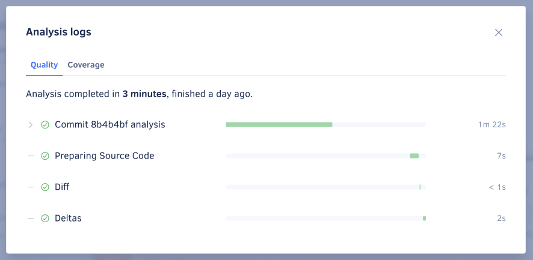
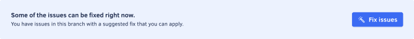

# Quality Pull Requests page

The **Quality Pull Requests page** displays an overview of the pull requests in your repository, such as the analysis status and the code quality metrics for each pull request. This allows you to monitor the code quality of the work in progress in your repository.

By default, the page lists open pull requests, but you can click the **Closed** tab at the top of the list to display the closed pull requests.

Click a specific pull request to see detailed information about the code quality changes introduced by that pull request.

The next sections describe each area of the pull request detail page.

## Pull request status {: id="status"}

This area displays the information that identifies the pull request (name, author, head and base branches, and last updated date), as well as:

-   A link to the pull request on your Git provider
-   A [link to reanalyze the latest pull request commit](../faq/repositories/how-do-i-reanalyze-my-repository.md), present when the committer [is part of your organization](../organizations/managing-people.md)
-   A link to [view analysis logs](#viewing-analysis-logs)





## Commits tab

The **Commits** tab displays an overview of each commit included in the pull request, such as the analysis status and the number of issues introduced.

Click a specific commit to see [detailed information about that commit](commits.md#status).

## Viewing analysis logs

Analysis logs can help you track and understand the performance of the tools and the timing of analyses on your pull requests.

To access these logs, click the **View logs** link in the [pull request status](#status) area. This opens a modal with two tabs:

-   The **Quality** tab displays execution times and outcomes for the tools used to analyze the latest commit of the pull request. It helps identify the duration of each analysis phase and any potential issues.
-   The **Coverage** tab lists reports received for the common ancestor commit and the head commit of the pull request. It helps you spot any issues with the coverage analysis, such as missing coverage reports.

## Fixing issues automatically

!!! info "This section applies to GitHub repositories only"

If Codacy detects code patterns that have suggested fixes, a **Fix issues** button appears above the issue list. Click this button to commit the suggested fixes to the pull request.

## See also

-   [Which metrics does Codacy calculate?](../faq/code-analysis/which-metrics-does-codacy-calculate.md)
