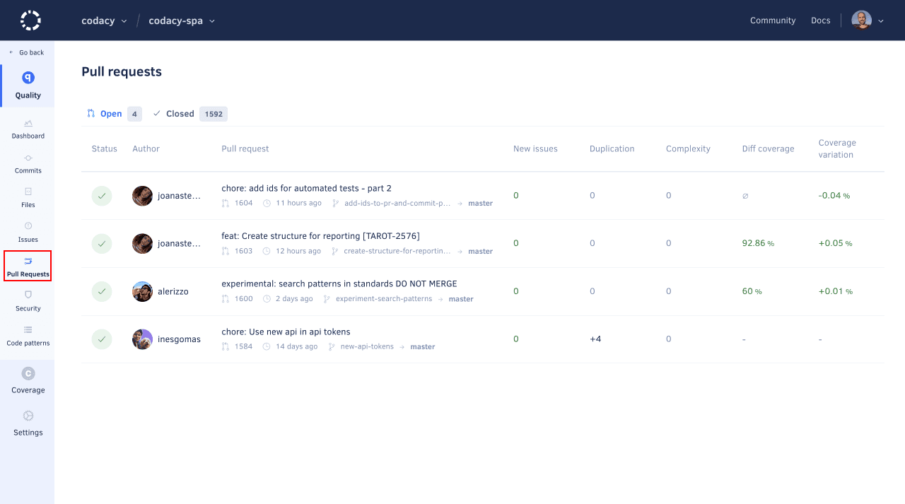

# Pull requests page

The **Pull requests page** displays an overview of the pull requests in your repository, such as the analysis status and the number of new and fixed issues for each pull request. This allows you to monitor the code quality of the work in progress in your repository.

By default, the page lists open pull requests but you can use the drop-down list at the top of the page to display the merged pull requests.

Click a specific pull request to see detailed information about the code quality changes introduced by that pull request.

The next sections describe each area of the pull request detail page.

## Pull request status

This area displays the information that identifies the pull request (head and base branches, date, and name), as well as:

-   The analysis status and a button to re-analyze the last commit on the pull request branch
-   A link to the analysis logs
-   A link to the pull request on your Git provider





## Commits tab

The **Commits** tab displays an overview of each commit included in the pull request, such as the analysis status and the number of new and fixed issues for each commit.

