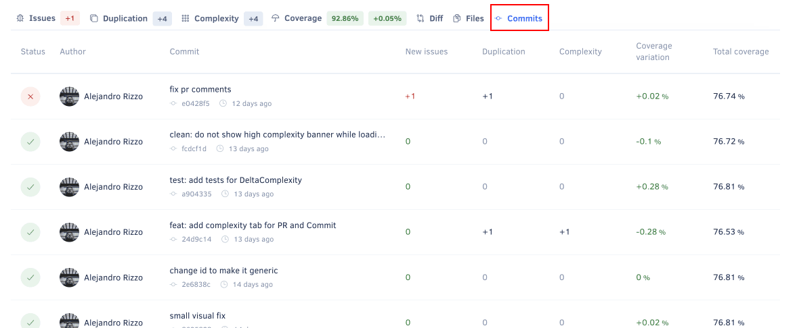

# Quality Pull Requests page

The **Quality Pull Requests page** displays an overview of the pull requests in your repository, such as the analysis status and the code quality metrics for each pull request. This allows you to monitor the code quality of the work in progress in your repository.

By default, the page lists open pull requests but you can click the **Closed** tab at the top of the list to display the closed pull requests.

<!--TODO CY-6556 Update screenshot. It might be tricky to update this screenshot only, because all the remaining screenshots for the Pull Request page are related with one-->

Click a specific pull request to see detailed information about the code quality changes introduced by that pull request.

The next sections describe each area of the pull request detail page.

## Pull request status {: id="status"}

This area displays the information that identifies the pull request (head and base branches, date, and name), as well as:

-   The analysis status and a [button to reanalyze the last commit on the pull request branch](../faq/repositories/how-do-i-reanalyze-my-repository.md) (enabled when the committer [is part of your organization](../organizations/managing-people.md))
-   A link to the analysis logs
-   A link to the pull request on your Git provider





## Commits tab

The **Commits** tab displays an overview of each commit included in the pull request, such as the analysis status and the number of new and fixed issues for each commit.

Click a specific commit to see [detailed information about that commit](commits.md#status).

## See also

-   [Which metrics does Codacy calculate?](../faq/code-analysis/which-metrics-does-codacy-calculate.md)
