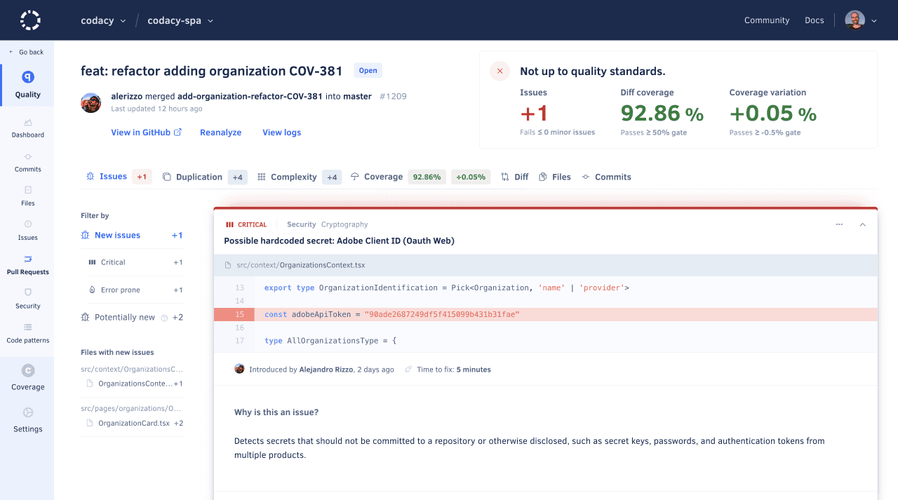

# Quality Pull Requests page

The **Quality Pull Requests page** displays an overview of the pull requests in your repository, such as the analysis status and the code quality metrics for each pull request. This allows you to monitor the code quality of the work in progress in your repository.

By default, the page lists open pull requests but you can click the **Closed** tab at the top of the list to display the closed pull requests.

Click a specific pull request to see detailed information about the code quality changes introduced by that pull request.

<!-- TODO ALA-643 Screenshot -->

The next sections describe each area of the pull request detail page.

## Pull request status {: id="status"}
<!-- TODO ALA-643 Review section -->

This area displays the information that identifies the pull request (head and base branches, date, and name), as well as:

-   The analysis status and a [button to reanalyze the last commit on the pull request branch](../faq/repositories/how-do-i-reanalyze-my-repository.md) (enabled when the committer [is part of your organization](../organizations/managing-people.md))
-   A link to the analysis logs
-   A link to the pull request on your Git provider

<!-- TODO ALA-643 Screenshot -->

<!-- TODO ALA-643 Mention that the PR status displays analysis info when analyzing. This may require copying the section here. -->


## Issues tab

The **Issues** tab displays the lists of issues that the commit created or fixed.



To [ignore or manage an issue](issues.md#ignoring-and-managing-issues), click the associated options menu.

<!-- TODO ALA-643 Screenshot -->



## Duplication tab

The **Duplication** tab displays the lists of duplicated blocks that the {{ page.meta.page_name }} created or fixed.

<!-- TODO ALA-643 Screenshot -->

## Complexity tab
<!-- TODO ALA-643 Draft section -->

<!-- TODO ALA-643 Screenshot -->

## Coverage tab
<!-- TODO ALA-643 Draft section -->

<!-- TODO ALA-643 Screenshot -->

<!-- TODO ALA-643 Confirm tab colors are kept -->


<!-- TODO ALA-643 Confirm the option to show files with no coverage changes is kept -->


## Commits tab

The **Commits** tab displays an overview of each commit included in the pull request, such as the analysis status and the number of issues fixed or introduced.

Click a specific commit to see [detailed information about that commit](commits.md#status).

<!-- TODO ALA-643 Screenshot -->

## See also

-   [Which metrics does Codacy calculate?](../faq/code-analysis/which-metrics-does-codacy-calculate.md)
