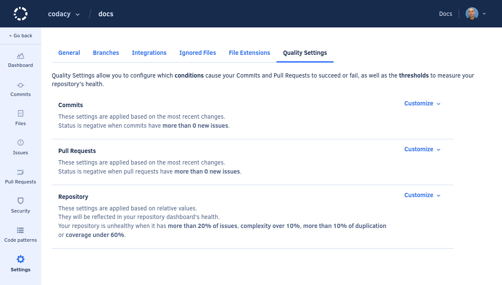
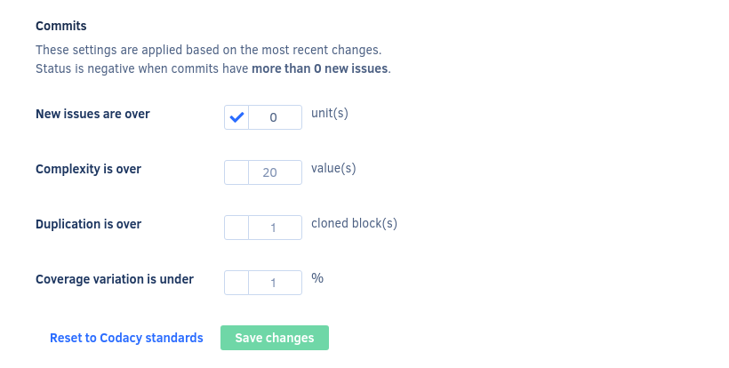
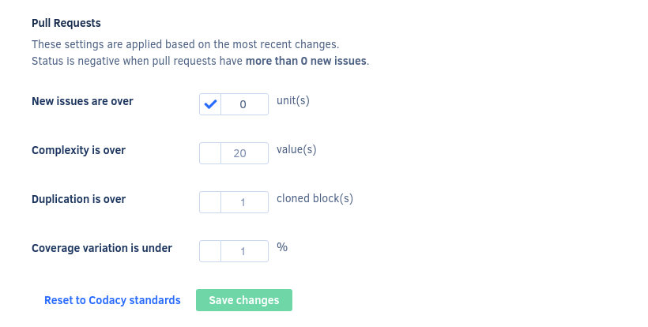
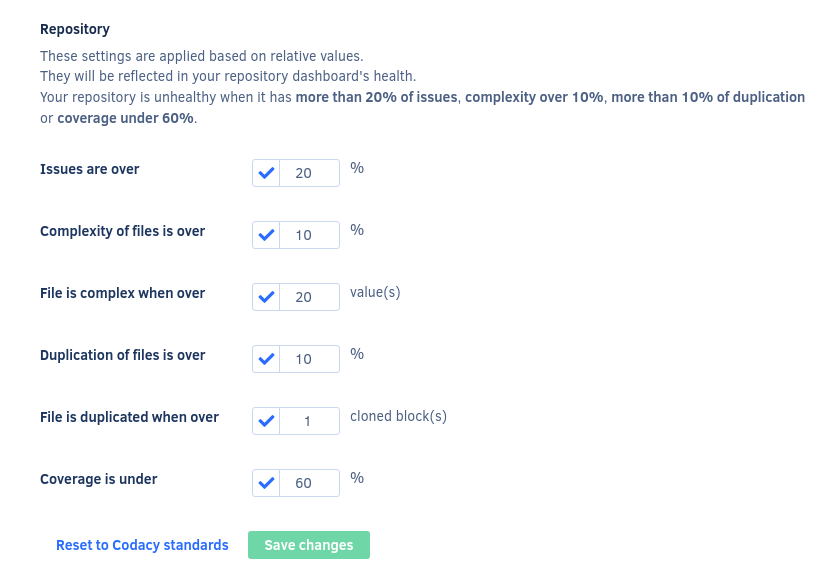

# Configuring quality settings

Here you can define quality settings for your repository, giving you control over the build status and success/fail of commits and pull requests. This feature also enables you to turn off metrics like duplication or complexity.

To access the quality settings, open your repository **Settings**, tab **Quality Settings**. On this page there are three sections where you can set specific values at the commit, pull request, and repository levels. Click **Customize** to edit the settings on each section.

The following sections explain the settings in detail.

## Commits

These settings configure quality thresholds for commits, as displayed on the [Commits](commits-view.md) page.

-   **New issues are over:** Commits are marked not up to standards if the number of issues introduced is bigger than the set value. The default value is 0.
-   **Complexity is over:** Commits are marked not up to standards if the introduced complexity is bigger than the set value. By default, this setting is off.
-   **Duplication is over:** Commits are marked not up to standards if the number of clones introduced is bigger than the set value. By default, this setting is off.
-   **Coverage variation is under:** Commits are marked not up to standards if the coverage introduced is smaller than the set value. By default, this setting is off.

## Pull Requests

These settings configure quality thresholds for pull requests, as displayed on the Pull Requests page.

-   **New issues are over:** Pull requests are marked not up to standards if the number of issues introduced is bigger than the set value. The default value is 0.
-   **Complexity is over:** Pull requests are marked not up to standards if the introduced complexity is bigger than the set value. By default, this setting is off.
-   **Duplication is over:** Pull requests are marked not up to standards if the number of clones introduced is bigger than the set value. By default, this setting is off.
-   **Coverage variation is under:** Pull requests are marked not up to standards if the coverage introduced is smaller than the set value. This value refers to the variation of coverage on your pull request. For example, if your repository has 90% coverage and you want to make sure that this value doesn't decrease, set the value to 0%. By default, this setting is off.

## Repository

These settings configure quality thresholds for the repository, as displayed on the [Repository Dashboard](repository-dashboard.md).

-   **Issues are over:** Defines the threshold displayed on the tab **Issues** of the quality evolution chart.
-   **Complexity of files is over:** Defines the threshold displayed on the tab **Complexity** of the quality evolution chart.
-   **File is complex when over:** A file is considered complex when its complexity is over this value.
-   **Duplication of files is over:** Defines the threshold displayed on the tab **Duplication** of the quality evolution chart.
-   **File is duplicate when over:** A file is considered duplicated when it has more clones than this value.
-   **Coverage is under:** Defines the threshold displayed on the tab **Coverage** of the quality evolution chart.
