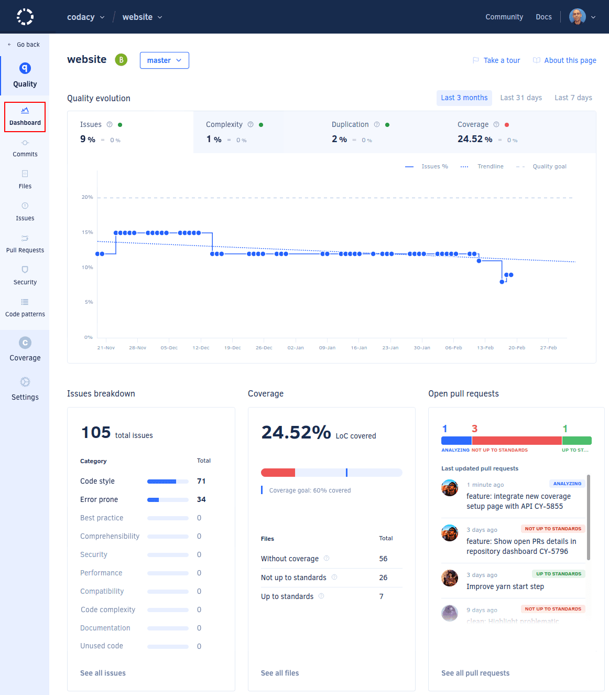

# Repository Dashboard

Your **Repository Dashboard** offers an overview of the repository and attention points we select for you on relevant items requiring your intervention.

You can access the Repository Dashboard by selecting a specific repository on the [Organization Dashboard](../organizations/organization-overview.md), or by opening a repository on any other page of the platform.

On the Repository Dashboard you can find two main sections: the repository view of a specific branch (in white) and the main branch summary view on the right side (in gray). Overall, you will find 3 main sections on the branch specific section:

1.  [Repository certification and quality evolution chart](#quality-evolution-chart)
1.  [Issues breakdown](#issues-breakdown)
1.  [Coverage status](#coverage)
1.  [Pull requests status](#open-pull-requests)

On the Repository Dashboard you can select which branch you want to see details for. You can do this by selecting (or searching on the search bar) for a specific branch, next to the name of the repository:

The following sections provide a detailed overview of each dashboard area.

## 1. Repository certification and quality evolution chart {: id="quality-evolution-chart"}

Here you can see the grade of the repository and the evolution of the code quality. On the chart you can select to see results for the last 7 or 31 days. Use the tabs to see the evolution for each metric: Issues, Complex files, Duplicated code, and Coverage.

The chart also displays the **trend for the next 31 days** based on the past behavior, the **pull request prediction** (the changes caused by open pull requests if they are not changed) and the **quality standard** (defined on the repository [quality settings](quality-settings.md)).

In the example above, "Issues" has a red indicator  meaning that the number of Issues is above what was defined on the quality standards. Next to each metric there's a delta (can be "=", a drop, or an increase), representing the changes observed during the selected period. In the example, there was no change of number of Issues on the last 31 days, however there was a decrease of 160% of duplicated code.

You should know for Issues/Complex Files/Duplicated code (the more we have it, the worse we are), being above of the defined standards is considered bad, so the indication will be  while for Coverage (the more we have it, the better we are), being above the defined standards will be flagged with .

Still with regards to coverage it only shows a value if the most recent commit received a coverage report. We do this as one commit can easily change the size or number of files on the repository and even remove some of the files that had coverage information.

If you don't have recent data, Codacy displays the chart and all the metrics for the last 8 analyzed commits instead.

## 2. Issues breakdown {: id="issues-breakdown"}

This area displays the total number of issues found on the selected branch, as well as a breakdown of the number of issues in each category.

Click **See all issues** to see the full list of issues found, or click the name of a category to see only the issues in that category.

## 3. Coverage {: id="coverage"}

This area displays the number of files without coverage, the number of files with coverage "not up to standards", and files with coverage "up to standards" based on your repository [quality settings](quality-settings.md).

Click **See all files** to open the list of files.

In case you don't have coverage set up for this repository we will let you know on this component, and if you have write permission on the repository you can click **Set up your coverage here** to set up coverage.

## 4. Open pull requests {: id="open-pull-requests"}

This area displays the number of open pull requests in the repository and the split between "Not up to standards", "Up to standards", and "Analysis failed".

Click **See all pull requests** to open the list of pull requests in the repository.
