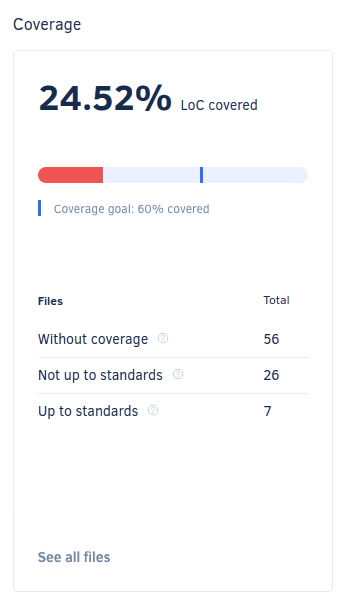

# Repository Dashboard

The **Repository Dashboard** provides an overview of the repository code quality and items that require your attention.

To access your Repository Dashboard, select a repository from the [Organization Dashboard](../organizations/organization-overview.md) or open a repository on any other page and select **Dashboard** on the left navigation sidebar.

!!! tip
    You can share the URL of the Repository Dashboard for your public repositories to allow other people to see your repository code quality metrics, even if they aren't registered on Codacy.

The top of the Repository Dashboard displays:

-   The name and code quality grade of the repository
-   A drop-down list that selects which branch of your repository to display on the dashboard

On the Repository Dashboard you have four areas to help you monitor your repository:

-   [Quality evolution chart](#quality-evolution-chart)
-   [Issues breakdown](#issues-breakdown)
-   [Coverage](#coverage)
-   [Open pull requests](#open-pull-requests)

The following sections provide a detailed overview of each dashboard area.

## Quality evolution chart

The **Quality evolution** chart displays the evolution of the repository code quality regarding issues, complex files, duplication, and coverage. Click on **Last 3 months**, **Last 31 days**, or **Last 7 days** to select the time interval of the historical data to display on the chart.

Each tab displays the following information for the corresponding metric:

-   A green or red indicator depending if the metric is within the acceptable quality level or not
-   The current value
-   The variation of the value introduced by the last commit

!!! note
    The coverage tab only displays a value if Codacy received coverage data for the most recent commit. This is because one commit can easily change the size or number of files on the repository, or even remove some of the files that had coverage information.

The chart also displays the **trendline** based on the past behavior and the **quality standard**  defined on the repository [quality settings](../repositories-configure/quality-settings.md).

## Issues breakdown

The **Issues breakdown** area displays the total number of issues found on the selected branch, as well as the distribution of issues across each code quality issue category.

Click **See all issues** to see the full [list of issues](issues.md) found, or click a category to see the issues in that category.

## Coverage

The **Coverage** area displays the percentage of lines of code on the selected branch that are covered by tests versus the [quality settings](../repositories-configure/quality-settings.md) defined for the repository, as well as the number of files:

-   Without coverage
-   With coverage not up to standards (based on your repository quality settings)
-   With coverage up to standards (based on your repository quality settings)

Click **See all files** to open the [list of files](files.md) in the repository.

!!! tip
    If you don't have coverage set up for your repository yet, the Coverage area provides you with instructions on [how to add coverage for your repository](../coverage-reporter/index.md).

## Open pull requests

The **Open pull requests** area displays the number of open pull requests in the repository and the split between the following status:

-   Not up to standards
-   Up to standards
-   Analyzing (intermediate status while Codacy is analyzing the pull request)

Click **See all pull requests** to open the list of pull requests in the repository.

