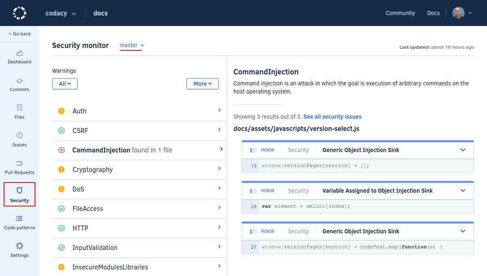

# Security Monitor



The **Security Monitor** provides an overview of all security issues that Codacy found on your repository, and also warns you if any security code patterns are currently turned off.

By default, the page displays the overview for the main branch of your repository but if you have [more than one branch enabled](../repositories-configure/managing-branches.md) you can use the drop-down list at the top of the page to display information for other branches.

The left-hand side of the dashboard lists the status for each security category that the tools that can analyze the programming languages in your repository support:

<table>
  <thead>
    <tr>
      <th>Status</th>
      <th>Description</th>
    </tr>
  </thead>
  <tbody>
    <tr>
      <td></td>
      <td><strong>Codacy found security issues in this category</strong>  
          Click the category name to see the list of security issues in this category, and click the title of the issues to see more information about the issue.</td>
    </tr>
    <tr>
      <td rowspan="2"></td>
      <td><strong>There are security code patterns in this category that are turned off</strong>  
          You should turn on the code patterns in this category so that Codacy can find the corresponding security issues. Click the category name to see the code patterns that are turned off, and click the check box next to each code pattern to turn it on.  
          To turn on all security code patterns on the repository regardless of their category, click the button <strong>More</strong> and select <strong>Turn on all security patterns</strong>.</td>
    </tr>
    <tr>
      <td style="display: none;"></td>
      <td><strong>Codacy can't determine if all security code patterns in this category are turned on or not</strong>  
          This happens when you're using configuration files to control which code patterns are turned on. Ensure that you manually turn on the listed code patterns on your configuration files.</td>
    </tr>
    <tr>
      <td></td>
      <td><strong>Everything is OK for this category</strong>  
          All security code patterns in this category are turned on, and Codacy didn't find security issues in this category.</td>
    </tr>
  </tbody>
</table>

!!! tip
    You can use the **Warnings** drop-down list to display only security categories that have found issues or categories that have code patterns turned off.

## Supported languages

<!--TODO
    Merge supported languages and tools using a table?-->

<!--NOTE
    When adding a new supported tool, make sure that you update the following pages:

    docs/getting-started/supported-languages-and-tools.md
    docs/related-tools/codacy-plugin-tools.md
    docs/related-tools/local-analysis/client-side-tools.md (if the tool runs client-side)
    docs/repositories/security-monitor.md (if the tool reports security issues)
    docs/repositories-configure/configuring-code-patterns.md (supported configuration files table, or list of tools that don't support configuration files)
    docs/repositories-configure/codacy-configuration-file.md (list of tool short names to use on the Codacy configuration file)
-->

The Security Monitor is available for the following languages:

-   Apex
-   C#
-   Java
-   JavaScript
-   Python
-   Ruby
-   Scala
-   PHP
-   C
-   C++
-   Shell script
-   Dockerfile
-   Visual Basic
-   Elixir
-   PowerShell
-   TSQL
-   Groovy

## Tools

The Security Monitor displays issues using security patterns from:

-   [Bandit](https://bandit.readthedocs.io/en/latest/plugins/index.html#complete-test-plugin-listing){: target="_blank"}
-   [Brakeman](https://brakemanscanner.org/docs/warning_types/){: target="_blank"}
-   [Codacy Scalameta Pro](https://github.com/codacy/codacy-scalameta/tree/master/patterns-base/src/main/scala/codacy/patterns){: target="_blank"}
-   [ESLint](https://www.npmjs.com/package/eslint-plugin-security){: target="_blank"} (also: [1](https://www.npmjs.com/package/eslint-config-nodesecurity){: target="_blank"}, [2](https://www.npmjs.com/package/eslint-plugin-scanjs-rules){: target="_blank"}, [3](https://www.npmjs.com/package/eslint-plugin-no-unsafe-innerhtml){: target="_blank"} and [4](https://www.npmjs.com/package/eslint-config-secure){: target="_blank"})
-   [SpotBugs](https://spotbugs.readthedocs.io/en/latest/bugDescriptions.html){: target="_blank"} (includes the plugin [Find Security Bugs](https://find-sec-bugs.github.io/bugs.htm){: target="_blank"})
-   [Sonar C#](https://rules.sonarsource.com/csharp/type/Vulnerability){: target="_blank"}
-   [Sonar VB.NET](https://rules.sonarsource.com/vbnet){: target="_blank"}
-   [PMD](https://pmd.github.io/pmd-6.21.0/){: target="_blank"}
-   [PHP Mess Detector](https://phpmd.org/rules/){: target="_blank"}
-   [Pylint](http://pylint.pycqa.org/en/1.9/technical_reference/features.html){: target="_blank"} (Python 2)
-   [Pylint](http://pylint.pycqa.org/en/stable/technical_reference/features.html){: target="_blank"} (Python 3)
-   [RuboCop](https://rubocop.readthedocs.io/en/latest/cops/){: target="_blank"}
-   [Cppcheck](http://cppcheck.sourceforge.net/){: target="_blank"}
-   [ShellCheck](https://github.com/koalaman/shellcheck/wiki/Checks){: target="_blank"}
-   [PHP_CodeSniffer](https://github.com/squizlabs/PHP_CodeSniffer){: target="_blank"}
-   [Hadolint](https://github.com/hadolint/hadolint#rules){: target="_blank"}
-   [Prospector](https://github.com/PyCQA/prospector){: target="_blank"}
-   [bundler-audit](https://github.com/rubysec/bundler-audit){: target="_blank"}
-   [Credo](https://github.com/rrrene/credo/){: target="_blank"}
-   [Flawfinder](https://dwheeler.com/flawfinder/){: target="_blank"}
-   [PSScriptAnalyzer](https://dwheeler.com/flawfinder/){: target="_blank"}
-   [TSQLLint](https://github.com/tsqllint/tsqllint/){: target="_blank"}
-   [CodeNarc](https://codenarc.github.io/CodeNarc/codenarc-rule-index.html){: target="_blank"}

## Supported categories

Each issue reported on the Security Monitor belongs to one of the following security categories:

<!--TODO
    - Review description of each category, and also update the Codacy UI copy-->

-   **XSS:** XSS enables attackers to inject client-side scripts into web pages viewed by other users.
-   **Input validation:** Input not validated may originate SQL Injection attacks for instance.
-   **File access:** An attacker may use special paths to access files that shouldn't be accessible.
-   **HTTP:** HTTP headers are a common attack vector for malign users.
-   **Cookies:** An HTTP cookie is a small piece of data sent from a website and stored on the user's computer by the browser while the user is browsing.
-   **Unexpected behaviour:** Assigning values to private APIs might lead to unexpected behavior.
-   **Mass assignment:** Mass assignment is a feature of Rails which allows an application to create a record from the values of a hash.
-   **Insecure storage:** Storing sensitive data using these APIs isn't safe.
-   **Insecure modules/libraries:** Consider possible security implications associated with some modules.
-   **Visibility:** Fields shouldn't have public accessibility.
-   **CSRF:** Cross-Site Request Forgery (CSRF) is an attack that forces an end user to execute unwanted actions on a web application in which they're currently authenticated.
-   **Android:** Android-specific issues.
-   **Malicious code:** Exposed internal APIs can be accessed or changed by malicious code or by accident from another package.
-   **Cryptography:** Cryptography is a security technique widely used and there are several cryptographic functions, but not all of them are secure.
-   **Command injection:** Command injection is an attack in which the goal is the execution of arbitrary commands on the host operating system.
-   **Firefox OS:** Sensitive APIs of Firefox OS.
-   **Auth:** Authentication is present in almost all web applications nowadays.
-   **DoS:** The Denial of Service (DoS) attack is focused on making a resource (site, application, server) unavailable for the purpose it was designed.
-   **SQL injection:** A SQL injection attack consists of insertion or "injection" of a SQL query via the input data from the client to the application.
-   **Routes:** Badly configured routes can give unintended access to an attacker.
-   **Regex:** Regex can be used in a Denial of Service attack, that exploits the fact that most Regular Expression implementations may reach heavy computation situations that cause them to work very slowly (exponentially related to input size).
-   **SSL:** Simply using SSL isn't enough to ensure the data you're sending is secure. Man in the middle attacks are well known and widely used.
-   **Other:** Other language-specific security issues.

## See also

-   [Issues page](issues.md)
-   [Configuring code patterns](../repositories-configure/configuring-code-patterns.md)
