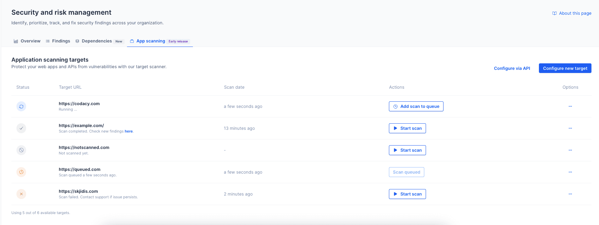
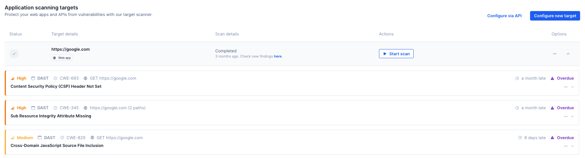

# App scanning

!!! important
    App scanning is a business feature. If you are a Codacy Pro customer, contact our customer success team to access a short trial.

The **Security and risk management > App scanning** page allows organizations to scan Web Applications and APIs for security vulnerabilities. This feature is part of Codacy's Dynamic Application Security Testing (DAST) capabilities, powered by ZAP.

To access the App scanning page, go to the [Overview page](index.md#dashboard) and click the **App scanning** tab.

App scanning analyzes applications in production or production-like environments to help identify vulnerabilities such as misconfigurations, insecure authentication, or other security issues that occur in real-world usage. Because it doesn't rely on access to source code, it’s language-agnostic and useful for validating security across your entire stack. 

Codacy supports two types of scanning:

- **Web application scans** perform baseline, non-intrusive analysis. These scans are safe for production environments and detect surface-level issues such as:
    - Missing security headers
    - Insecure cookie configurations
    - Information disclosure through HTTP response headers
    - Exposure of sensitive or misconfigured files

- **API scans** simulate real-world attacks against your API endpoints. These are more aggressive and best suited for **non-production environments**, such as staging or development. API scans provide deeper insights into runtime behavior and potential vulnerabilities, such as:
    - Broken authentication or authorization controls
    - Injection vulnerabilities (SQL or command injection)
    - Exposure of sensitive data in API responses
    - Insecure CORS or HTTP method configurations

!!! note
    Already using ZAP? [Upload your results via the API.](../codacy-api/examples/uploading-dast-results.md)

## Creating an App Scanning target

!!! important
    **Do not run API scans on production enviroments as our API scanners may cause potential downtime.**

    Our DAST API scanner performs active security testing by sending a large number of requests to your application. When using authenticated API scanning, this activity can be even more intensive, as ZAP explores and probes more of your API surface.

    Depending on how your target environment is configured, this may:

    - Trigger rate limiting or throttling
    - Appear as a high volume of traffic, similar to a load test
    - Lead to incomplete scan results if key endpoints are blocked or limited

    We recommend running scans in a **test or staging environment**, or coordinating with your infrastructure team to ensure that your environment can safely handle the load.

When creating a scan target, you'll be able to choose between a Web App or an API. Configuring a Web App will only require a target URL, while APIs will have other requirements:

- **REST APIs**, which require a publicly accessible OpenAPI specification URL.
- **GraphQL APIs**, where the schema is inferred from the default path `{targetUrl}/graphql`.

API targets optionally support **header-based authentication**. As you create a target, keep in mind you may not be able to view or change certain fields later (to change your configurations you may need to delete and create a new target).

!!! note
    If exposing your API specification isn't feasible for your team, let us know via support or your account representative.

## How to scan a target

You can initiate scans in two ways:
- From the **App scanning** tab in the Security and risk management dashboard
- By automating scans using [Codacy's API](../codacy-api/examples/triggering-dast-scans.md)

!!! important
    Only [admins and organization managers](../organizations/roles-and-permissions-for-organizations.md) can create targets and start scans, both in-app and via the API.

  <iframe width="100%" height="472" src="https://www.youtube.com/embed/qPwHlIGJYXs?autoplay=1&mute=1&showinfo=0&loop=1" title="DAST targets" frameborder="0"
allowfullscreen>
  </iframe>

Each organization can have up to **6 active scan targets**. If you need additional capacity, contact your customer success representative.

Scans are triggered manually through the UI and are queued before execution. You can queue one single scan per target — it will run sequentially. There is no limit to the number of scans you can run on a target, in order to support your deployment needs.

Once a scan completes, results will be available under the **Findings** tab. Use the **Scan types > DAST/App scanning** filter to view relevant findings.

!!! important
    Depending on the complexity of the target, DAST scans can take a significant amount of time to complete. Codacy may enforce timeouts to ensure platform stability and fair resource distribution.

!!! important
    Failed scans are retried based on the failure reason. Retries are added back to the queue automatically and processed when capacity allows.

!!! note
    Currently, DAST findings are only visible to admin and organization admin roles.

## Findings results for your DAST scans

As previously mentioned, once a scan completes, results will be available under the **Findings** tab. Use the **Scan types > DAST/App scanning** filter to view relevant findings.
Additionaly, you can click on a configured target to expand all of that target's results.

Follow our [roadmap](https://roadmap.codacy.com) for updates on this feature.

