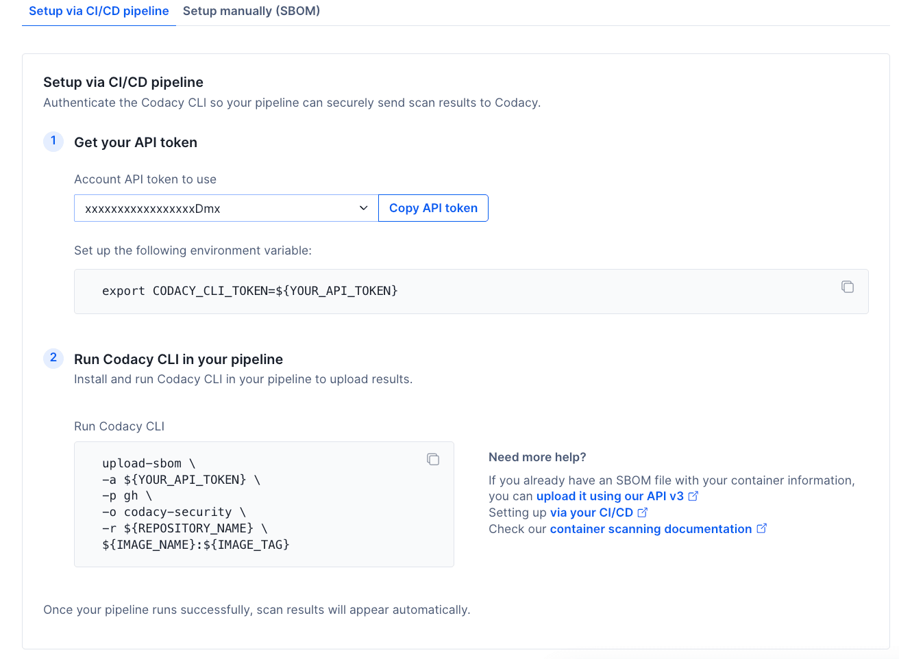
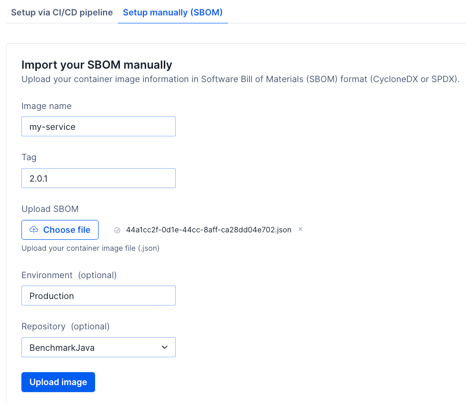
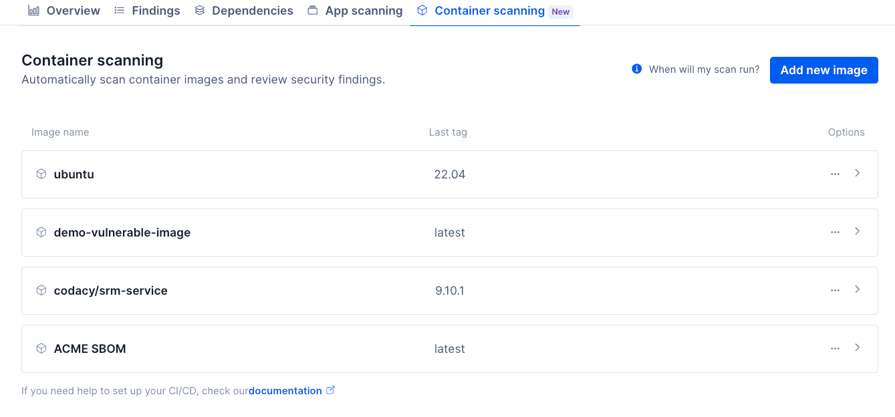
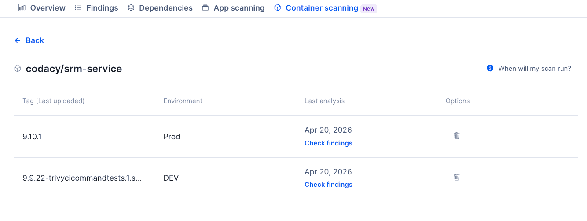
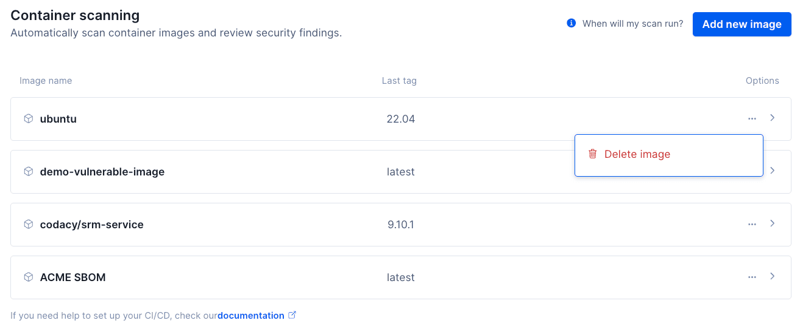

# Container scanning

!!! important
    Container scanning is a business-tier feature. If you are a Codacy Pro customer interested in upgrading to gain access to this feature, [talk to us](https://start-chat.com/slack/codacy/rmbTzb).

Container Scanning is a technique to scan your container image's dependencies for known vulnerabilities. The **Security and risk management > Container scanning** page allows you to set up scans that run automatically every night, and surface actionable security findings as new vulnerabilities get discovered.

## How our container image scanning Works

The security tool analyzes your uploaded SBOM (Software Bill of Materials) files to find vulnerabilities in your container images. An SBOM of a container lists all the dependencies included in the image, which in turn allows the scanner to search for known vulnerabilities (CVEs).

### High-level flow

1. Image SBOMs are received either via CI/CD integration or manual upload
2. The image dependencies are scanned against Trivy's vulnerability databases
3. Results appear in the UI after processing

### Scan frequency

1. Proactive scans run automatically once per day
2. Scans are executed every night (UTC) and the findings are updated automatically

No manual action is required to trigger scans after the initial setup.

## How tagging affects your findings

Codacy keeps a separate set of findings for every image tag you upload, and scans each of those tags once a day. The tag you upload to therefore decides how your findings behave over time, and it is the setup choice that is hardest to reverse: findings you have already accumulated stay on the tags that produced them.

You have two options:

- **One list, kept up to date.** Upload every build to the same tag, such as `prod`. Each upload replaces the last, so vulnerabilities you fix close automatically and your dismissals and owners carry over.
- **A separate list per release.** Upload each build to a new tag, such as `1.4.2`. Every release starts its own set of findings, so a vulnerability you fixed in your newest release stays open on the older ones.

This changes what Codacy scans, not what you deploy. You can keep deploying from an immutable tag or a digest while pointing Codacy at a single rolling tag.

|  | One list, kept up to date | A separate list per release |
| --- | --- | --- |
| Findings across releases | The same findings are updated | A new set every release |
| A vulnerability you fixed | Closes automatically | Stays open on the older tags |
| Dismissals and owners | Carry over to the next upload | Reset on every release |
| SLA and MTTR | Measured across the life of the image | Restart with every release |
| Which build introduced a vulnerability | Not recorded | Recorded exactly |
| Image tags stored | One per image | One per release |

Upload to a single tag unless you need a per-release record of what shipped.

### What the image tag limit does

Your organization can hold 1,000 image tags in total, counted across all your images. Uploading again to a tag Codacy already holds does not count against the limit, so an organization that uploads every image to a single rolling tag can stay under it indefinitely.

Once you reach the limit, Codacy stops accepting image tags it has not seen before. The tags you already have keep being scanned every day, so the images list still looks healthy, but the release you just shipped is not scanned at all. The only signal is the error returned to your pipeline.

To make room, delete the image tags for releases you no longer support. You can delete a single tag from the tag list of an image, or delete an image to remove all its tags at once.

## Container scanning setup

You can set up container scanning in one of two ways: by connecting your CI/CD pipeline or by manually uploading your image SBOM. Once configured, your image dependencies are scanned daily and results will appear in the Image card list.

### CI/CD integration
You must authenticate the Codacy CLI so your pipeline can securely send your image SBOM to Codacy. 



In order to do that, you need to:

1. Get the API token and set up the environment variable as shown in the UI;
2. Install and run Codacy CLI in your pipeline to upload results.

When CI/CD is configured:

- Every pipeline run uploads an SBOM for the image and tag you name in the command
- Codacy scans each image tag you have uploaded once per day
- No manual action is required between releases

This is the recommended setup for continuous coverage.

#### Example pipeline steps

These examples use the [Codacy CLI v2](https://github.com/codacy/codacy-cli-v2), which generates the SBOM from your image and uploads it in a single command. They assume you have already set `CODACY_API_TOKEN` as described above.

Install the CLI once per pipeline run:

```bash
curl -fsSL https://raw.githubusercontent.com/codacy/codacy-cli-v2/main/codacy-cli.sh -o codacy-cli.sh
chmod +x codacy-cli.sh
./codacy-cli.sh init
```

`upload-sbom` reads a Codacy configuration from the working directory, which is what `init` creates. Without it the upload stops with `No configuration file was found, execute init command first.`

To keep [one list of findings, kept up to date](#how-tagging-affects-your-findings), point your rolling tag at the image you just built and upload that:

```bash
docker tag "${IMAGE_NAME}:${IMAGE_VERSION}" "${IMAGE_NAME}:prod"

./codacy-cli.sh upload-sbom \
  -a "${CODACY_API_TOKEN}" \
  -p gh \
  -o "${ORGANIZATION_NAME}" \
  -r "${REPOSITORY_NAME}" \
  -e production \
  "${IMAGE_NAME}:prod"
```

The `docker tag` alias stays on the build machine and is never pushed. Without it the CLI resolves `prod` against your registry and scans whatever that tag points at there, rather than the image your pipeline just built.

To keep [a separate list per release](#how-tagging-affects-your-findings), upload the release tag instead:

```bash
./codacy-cli.sh upload-sbom \
  -a "${CODACY_API_TOKEN}" \
  -p gh \
  -o "${ORGANIZATION_NAME}" \
  -r "${REPOSITORY_NAME}" \
  -e production \
  "${IMAGE_NAME}:${IMAGE_VERSION}"
```

Every release adds an image tag, so delete the tags for releases you no longer support to stay under your organization limit.

Replace the placeholders with your own values:

-   **CODACY_API_TOKEN:** [Account API token](../codacy-api/api-tokens.md#account-api-tokens) used to authenticate on Codacy, set as described in step 1 of the setup page.
-   **`-p`:** Git provider hosting the organization, using one of the values in the table below. For example, `gh` for GitHub Cloud.

    | Value | Git provider    |
    |-------|-----------------|
    | `gh`  | GitHub Cloud    |
    | `gl`  | GitLab Cloud    |
    | `bb`  | Bitbucket Cloud |

-   **ORGANIZATION_NAME:** Name of the organization on the Git provider. For example, `codacy`.
-   **IMAGE_NAME:** Name of the container image, without a tag. For example, `myapp`.
-   **IMAGE_VERSION:** The tag your pipeline built, such as `1.4.2`. Only used by the per-release example.
-   **REPOSITORY_NAME:** Optional. Name of the repository to associate the image with, so findings link back to it.
-   **`-e`:** Optional. Environment where the image is deployed, such as `production`. It appears in the tag list.

### Manual upload
You can also manually upload your container's Software Bill of Materials (SBOM) in CycloneDX or SPDX format.



To manually upload an image SBOM, you need to:

1. Add the image name;
2. Add the image tag;
3. Upload your SBOM file (environment and repository fields are optional).

Reuse a tag and each upload replaces the last. A new tag starts its own set of findings, so choose it with care: see [How tagging affects your findings](#how-tagging-affects-your-findings).

!!! note
    You can use the [Codacy CLI v2](https://github.com/codacy/codacy-cli-v2) to generate and upload your SBOM file to Codacy.
   


## Image card list

The Image card list provides an overview of all container images and the most recent tag pushed for each image.



For each image, you can see:

- Image name
- The most recent tag pushed for this image
- Options and entry point to check all image tags.

By clicking the card for a specific image, you will see a list of all tags for that image.



For the image tags, the list is sorted by latest uploaded, and the information includes:

- Tag used
- Environment (optional field)
- Last analysis: Date of the last scan for that tag
- Button to delete that image tag

Once a tag is scanned, you can click on the `check findings` link to access the findings page filtered by the respective results.

!!! important
    Findings are tied to a specific image tag. To resolve one, upload an image where the dependency is fixed, usually by bumping it to a newer version. Where no fix exists, a downgrade or an alternative base image may be required.

Whether that fix also closes the finding on your other tags depends on how you tag your images. See [How tagging affects your findings](#how-tagging-affects-your-findings).

## Deleting container image files from Codacy



What happens when you delete an image:

- The image is permanently removed
- All associated image tags are deleted
- Scan history and results for that image are removed

!!! important
    This action can't be undone.
    You can also delete a specific tag inside an image card.

## No results yet

If there is no last analysis date for an image tag, it means that the SBOM file was received but the scan hasn't been completed yet. The most likely scenario is that an analysis hasn't been executed yet.

!!! note
    Remember that scans run nightly (UTC). If you just uploaded the SBOM file, but need results immediately, consider using our [Codacy CLI v2](https://github.com/codacy/codacy-cli-v2) to run a local analysis to scan for any issues.
