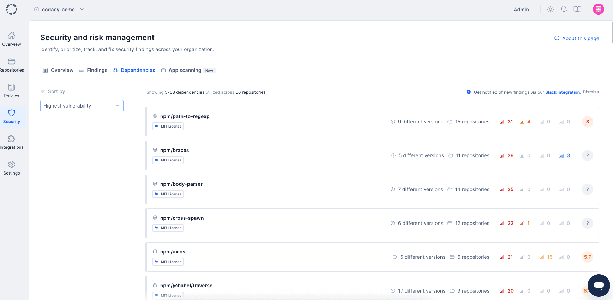
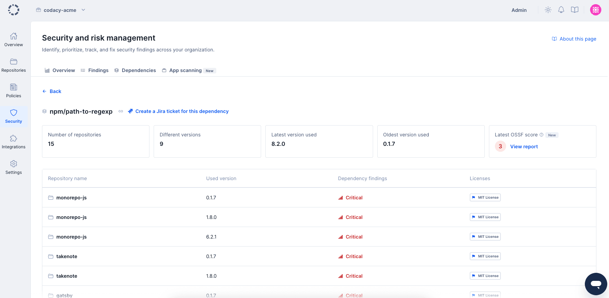
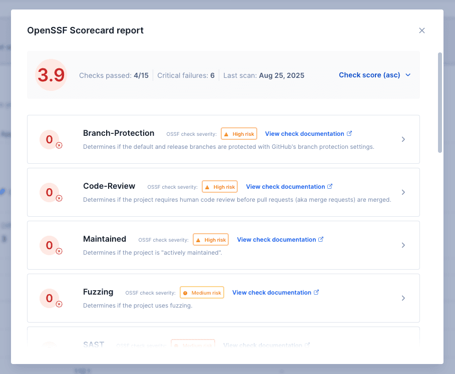

# Dependencies

!!! important
    The dependency tab is a business-tier feature. If you are a Codacy Pro customer interested in upgrading to gain access to this feature, [talk to us](https://start-chat.com/slack/codacy/rmbTzb).

The **Security and risk management Dependencies** page displays a unified view of all dependencies used by your repositories, populated by Codacy's daily SCA re-scans.

## Daily re-scan requirements {: id="proactive-sca-requirements"}

Proactive SCA uses **Trivy** as its scanning tool. For daily re-scans to produce results on a repository, **both** conditions must be met:

1. The **Trivy tool** is enabled—either through a [coding standard](../organizations/using-coding-standards.md) applied to the repository, or directly via the repository's [Code patterns settings](../repositories-configure/configuring-code-patterns.md).
2. At least one **Trivy vulnerability pattern** is enabled:
    -   `Trivy_vulnerability_critical`
    -   `Trivy_vulnerability_high`
    -   `Trivy_vulnerability_medium`
    -   `Trivy_vulnerability_minor`
    -   `Trivy_malicious_packages`

To enable Trivy across your organization, you can:

-   **Recommended — via coding standard:** [Add Trivy to a coding standard](../organizations/using-coding-standards.md), enable its vulnerability patterns in the standard configuration, and apply the standard to your repositories. This covers all linked repositories in one step.
-   **Per repository:** Open each repository's [Code patterns page](../repositories-configure/configuring-code-patterns.md), enable the Trivy tool, and enable the relevant vulnerability patterns.

## Viewing your dependencies

To access the dependencies page, access the [overview page](index.md#dashboard) and click the **Dependencies** tab.

When viewing dependencies, you'll be presented with a list of the dependencies used by all repositories in your organization. For each dependency, you'll be able to see how many repositories are making use of it, how many different versions you are using across all repositories, and how many security findings were found due to the presence of that dependency.

You can sort the dependencies list using the sort dropdown to prioritize dependencies based on your security assessment needs:

-   **Highest vulnerability** (default) - Dependencies with the most critical security findings appear first
-   **Lowest OSSF score** - Dependencies with the lowest [OSSF Scorecard](#ossf-scorecard) security scores appear first, helping you identify dependencies that may not follow security best practices

You're also able to click any dependency to find out more information about it.

 The dependency overview page offers a quick bird's-eye view of that particular dependency. You'll be able to see all different versions that are being used, including which repository is using them, the oldest and most recent versions you're leveraging, as well as the highest criticality of security issues, the license <a href="#license-scanning">1</a> applied to any particular version of that dependency, and the [OSSF Scorecard](#ossf-scorecard) security assessment.

## OSSF Scorecard {: id="ossf-scorecard"}

The **OSSF Scorecard** feature provides additional security insights for your dependencies by displaying security assessment data from the Open Source Security Foundation (OSSF) Scorecard project.

The OSSF Scorecard is an automated tool that evaluates open source repositories against a comprehensive set of security best practices. It performs various checks on a dependency's repository to assess whether the project follows security best practices and helps determine if the dependency is safe for consumption.

When available, OSSF Scorecard information appears on the dependency overview page, providing you with:

-   **Overall security score** - A numerical score indicating the overall security posture of the dependency
-   **Individual check results** - Detailed results for specific security practices such as:
    -   Code review practices
    -   Dependency update policies  
    -   Security policy documentation
    -   Vulnerability disclosure processes
    -   Branch protection configurations
    -   Binary artifact verification
    -   Token permissions and usage

This information helps you make informed decisions about the security risks associated with your dependencies and identify which dependencies may require additional scrutiny or alternative options.

1: Visit the [supported languages and tools](../getting-started/supported-languages-and-tools.md#supported-languages-and-tools) page for a list of supported languages.  
