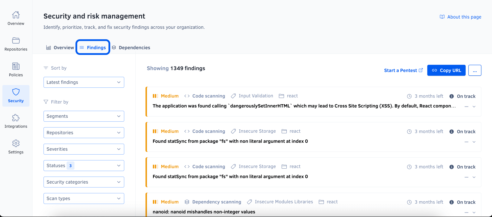
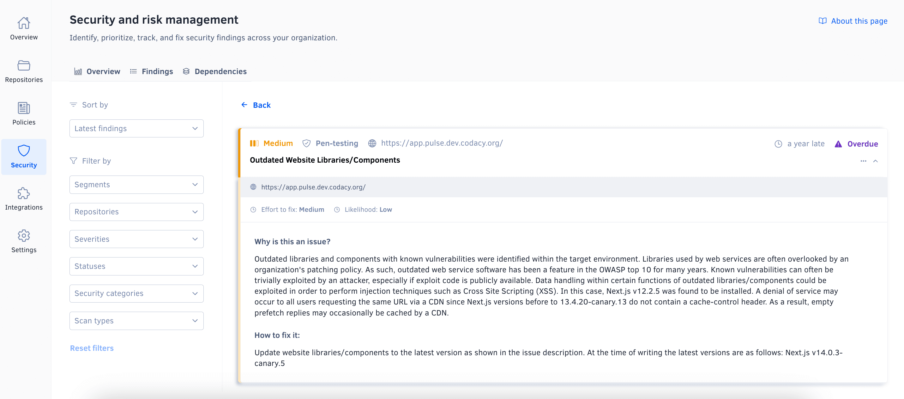
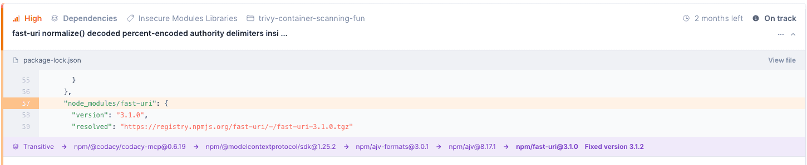
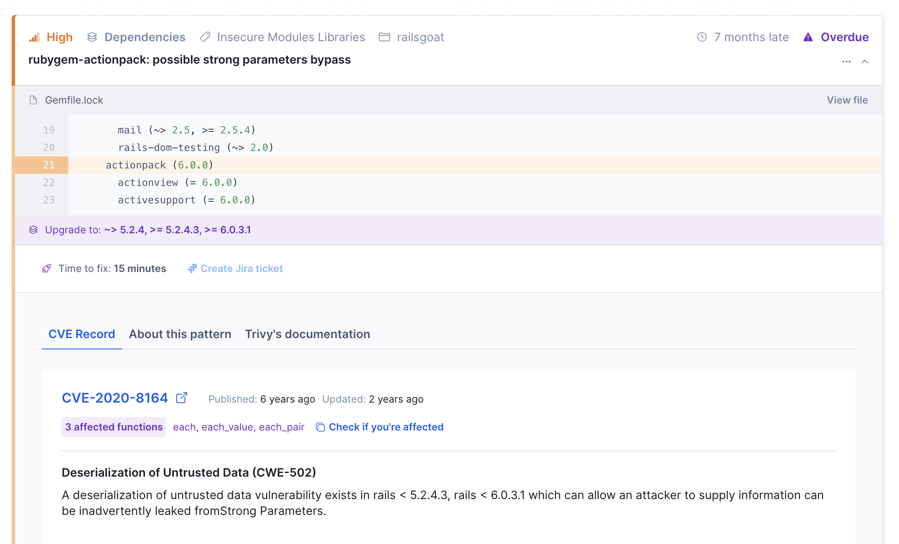
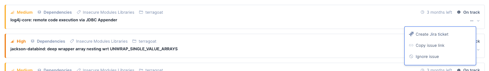
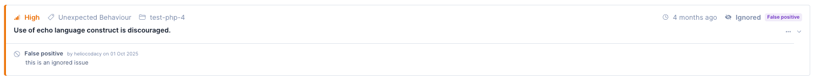
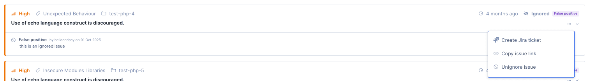
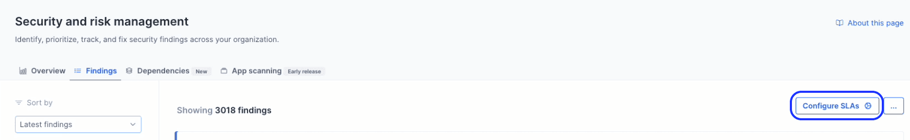
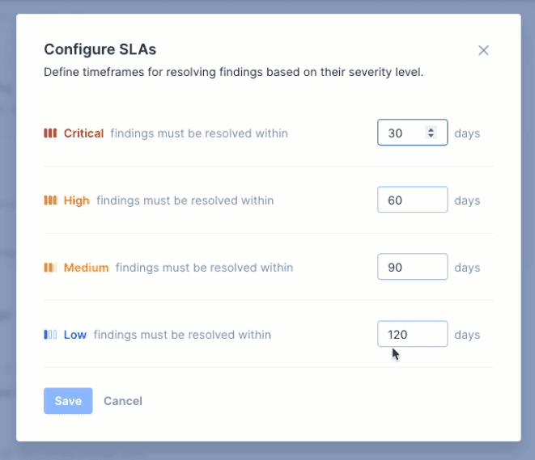

# Findings

The **Security and risk management findings** page displays a filtered list of findings. By default, you are shown the findings that are currently opened and this list is sorted by **Latest findings** found. You can click on the sort dropdown to sort the findings by detection date - latest or oldest. Use this page to review and prioritize findings and track the progress of your security efforts.

To access the findings page, access the [overview page](index.md#dashboard) and click the **Findings** tab.

On the left section of the page, besides sorting, you can update the filtering criteria by clicking the  [**Segments**](../organizations/segments.md) , **Repositories**, **Severities**, **Statuses**,  **Security categories**, or **Scan types** dropdowns above the list.
!!! info "Check out how to [enable and configure **Segments**](../organizations/segments.md#enabling-segments)"

On the right section, you can view the filtered list of findings. Each finding card offers a quick overview of the vulnerability found, including its title, [source platform](#opening-and-closing-items), [scan type](index.md#scan-types), [security category](index.md#supported-security-categories), and related information such as the repository name, Jira issue key, or affected URL targets. To find out more, click this overview to navigate to the finding details on the source platform.

### Dependency chain {: id="dependency-chain"}

For findings on transitive dependencies, the finding also displays the **dependency chain**: the ordered path from a direct (top-level) dependency in your manifest down to the vulnerable package (for example, `direct-package → intermediate-package → vulnerable-package`). This helps you identify which of your direct dependencies you need to update to resolve the finding.

### Affected functions {: id="affected-functions"}

For vulnerable dependency and container scanning findings linked to an advisory (a CVE or a GitHub Security Advisory) where Codacy has identified which functions in the dependency are affected, the finding's **Advisory Information** tab shows the list of **affected functions**.

Click **Check if you're affected** to copy a ready-made prompt for your AI coding assistant (such as Cursor, Claude Code, or GitHub Copilot). The prompt asks your assistant to search your repository for calls to the affected functions and recommend whether to upgrade the dependency or, if the functions aren't used, ignore the finding as **Not exploitable**.

!!! note
    This is a signal, not a guarantee. Review your coding assistant's findings before upgrading a dependency or ignoring a finding.

!!! note
    Not every advisory lists specific affected functions — some vulnerabilities (for example, configuration issues) aren't tied to specific functions, so this section doesn't appear for every finding.

Affected functions are also available from the terminal — see [checking affected functions with the Codacy Cloud CLI](../codacy-cloud-cli/index.md#affected-functions).

To review reachable dependencies across one or multiple repositories at once, instead of one finding at a time, see [auditing affected functions across one or multiple repositories](../codacy-cloud-cli/index.md#affected-functions-scale) with the Codacy Cloud CLI.

### Severity changes {: id="severity-changes"}

The same Common Vulnerability and Exposure can be classified with different severities in different sources, like cve.org or NVD, and Trivy uses these and other sources to update their database. As such, there may be situations where the severity attributed to a Finding by Trivy is not in line with a specific source. Subsequent analysis can then close a Finding and re-open it with a different severity, if a Trivy database update occurs.

## Sharing a filtered view of findings {: id="sharing-filtered-view"}

To share the current view of the overview or findings page, click the **Copy URL** button in the top right-hand corner of the page. This action copies the URL with the current filters applied to the clipboard.

!!! important "[**Segments**](../organizations/segments.md) filter won't be considered when sharing the filtered view"

## Ignoring findings {: id="ignoring-findings"}

!!! info "This feature is available only to organization admins and organization managers except for findings detected on [Git repositories](#opening-and-closing-items). For those findings, [repository permissions are respected](../repositories/issues.md#ignoring-and-managing-issues)"

You can ignore a finding using the context menu both in the findings list page and the findings details page. When ignoring a finding you can optionally specify a reason for doing so.

From an organization standpoint, ignoring a finding means that you accept the risk it poses and you're not planning on addressing the issue.

From Codacy's standpoint, ignoring a finding means it will be removed from the metrics featured in the [overview page](index.md#dashboard) page. Note that the [Open Findings history](index.md#open-findings-history) chart will only be changed at the start of next week.

!!! info "[Jira](../organizations/integrations/jira-integration.md) findings can't be ignored in Codacy. You should closed the issue directly in Jira."

!!! important "Ignoring findings detected on [Git repositories](#opening-and-closing-items) will also [ignore the issue at the repository level](../repositories/issues.md#ignoring-and-managing-issues)."

You can still see **Ignored** findings in the [findings list](#findings), by filtering for the **Ignored** status in the **Statuses** dropdown. You can assess which status a finding has at his overview, on the right top corner.

An Ignored finding can be **unignored** directly from the [findings list](#findings) or by going to the same menu in the finding details page. Note that in this page you can also find out more about who ignored the finding and why, if such a reason was provided.

Unignoring a finding reverts the effects of ignoring it.

!!! important "Unignoring findings detected on [Git repositories](#opening-and-closing-items) will also [unignore the issue at the repository level](../repositories/issues.md#ignoring-and-managing-issues)."

!!! info "Ignoring and unignoring findings are [auditable actions](../organizations/audit-logs-for-organizations.md#organization)."

## Exporting findings {: id="exporting-the-security-item-list"}

!!! info "This feature is available only to organization admins and organization managers"

To export a list of findings as a CSV file, click the options menu in the top right-hand corner of the page and select **Export findings (.csv)**. The exported list always includes all findings, ignoring any applied filters.

## Reviewing severity rules and integration settings {: id="reviewing-settings"}

To [review the severity assignment rules](#item-severities-and-deadlines) or manage the integration with [Jira](../organizations/integrations/jira-integration.md) or [Slack](../organizations/integrations/slack-integration.md), click the options menu in the top right-hand corner of the page and select respectively **See severity rules** or **View integrations**.

## How Codacy manages findings {: id="opening-and-closing-items"}

!!! important
    To open and close findings, Codacy must detect when the associated issues are introduced and fixed. The detection logic is platform-dependent and is described below.

Codacy opens a new finding whenever a source platform detects a new security issue. The new finding is automatically assigned a severity and a status:

-   The priority of the issue on the source platform sets the [severity of the finding](#item-severities-and-deadlines). In turn, the severity of the finding defines a deadline to close the finding.
-   The time to the deadline sets the [status of the finding](#item-statuses). The finding then moves through different statuses as the deadline is approached, met, or missed.

Codacy closes a finding when the source platform stops detecting the associated security issue.

The following section details when Codacy opens and closes findings for each supported platform.

### How Codacy manages findings detected on Git repositories {: id="opening-and-closing-codacy-items"}

!!! note
    To make sure that Codacy detects security issues correctly:

    -   [Enable code patterns](../repositories-configure/configuring-code-patterns.md) belonging to the Security category. These patterns are enabled by default, but may not be on custom configurations.
    -   Alternatively, [apply a coding standard](../organizations/using-coding-standards.md) that includes patterns belonging to the Security category.
    -   Confirm that the latest [commits](../repositories/commits.md) to the default branches of your repositories are analyzed.

Codacy opens a new finding when it detects a new security issue on the default branch of a repository.

Codacy closes a finding in either of the following cases:

-   Codacy detects that the associated issue isn't present in the most recent analyzed commit and therefore is fixed
-   You [ignore the associated issue](../repositories/issues.md#ignoring-and-managing-issues)
-   You [disable the tool](../repositories-configure/configuring-code-patterns.md) that found the associated issue

!!! important
    Deleting a repository deletes all open findings belonging to that repository.

### How Codacy manages findings detected during software composition analysis (SCA) {: id="opening-and-closing-sca-items"}

SCA findings behave like other Git repository findings. Codacy opens a finding whenever a commit to the default branch is analyzed and a vulnerable dependency is detected, and closes it when the dependency is no longer detected.

On the Business plan, Codacy also runs [daily re-scans](dependencies.md#proactive-sca-requirements) across all repositories — so newly discovered vulnerabilities are surfaced even without a new commit. [Talk to us](https://start-chat.com/slack/codacy/rmbTzb) if you're interested in upgrading.

### How Codacy manages findings detected on Jira {: id="opening-and-closing-jira-items"}

!!! note
    -   For Codacy to detect Jira issues, you must [integrate Jira with Security and risk management](../organizations/integrations/jira-integration.md).
    -   Codacy retrieves updates from Jira once a day. If an issue is opened and closed on the same day, Codacy may not detect it.
    -   To make sure that Codacy detects Jira issues correctly, assign the **security** label when creating the issue or immediately after.

Codacy opens a new finding when it detects a new Jira issue with a **security** label (case-insensitive).

Codacy closes a finding when it detects that the associated Jira issue is marked as Closed.

### How Codacy manages findings detected during penetration testing {: id="opening-and-closing-pen-testing-items"}

!!! note
    Penetration testing is available upon request and is provided by a third-party partner. See [how to request penetration testing for your organization](https://www.codacy.com/security).

Codacy opens a finding for each security issue detected during a penetration test.

Codacy closes a finding when a subsequent penetration test doesn't detect the underlying security issue.

### How Codacy manages findings detected during application scanning (DAST) {: id="opening-and-closing-app-scanning-items"}

!!! note
    To view application scanning findings, also known as DAST (Dynamic Application Security Testing) findings, you must first [generate a DAST report and upload it to Codacy](../codacy-api/examples/uploading-dast-results.md).

Codacy opens a finding for each security issue detected in the DAST report. If subsequent reports identify the same issue, Codacy updates the existing finding.

Codacy closes a finding when it's not detected in a subsequent DAST report. If a previously closed issue reappears in a later report, Codacy reopens the finding.

## Finding severities and deadlines {: id="item-severities-and-deadlines"}

The following table defines finding severities and the default number of days to the deadline to fix the associated security issue, based on the importance of the underlying issue:

| Finding severity |  Days to deadline | Underlying Codacy issue severity | Underlying Jira issue priority 1 |
|----------------------|-----------------------|--------------------------------------|-------------------------------------------------|
| Critical             | 30                    | Critical                             | Highest                                         |
| High                 | 60                    | -                                    | High                                            |
| Medium               | 90                    | Medium                               | Medium                                          |
| Low                  | 120                   | Minor                                | Low and other/custom                            |

<small>1 Those listed are the default Jira priority names. If you rename a default Jira priority, it keeps the correct mapping.</small>

### Customize deadlines {: id="item-configurable-deadlines"}

!!! info "This feature is available only to [organization admins and organization managers](../organizations/roles-and-permissions-for-organizations.md)."

You can configure your findings deadline by clicking on the "Configure SLAs" button, on the right corner of the page.

In the open configuration modal you'll be able to input your deadline preferences for each severity. Each deadline must be between a minimum of 1 day and a maximum of 9999 days.

As soon as changes are saved, your open findings statuses will be updated accordingly.
You are also able to reset to Codacy default deadline values (see table above) at any time.

## Finding statuses {: id="item-statuses"}

The following table describes how finding statuses map to deadlines:

<table>
    <thead>
        <tr>
            <th>Status category</th>
            <th>Finding status</th>
            <th>Deadline</th>
        </tr>
    </thead>
    <tbody>
        <tr>
            <td rowspan="3">Open</td>
            <td>Overdue</td>
            <td>The deadline has been missed</td>
        </tr>
        <tr>
            <td>Due soon</td>
            <td>Fewer than 15 days to the deadline</td>
        </tr>
        <tr>
            <td>On track</td>
            <td>15 days or more to the deadline</td>
        </tr>
        <tr>
            <td rowspan="2">Closed</td>
            <td>Closed late</td>
            <td>Closed after the deadline</td>
        </tr>
        <tr>
            <td>Closed on time</td>
            <td>Closed before the deadline</td>
        </tr>
    </tbody>
</table>

