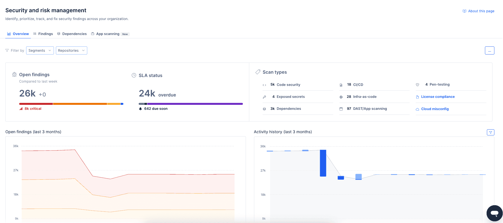
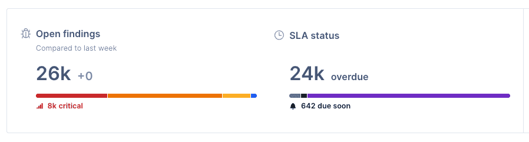
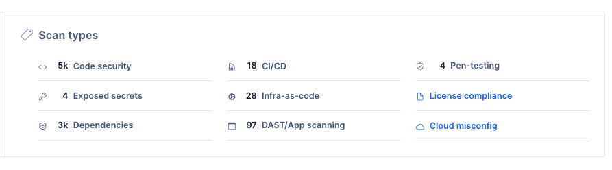
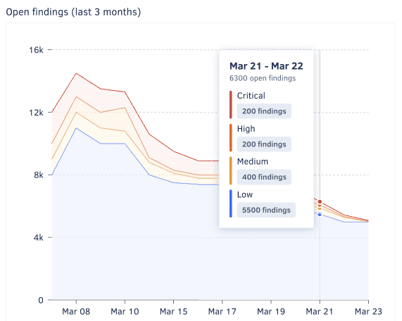
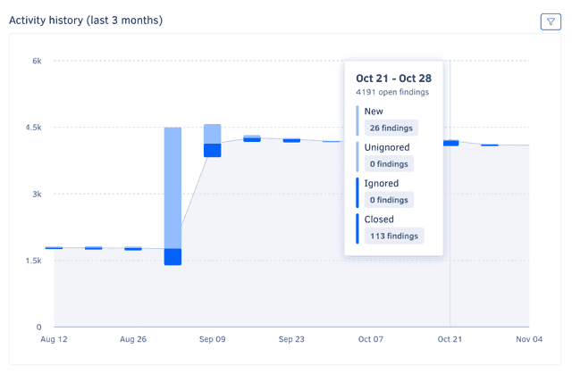
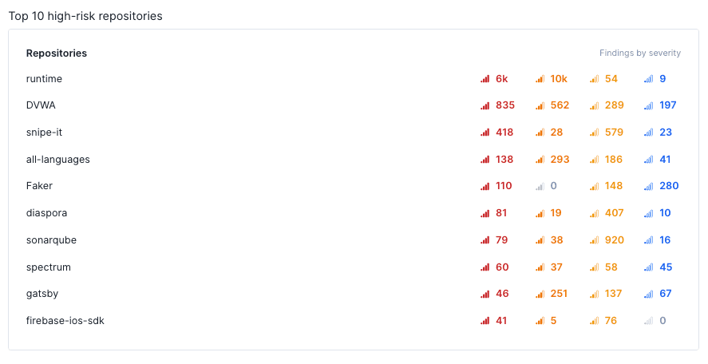
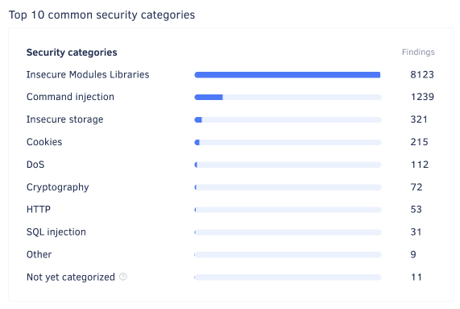

# Security and risk management

The Security and risk management feature helps you quickly identify, track, and address security across your organization by automatically opening time-bound, prioritized findings whenever security problems are detected in your organization repositories, in your [connected Jira instance](../organizations/integrations/jira-integration.md), or as a result of [penetration testing](https://www.codacy.com/security).

Under Security and risk management, you can find the following pages to help you monitor the security of your repositories:

-   [Overview](#dashboard)
-   [Findings](findings.md)
-   [Dependencies](dependencies.md)
-   [App scanning](app-scanning.md)
-   [Container scanning](container-scanning.md)

In addition, on these pages, you can [share filtered views of findings](findings.md#sharing-filtered-view), [export findings as a CSV file](findings.md#exporting-the-security-item-list), and [review severity rules and integration settings](findings.md#reviewing-settings)

## Overview {: id="dashboard"}

The **Security and risk management overview** page provides a high-level view of the security posture of your organization, including the number of open findings, the distribution of open findings by severity, the history of finding resolution, and a breakdown of the most high-risk repositories and most detected security categories.

Use this page to assess your organization's security posture and its progress over time, identify areas for improvement, and share findings with stakeholders.

To access the overview page, select an organization from the top navigation bar and select **Security and risk** on the left navigation sidebar.

The overview page includes six panels:

-   [Open findings overview](#open-findings-overview)
-   [Scan types distribution](#scan-types-distribution)
-   [Open findings history](#open-findings-history)
-   [Activity history](#activity-history)
-   [Top 10 high-risk repositories](#top-10-high-risk-repositories)
-   [Top 10 common security categories](#top-10-common-security-categories)

To limit the information displayed in each panel, use the filter drop-down above the main area, and choose the relevant repositories, or utilise [**Segments**](../organizations/segments.md).
!!! info "Check out how to [enable and configure **Segments**](../organizations/segments.md#enabling-segments)"

### Open findings overview

The **Open findings overview** panel displays the total number of open security findings and the number of findings of each severity, helping you quickly assess the overall security posture of your organization and quickly review findings that are critical or overdue.

Within this same panel, an additional visualization shows the relative distribution of open findings by status, helping you evaluate the distribution of risk across different criteria and identify areas that may need immediate attention.

To access the findings page with the corresponding filter applied, click on a number or bar area.

### Scan types distribution

The **Scan types** panel shows the relative distribution of open findings by scan type. To access the findings page with the corresponding filter applied, click on a number from the panel.

### Open findings history

The **Open findings history** graph shows the open findings trends over the past three months, grouped by week and severity. It details the progression of your organization's risk and security posture over time and can, for example, help you understand if the right issues are being addressed.

For a detailed view of the distribution on a specific week, hover over the graph.

### Activity history

The **Activity history** graph shows weekly counts of open, closed, ignored and unignored findings over the past three months, overlaid on the overall open findings trend. It complements the **Open findings history** graph with more information, such as the volume of findings addressed each week and a visual representation of the new/closed ratio.

To filter the graph by finding severity, use the drop-down in the top right-hand corner of the panel.

For a detailed view of the counts on a specific week, hover over the graph.

### Top 10 high-risk repositories

The **Top 10 high-risk repositories** list shows the repositories with the highest number of open findings, ordered by severity.

!!! note
    This panel may list fewer than ten repositories if there are fewer than ten repositories with open findings in the organization or if fewer than ten repositories are selected in the dropdown **Repository** filter.

### Top 10 common security categories

The **Top 10 common security categories** list shows the most common security categories of open findings, ordered by count.

To access the findings page with the corresponding filter applied, click on a category.

## Supported security categories

!!! note
    Due to a recent update, some issues may be temporarily assigned the **Not yet categorized** category. To categorize these issues, you can [reanalyze the default branch of the relevant repository](../faq/repositories/how-do-i-reanalyze-my-repository.md#reanalyzing-a-branch). For a list of repositories that have issues with this category, use the **Security category** filter on the [Findings](findings.md#findings) page.
    Note that some issues just don't have a security category. These issues will remain **Not yet categorized**.

Each Codacy issue reported by Security and risk management belongs to one of the following security categories:

<!--NOTE
    Currently, this category doesn't include any security issues
    https://github.com/codacy/codacy-tools/pull/496#discussion_r892437164

|**Firefox OS**|Security issues related to sensitive APIs of Firefox OS.|
-->

| Security category                  | Description                                                                                                                                                                                                      |
|------------------------------------|------------------------------------------------------------------------------------------------------------------------------------------------------------------------------------------------------------------|
| **Android**                        | Android-specific security issues.                                                                                                                                                                                |
| **Authentication**                 | Broken authentication and authorization attacks consist in gaining access to accounts that allow disclosing sensitive information or performing operations that could compromise the system.                     |
| **Command Injection**              | Command injection attacks aim to execute arbitrary commands on the host operating system.                                                                                                                        |
| **Cookies**                        | Security issues related to insecure cookies.                                                                                                                                                                     |
| **Cryptography**                   | Cryptography attacks exploit failures related to cryptography (or lack thereof), potentially leading to exposure of sensitive data.                                               |
| **CSRF**                           | Cross-Site Request Forgery (CSRF) attacks force an end user to execute unwanted actions on a web application in which they're currently authenticated.                                                           |
| **Denial of Service**              | Denial of Service (DoS) attacks make a resource (site, application, server) unavailable for legitimate users, typically by flooding the resource with requests or exploiting a vulnerability to trigger a crash. |
| **File Access**                    | File access security issues may allow an attacker to access arbitrary files and directories stored on the file system such as application source code, configuration, and critical system files.                 |
| **HTTP Headers**                   | Insecure HTTP headers are a common attack vector for malicious users.                                                                                                                                            |
| **Input Validation**               | Client input should always be validated to prevent malformed or malicious data from entering the workflow of an information system.                                                                              |
| **Insecure Modules and Libraries** | Security issues related to modules or libraries that are malicious or can potentially include vulnerabilities.                                                                                     |
| **Insecure Storage**               | Security issues related to insecure storage of sensitive data.                                                                                                                                                   |
| **Malicious Code**                 | Security issues related to code patterns that are potentially unsafe.                                                                                                             |
| **Mass Assignment**                | Unprotected mass assignments are a Rails feature that could allow an attacker to update sensitive model attributes.                                                                                              |
| **Regex**                          | Regular expressions can be used in Denial of Service attacks, exploiting the fact that in most regular expression implementations the computational load grows exponentially with input size.                    |
| **Routes**                         | Badly configured routes can give unintended access to an attacker.                                                                                                                                               |
| **SQL Injection**                  | SQL injection attacks insert or "inject" malicious SQL queries into the application via the client input data.                                                                                                   |
| **SSL**                            | Security issues related with old SSL versions or configurations that have known cryptographic weaknesses and should no longer be used.                                                                           |
| **Unexpected Behaviour**           | Security issues related to potentially insecure system API calls.                                                                                                                 |
| **Visibility**                     | Logging should always be included for security events to better allow attack detection and help defend against vulnerabilities.                                                                                  |
| **XSS**                            | Cross-Site Scripting (XSS) attacks inject malicious client-side scripts into trusted websites that are visited by the end users.                                                                                 |
| **Other**                          | Other language-specific security issues.                                                                                                                                                                         |

## Scan types

Security and risk management classifies each finding with a **Scan type**, indicating the specific source or method used to detect the finding. This information helps you understand the origin of the finding and the context in which the underlying issue was detected.

The following table lists the available scan types and their descriptions:

| Scan type                         | Description                                                                                                                    |
|-----------------------------------|--------------------------------------------------------------------------------------------------------------------------------|
| **Code Scanning**                 | Analysis of source code for vulnerabilities without execution. Also known as Static Application Security Testing (**SAST**).   |
| **Software Composition Analysis** | Analysis of external libraries and packages for malicious intent, vulnerabilities or outdated versions.                                          |
| **Exposed Secrets**               | Detection of sensitive information, such as passwords or API keys, inadvertently included in the code.                         |
| **Infrastructure as Code**        | Detection of configuration issues within infrastructure-as-code (IaC) files that could pose risks.                             |
| **Penetration Testing**           | Results from [penetration testing](findings.md#opening-and-closing-pen-testing-items) to find security vulnerabilities in running code.   |
| **App Scanning**                  | Simulated attacks on live applications to find vulnerabilities. Also known as Dynamic Application Security Testing (**DAST**). |

## Languages checked for security issues

Security and risk management supports checking the languages and infrastructure-as-code platforms below for any Codacy security issues reported by the corresponding tools:

<!--NOTE
    When adding a new supported tool, make sure that you update the following pages:

    docs/getting-started/supported-languages-and-tools.md
    docs/repositories-configure/local-analysis/client-side-tools.md (if the tool runs client-side)
    docs/security/index.md  (if the tool reports security issues)
    docs/repositories-configure/configuring-code-patterns.md (supported configuration files table, or list of tools that don't support configuration files)
    docs/repositories-configure/codacy-configuration-file.md (list of tool short names to use on the Codacy configuration file)
-->

<table>
  <thead>
    <tr>
      <th>Language</th>
      <th>Tools that report security issues</th>
    </tr>
  </thead>
  <tbody>
    <tr>
      <td>Apex</td>
      <td><a href="https://pmd.github.io/">PMD</a>,
          <a href="https://github.com/opengrep/opengrep/">Opengrep</a></td>
    </tr>
    <tr>
      <td>AsyncAPI</td>
      <td><a href="https://stoplight.io/open-source/spectral/">Spectral</a></td>
    </tr>
    <tr>
      <td>AWS CloudFormation</td>
      <td><a href="https://github.com/bridgecrewio/checkov/">Checkov</a>,
          <a href="https://trivy.dev">Trivy</a> <a href="#yaml-only">1</a></td>
    </tr>
    <tr>
      <td>C</td>
      <td><a href="https://clang.llvm.org/extra/clang-tidy/">Clang-Tidy</a><a href="#client-side"> 2</a>,
          <a href="http://cppcheck.sourceforge.net/">Cppcheck</a>,
          <a href="https://dwheeler.com/flawfinder/">Flawfinder</a>,
          <a href="https://github.com/opengrep/opengrep/">Opengrep</a>,
          <a href="https://trivy.dev">Trivy</a></td>
    </tr>
    <tr>
      <td>C#</td>
      <td><a href="https://github.com/SonarSource/sonar-dotnet">SonarC#</a>,
          <a href="https://github.com/opengrep/opengrep/">Opengrep</a>,
          <a href="https://trivy.dev">Trivy</a></td>
    </tr>
    <tr>
      <td>C++</td>
      <td><a href="https://clang.llvm.org/extra/clang-tidy/">Clang-Tidy</a><a href="#client-side"> 2</a>,
          <a href="http://cppcheck.sourceforge.net/">Cppcheck</a>,
          <a href="https://dwheeler.com/flawfinder/">Flawfinder</a>,
          <a href="https://github.com/opengrep/opengrep/">Opengrep</a>,
          <a href="https://trivy.dev">Trivy</a></td>
    </tr>
    <tr>
      <td>CSS</td>
      <td><a href="https://stylelint.io/">Stylelint</a>,
      <a href="https://biomejs.dev/">BiomeJS</a></td>
    </tr>
    <tr>
      <td>Dart</td>
      <td><a href="https://trivy.dev">Trivy</a>,
      <a href="https://github.com/dart-lang/sdk/tree/main/pkg/analyzer_cli">dartanalyzer</a></td>
    </tr>
    <tr>
      <td>Dockerfile</td>
      <td><a href="https://github.com/hadolint/hadolint">Hadolint</a>,
          <a href="https://github.com/opengrep/opengrep/">Opengrep</a>,
          <a href="https://trivy.dev">Trivy</a></td>
    </tr>
    <tr>
      <td>Elixir</td>
      <td><a href="https://github.com/rrrene/credo">Credo</a>,
          <a href="https://trivy.dev">Trivy</a></td>
    </tr>
    <tr>
      <td>GitHub Actions</td>
      <td><a href="https://github.com/opengrep/opengrep/">Opengrep</a></td>
    </tr>
    <tr>
      <td>Go</td>
      <td><a href="https://github.com/securego/gosec">Gosec</a><a href="#client-side"> 2</a>,
          <a href="https://github.com/opengrep/opengrep/">Opengrep</a>,
          <a href="https://trivy.dev">Trivy</a>,
          <a href="https://github.com/mgechev/revive">Revive</a>,
          <a href="https://github.com/golangci/golangci-lint">GolangCI Lint</a><a href="#client-side"> 2</a></td>
    </tr>
    <tr>
      <td>Groovy</td>
      <td><a href="https://codenarc.github.io/CodeNarc/">CodeNarc</a></td>
    </tr>
    <tr>
      <td>Helm</td>
      <td><a href="https://trivy.dev">Trivy</a> <a href="#yaml-only">1</a></td>
    </tr>
    <tr>
      <td>Java</td>
      <td><a href="https://github.com/opengrep/opengrep/">Opengrep</a>,
          <a href="https://spotbugs.github.io/">SpotBugs</a><a href="#client-side"> 2</a><a href="#spotbugs-plugin"> 3</a>,
          <a href="https://trivy.dev">Trivy</a></td>
    </tr>
    <tr>
      <td>JavaScript</td>
      <td><a href="https://eslint.org/">ESLint</a> <a href="#eslint-plugin">4</a>,
          <a href="https://github.com/opengrep/opengrep/">Opengrep</a>,
          <a href="https://trivy.dev">Trivy</a>,
          <a href="https://biomejs.dev/">BiomeJS</a></td>
    </tr>
    <tr>
      <td>JSON</td>
      <td><a href="https://trivy.dev">Trivy</a>,
      <a href="https://biomejs.dev/">BiomeJS</a></td>
    </tr>
    <tr>
      <td>Kotlin</td>
      <td><a href="https://github.com/opengrep/opengrep/">Opengrep</a></td>
    </tr>
    <tr>
      <td>Kubernetes</td>
      <td><a href="https://trivy.dev">Trivy</a> <a href="#yaml-only">1</a></td>
    </tr>
    <tr>
      <td>Less</td>
      <td><a href="https://stylelint.io/">Stylelint</a></td>
    </tr>
    <tr>
      <td>Markdown</td>
      <td><a href="https://github.com/seojoonkim/agentlinter">Agentlinter</a></td>
    </tr>
    <tr>
      <td>Objective-C</td>
      <td><a href="https://clang.llvm.org/extra/clang-tidy/">Clang-Tidy</a><a href="#client-side"> 2</a></td>
    </tr>
    <tr>
      <td>OpenAPI</td>
      <td><a href="https://stoplight.io/open-source/spectral/">Spectral</a></td>
    </tr>
    <tr>
      <td>PHP</td>
      <td><a href="https://github.com/squizlabs/PHP_CodeSniffer">PHP_CodeSniffer</a>,
          <a href="https://phpmd.org/">PHP Mess Detector</a>,
          <a href="https://github.com/opengrep/opengrep/">Opengrep</a>,
          <a href="https://trivy.dev">Trivy</a></td>
    </tr>
    <tr>
      <td>PowerShell</td>
      <td><a href="https://github.com/PowerShell/PSScriptAnalyzer">PSScriptAnalyser</a></td>
    </tr>
    <tr>
      <td>Python</td>
      <td><a href="https://github.com/PyCQA/bandit">Bandit</a>,
          <a href="https://github.com/landscapeio/prospector">Prospector</a>,
          <a href="https://github.com/pylint-dev/pylint">Pylint</a>,
          <a href="https://docs.astral.sh/ruff/">Ruff</a>,
          <a href="https://github.com/opengrep/opengrep/">Opengrep</a>,
          <a href="https://trivy.dev">Trivy</a></td>
    </tr>
    <tr>
      <td>Ruby</td>
      <td><a href="https://brakemanscanner.org/">Brakeman</a>,
          <a href="https://github.com/rubocop/rubocop">RuboCop</a>,
          <a href="https://github.com/opengrep/opengrep/">Opengrep</a>,
          <a href="https://trivy.dev">Trivy</a></td>
    </tr>
    <tr>
      <td>Rust</td>
      <td><a href="https://github.com/opengrep/opengrep/">Opengrep</a>,
          <a href="https://trivy.dev">Trivy</a></td>
    </tr>
    <tr>
      <td>Sass</td>
      <td><a href="https://stylelint.io/">Stylelint</a></td>
    </tr>
    <tr>
      <td>Scala</td>
      <td><a href="https://github.com/codacy/codacy-scalameta">Codacy Scalameta Pro</a>,
          <a href="https://github.com/opengrep/opengrep/">Opengrep</a>,
          <a href="https://spotbugs.github.io/">SpotBugs</a><a href="#client-side"> 2</a><a href="#spotbugs-plugin"> 3</a></td>
    </tr>
    <tr>
      <td>Swift</td>
      <td><a href="https://github.com/opengrep/opengrep/">Opengrep</a>,
      <a href="https://github.com/realm/SwiftLint">SwiftLint</a></td>
    </tr>
    <tr>
      <td>Shell</td>
      <td><a href="https://www.shellcheck.net/">ShellCheck</a>,
          <a href="https://github.com/opengrep/opengrep/">Opengrep</a></td>
    </tr>
    <tr>
      <td>Terraform</td>
      <td><a href="https://github.com/opengrep/opengrep/">Opengrep</a>,
          <a href="https://trivy.dev">Trivy</a></td>
    </tr>
    <tr>
      <td>Transact-SQL</td>
      <td><a href="https://github.com/tsqllint/tsqllint/">TSQLLint</a></td>
    </tr>
    <tr>
      <td>TypeScript</td>
      <td><a href="https://eslint.org/">ESLint</a> <a href="#eslint-plugin">4</a>,
          <a href="https://github.com/opengrep/opengrep/">Opengrep</a>,
          <a href="https://trivy.dev">Trivy</a>,
          <a href="https://biomejs.dev/">BiomeJS</a></td>
    </tr>
    <tr>
      <td>Visual Basic</td>
      <td><a href="https://github.com/SonarSource/sonar-dotnet">SonarVB</a></td>
    </tr>
  </tbody>
</table>

1: Currently, Trivy only supports scanning YAML files on this platform.  
2: Supported as a [client-side tool](../repositories-configure/local-analysis/client-side-tools.md).  
3: Includes the plugin [Find Security Bugs](https://find-sec-bugs.github.io/).  
4: Includes the plugins [no-unsanitized](https://www.npmjs.com/package/eslint-plugin-no-unsanitized), [security](https://www.npmjs.com/package/eslint-plugin-security), [security-node](https://www.npmjs.com/package/eslint-plugin-security-node), and [xss](https://www.npmjs.com/package/eslint-plugin-xss).  
