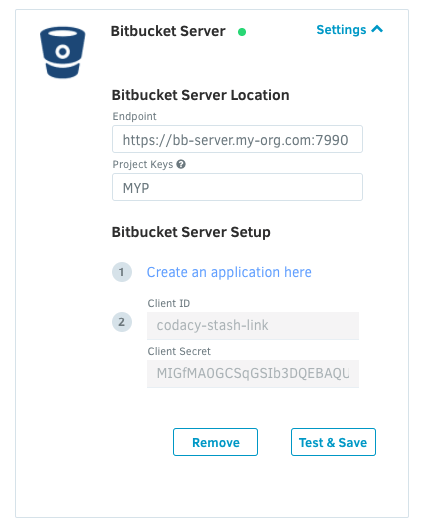
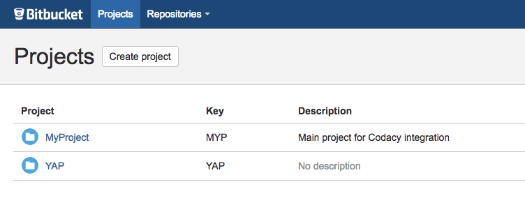
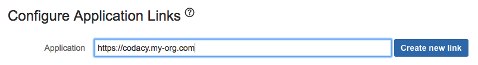
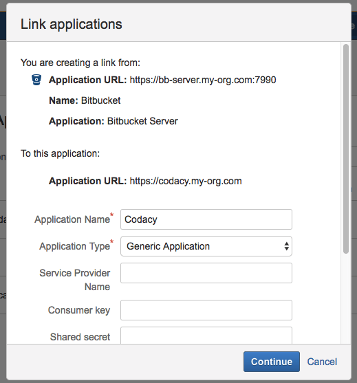
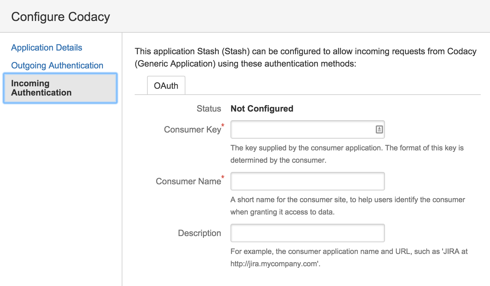

# Configuring Bitbucket Server (from Stash) with Codacy Self-hosted

<table>
  <tbody>
    <tr>
      <td style="background-color: #ffc4ad;">
        

          Codacy Self-hosted running on Docker is <strong>deprecated since April 2020</strong>. Codacy provides critical bug fixes and tool updates but no more feature enhancements for this version.
        

        

          <a href="/Chart/" target="_self">Click here for updated documentation on how to install and configure Codacy Self-hosted on Kubernetes.</a>
        

        

          If you are a current customer and have any questions regarding the migration process, please reach out to your CSM or <a href="mailto:success@codacy.com" target="_blank">success@codacy.com</a> for more information.
        

      </td>
    </tr>
  </tbody>
</table>

## Endpoint

### Url **_\[required]_**

The URL where the Stash application is deployed.

Should contain:

-   Protocol (ex: http, https)
-   Port (if other than 80) (ex: 9000)

##### Correct:

-   `http://my.stash.example.com:7990`

##### Incorrect:

-   `my.stash.example.com`
-   `my.stash.example.com/`
-   `my.stash.example.com:7990`
-   `my.stash.example.com:7990/`

### Project Keys **_\[required]_**

The project in Stash that you would like to retrieve repositories from.

## Stash Application Link

To set up Stash you need to create an application link on your Stash installation.
To start you can click on `here` and go to the application links list.

### Application Link Creation **_\[required]_**

#### Create the link

##### Application Url

This is your Codacy installation url.

#### Name the link

#### Application Name

You can name the application (ex: Codacy)

#### Application Type

The application type is `Generic Application`

The rest of the configuration should be left blank.

After the link is created, click edit to add an incoming connection.

#### Add incoming connection

##### Consumer Key

This value should be copied from the "Client ID" field in the Codacy setup page.

##### Consumer Name

You can choose any name (ex: Codacy).

##### Public Key

This value should be copied from the "Client Secret" field on the Codacy setup page.

The rest of the fields can be left blank.

After the application link is created, you will be able to add Bitbucket Server as an integration in the repository settings.

!!! note
    Please make sure that Bitbucket has SSH enabled so we can access your repositories' source code.

## Pull request comments

To enable comments on your pull requests you have to add the Stash integration to each of your repositories.

After you add a repository on Codacy go to Settings -> Integrations and add Stash. Click on the checkbox to enable the pull request comments.

Below is an example of a Codacy comment:

