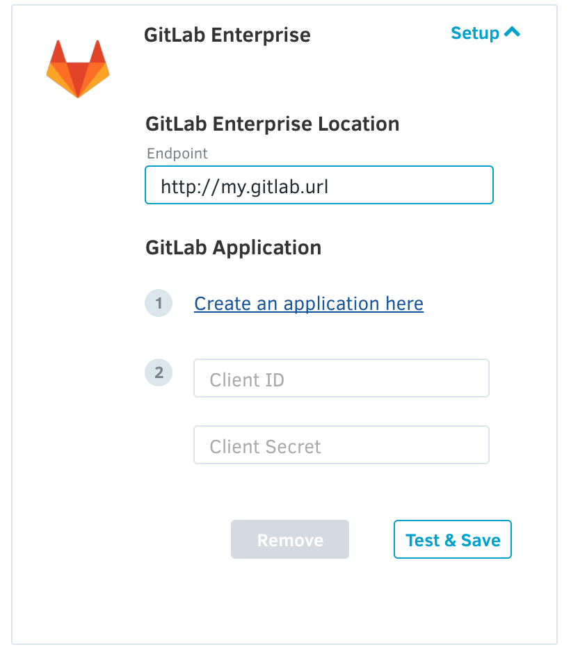
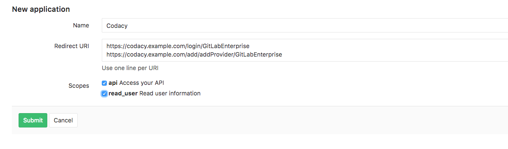
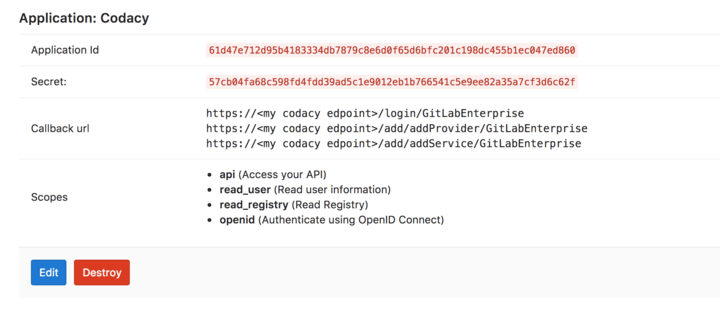

# Configuring GitLab Enterprise with Codacy Self-hosted

<table>
  <tbody>
    <tr>
      <td style="background-color: #ffc4ad;">
        <p>
          Codacy Self-hosted running on Docker is <strong>deprecated since April 2020</strong>. Codacy provides critical bug fixes and tool updates but no more feature enhancements for this version.
        </p>
        <p>
          <a href="/Chart/" target="_self">Click here for updated documentation on how to install and configure Codacy Self-hosted on Kubernetes.</a>
        </p>
        <p>
          If you are a current customer and have any questions regarding the migration process, please reach out to your CSM or <a href="mailto:success@codacy.com" target="_blank">success@codacy.com</a> for more information.
        </p>
      </td>
    </tr>
  </tbody>
</table>

Codacy only supports Gitlab version 9.5 or later. 



## Location

### **_Endpoint \[required]_**

The URL where the GitLab application is deployed.

This should contain:

-   Protocol (ex: http, https)
-   Port (if other than 80) (ex: 9000)

##### Correct:

-   `http://my.gitlab.url:7990`

##### Incorrect:

-   `my.gitlab.example.com`
-   `my.gitlab.example.com/`
-   `my.gitlab.example.com:7990`
-   `my.gitlab.example.com:7990/`

## GitLab Application

Follow the link to create an application on Gitlab Enterprise.



Then paste the application ID and secret in Codacy Self-hosted.

You'll also need to add the following 'Redirect URI'. Make sure to update your protocol to use either http or https and your domain name as well. Keep in mind this field is case sensitive. 

```text
https://codacy.example.com/login/GitLabEnterprise
https://codacy.example.com/add/addProvider/GitLabEnterprise
https://codacy.example.com/add/addService/GitLabEnterprise
https://codacy.example.com/add/addPermissions/GitLabEnterprise
```


