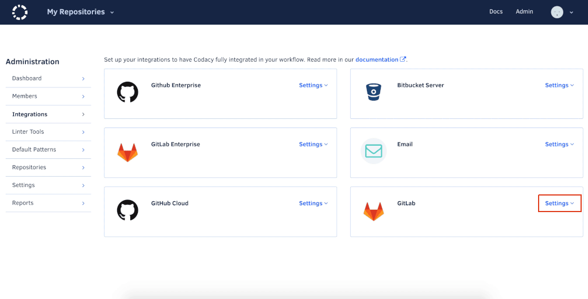
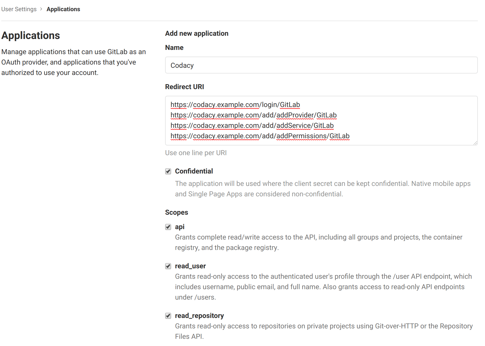
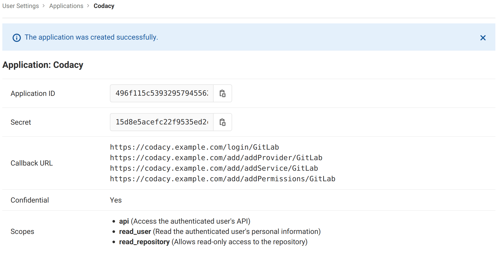

# Configuring GitLab.com with Codacy Self-hosted

<table>
  <tbody>
    <tr>
      <td style="background-color: #ffc4ad;">
        <p>
          Codacy Self-hosted running on Docker is deprecated since April 2020 and will <strong>stop being supported on February 16, 2021</strong>.<br/>
          Codacy will continue to provide critical bug fixes and tool updates for this version (but no more feature enhancements) until the end of support.
        </p>
        <p>
          <a href="/chart/" target="_self">Click here for updated documentation on how to install and configure Codacy Self-hosted on Kubernetes or MicroK8s.</a>
        </p>
        <p>
          If you are a current customer and have any questions regarding the migration process, please reach out to your CSM or <a href="mailto:success@codacy.com" target="_blank">success@codacy.com</a> for more information.
        </p>
      </td>
    </tr>
  </tbody>
</table>

If you have admin permissions on your Codacy self-hosted instance, you can set up or configure your GitLab.com integration by going to the Admin panel on the top navigation bar.



When you open the GitLab panel, if you haven't created an application yet, this is the first step you need to take. Just follow the link.


## Creating a GitLab Application

Follow the link to create an application on Gitlab.com



You need to ensure the "api", "read_user" and "read_repository" scopes are checked. 

You'll also need to add the following 'Redirect URL's. Make sure to update your protocol to use either HTTP or HTTPS and your domain name as well. Keep in mind this field is case sensitive. 

```text
https://codacy.example.com/login/GitLab
https://codacy.example.com/add/addProvider/GitLab
https://codacy.example.com/add/addService/GitLab
https://codacy.example.com/add/addPermissions/GitLab
```



After this, copy the "application ID" and "secret" and paste those to the GitLab integration panel on Codacy.  

 

Hit "Test & Save" and you should be good to go! 👍
