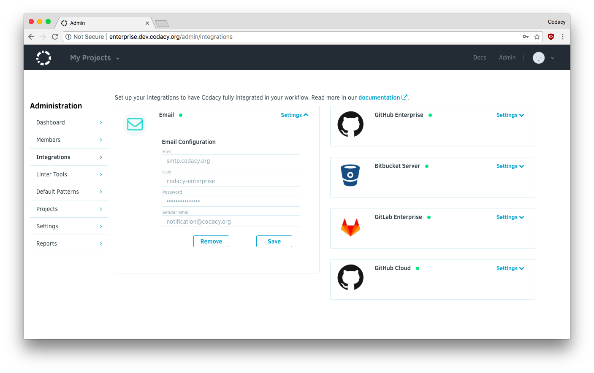

# Configuring your Email Server with Codacy Enterprise

<table>
  <tbody>
    <tr>
      <td style="background-color: #ffc4ad;">
        

          Codacy Self-hosted running on Docker <strong>stopped being supported on February 16, 2021</strong>.
        

        

          <a href="/chart/" target="_self">Click here for updated documentation on how to install and configure Codacy Self-hosted on Kubernetes or MicroK8s.</a>
        

        

          If you are a current customer and have any questions regarding the migration process, please reach out to your CSM or <a href="mailto:success@codacy.com" target="_blank">success@codacy.com</a> for more information.
        

      </td>
    </tr>
  </tbody>
</table>

Configuring an SMTP server is required for a Codacy Enterprise installation to able to send emails.

Configuring this integration enables the following features:

-   Invite new user via email
-   Commit and Pull Request emails
