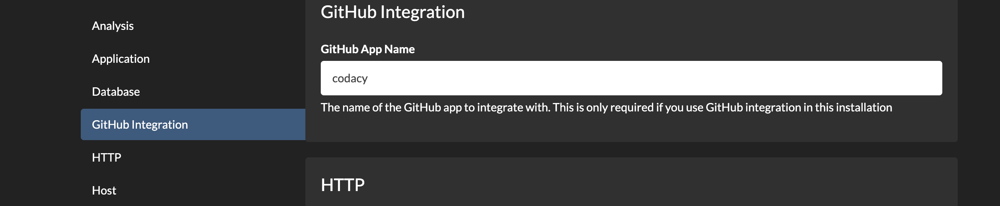
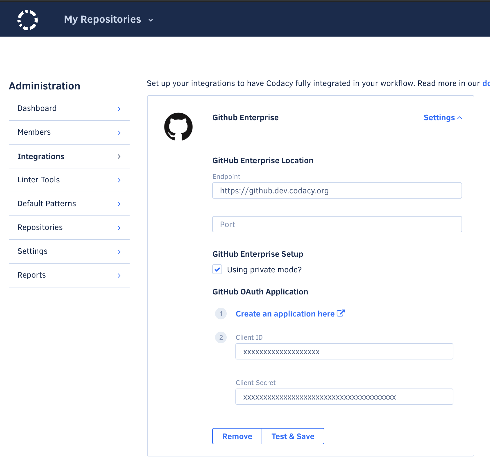

# Create and configure a new GitHub App

<table>
  <tbody>
    <tr>
      <td style="background-color: #ffc4ad;">
        

          Codacy Self-hosted running on Docker <strong>stopped being supported on February 16, 2021</strong>.
        

        

          <a href="/chart/" target="_self">Click here for updated documentation on how to install and configure Codacy Self-hosted on Kubernetes or MicroK8s.</a>
        

        

          If you are a current customer and have any questions regarding the migration process, please reach out to your CSM or <a href="mailto:success@codacy.com" target="_blank">success@codacy.com</a> for more information.
        

      </td>
    </tr>
  </tbody>
</table>

## Creating a new GitHub App

Navigate to your GitHub installation Settings > Developer Settings > GitHub Apps > New GitHub App or `https://github.example.com/settings/apps/new`, where github.example.com is your GitHub Enterprise hostname.

| Field                                   | Value                                                   |
| --------------------------------------- | ------------------------------------------------------- |
| GitHub App name                         | Codacy                                                  |
| Homepage URL                            | `https://codacy.example.com`                            |
| User authorization callback URL         | `https://codacy.example.com`                            |
| Webhook URL                             | `https://codacy.example.com/2.0/events/gh/organization` |
| Repository permissions                  |                                                         |
| Administration                          | Read & Write                                            |
| Checks                                  | Read & Write                                            |
| Issues                                  | Read & Write                                            |
| Metadata                                | Read Only                                               |
| Pull requests                           | Read & Write                                            |
| Webhooks                                | Read & Write                                            |
| Commit statuses                         | Read & Write                                            |
| Organization permissions                |                                                         |
| Members                                 | Read Only                                               |
| Webhooks                                | Read & Write                                            |
| User permissions                        |                                                         |
| Email addresses                         | Read Only                                               |
| Git SSH keys                            | Read & Write                                            |
| Where can this GitHub App be installed? | Any account                                             |

## Configuring a new GitHub App

Configure the name of the created app in Codacy's configuration panel (codacy.example.com:9000).

Update both Client ID and Client Secret with the ones generated by the new App (codacy.example.com/admin/integrations).

