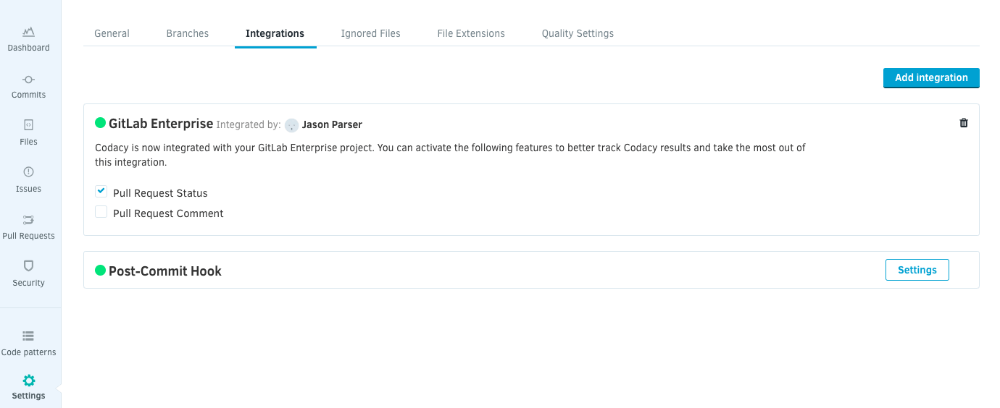

# GitLab integration - Codacy Self-hosted

<table>
  <tbody>
    <tr>
      <td style="background-color: #ffc4ad;">
        

          Codacy Self-hosted running on Docker is deprecated since April 2020 and will <strong>stop being supported on February 16, 2021</strong>. 
          Codacy will continue to provide critical bug fixes and tool updates for this version (but no more feature enhancements) until the end of support.
        

        

          <a href="/chart/" target="_self">Click here for updated documentation on how to install and configure Codacy Self-hosted on Kubernetes or MicroK8s.</a>
        

        

          If you are a current customer and have any questions regarding the migration process, please reach out to your CSM or <a href="mailto:success@codacy.com" target="_blank">success@codacy.com</a> for more information.
        

      </td>
    </tr>
  </tbody>
</table>

After adding a repository, you may want to enable GitLab integration to comment on commits, create issues, and more.

To do so, navigate to your **Repository Settings**, and select the **Integrations** tab. The installation takes one click, but you may have to move back and forth between Codacy and GitLab if additional permissions are required.

After GitLab has been installed, it needs to be enabled by a user with repository access on GitLab. For private repositories, this user will by default become the GitLab user Codacy uses to comment and create issues on GitLab.

