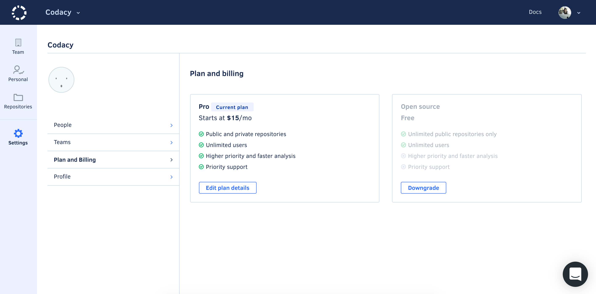

# Plans and Billing

## How does the 14-day trial work?

Sign up with your Git provider or Google account (no credit card required), and enjoy the full functionalities of Codacy for 14 days.
After the trial period, you can either upgrade to a paid plan to enjoy Codacy with unlimited private repositories, or do nothing and stick with the free plan for open source repositories.

## What is the best plan for me?

We offer 3 different plans:

-   Open Source
-   Pro
-   [Self-hosted](https://www.codacy.com/self-hosted)

To learn more about our plans, please see our [Pricing](https://www.codacy.com/pricing) page.

If you are still not sure what plan to choose, tell us about your requirements and we will get back to you with a tailored proposal.

## Can I change my plan or cancel anytime?

Yes, you can change your plan at any time.

## I'm part of an organization. How do I change my plan?

To change the plan for your organization, click on your avatar and go to **Organization**, select the organization, click on Plan and Billing, change the plan, and confirm.

## How many users do I need to have in my organization?

Users are developers contributing to the repository and any team member with access to the code analysis results on the Codacy UI. Your organization should have as many users as your repositories have contributors.

For more details on how to invite team members to your organization, please read [here](/hc/en-us/articles/360009340553-Creating-and-managing-teams). For more information on user permissions, please read [here](/hc/en-us/articles/207280189).

## How can I manage my billing details?

Either you have a single or an organization plan, just go to **Your Account** (or **Organizations** -> **Plans and Billing** -> **Manage Your Billing**). There you will be redirected to our payment provider portal where you can edit your details and view your invoices. 

## Do you offer student and non-profit plans?

If you are a student or a non-profit organization and have a team of up to 4 users you can benefit from our Startup plan for free.

Bigger teams will be eligible for a discount, so if your team has 5 users or more, please send us from your school or work email address. Please provide copies of documentation to verify your eligibility. We'll evaluate your request and get back to you.
