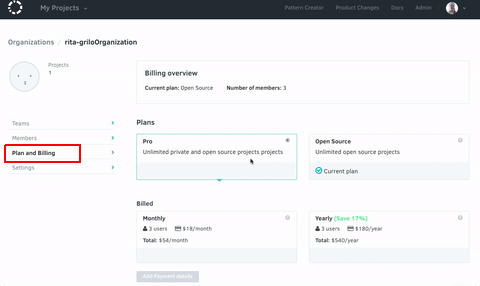

# Upgrading your Codacy account

To get access to unlimited results and faster analysis, you
should upgrade your current account.

Depending on where you have your repositories (are they in your user account or in an organization?), you will need to choose the correct billing page to upgrade to a Pro plan. 

## Upgrading your personal account

Open **Your Account,** open the **Plans and Billing** tab, and select the plan you wish.

Please, note that when upgrading your personal account, only your commits will be analyzed.

So if you would like to have more collaborators on your repositories, upgrade your organization plan.

## Upgrading your organization

Go to **Organizations**, select the organization you want to upgrade, open the **Plans and Billing** tab, and select the plan you'd like.

If you still have questions, please, contact us.
